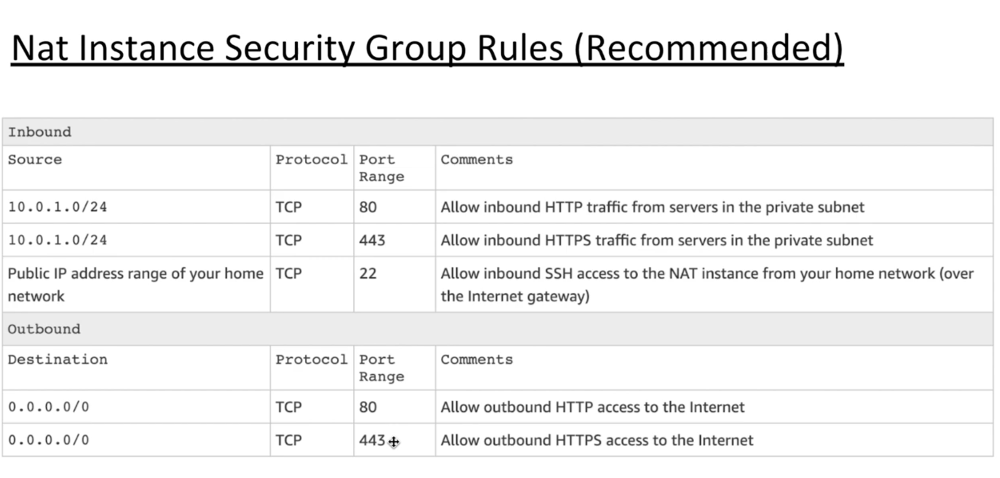

#AWS
This repo will be dedicated to AWS 

#AWS Services

1.Hosting a Static Website on AWS with S3, CloudFront and Route53 | Web | Hosting | AWS
  

- Below service will be used
    - S3: Upload website code
    - CloudFront: CDN to cache request
    - Route53: Act as a DNS to redirect request to Cloudfront
    - Certificate Manager: Apply the certificate to CloudFront so that it would support SSL
    
- Steps
    1. Get a domain. 
    2. Create a hosted zone in route53 and copy namespace values to domain nameservers.
    3. Create a S3 bucket with domain name and configure it as a static website hosting.
    4. Add a bucket policy so that it can be accessed.
        ~~~json
            {
              "Version":"2012-10-17",
              "Statement":[
                {
                  "Sid":"AddPerm",
                  "Effect":"Allow",
                  "Principal": "*",
                  "Action":["s3:GetObject"],
                  "Resource":["arn:aws:s3:::{bucket_name}/*"]
                  }
              ]
            }
        ~~~
    5. Now you should be able to access the site from S3, but we need to cache our site through cloudfront
    6. Create a cloudfront distribution and under the origin domain name paste S3 website url without http://
    7. Update domain name as Alternate domain name in cloudfront.
    8. Acquire a certificate and apply to cloudfront(ACM).
    9. You need to apply the CNAME given by certificate manager to route53
    10. You need to configure route53 to cloudfront using an A record with alias target to cloudfront domain name.

2.Deploying React, Angular, Vue.js apps on AWS

Check angular version
- ng version

Create new angular project
- ng new angularApp --style=scss --routing

- Steps
    1. Create a user that has permission to upload build files to S3.
        - Navigate to IAM
        - Create a new user with Programmatic access(AWS API,CLI,SDK access) and Management console access
        - Best practice to give only the access that the user needs rather than giving all the access(List access, GetObject and PutObject access)
        - You need to download Access key Id, Secret Access Key and Password for that user
    2. Configure AWS Cli in machine and Cli with created user
        - aws configure --profile {name}
    3. Write a simple script to deploy to S3
        ~~~json
           {
             "deploy-s3" : "aws s3 --profile {name} sync ./dist/ s3://{bucket-name} --region us-east-1"
           }   
        ~~~
    4. Invalidating CloudFront cache 
        ~~~json
           {
             "cache-bust" : "aws cloudfront --profile {name} create-invalidation --distribution-id {dist-id} --paths '/*'"
           }   
        ~~~
    5. Make sure to add permission for the above user to interact with cloudfront as well
 
3.Developing an API backend - AWS Lambda - API Gateway - DynamoDB

    
Serverless Framework
- npm install -g serverless
- serverless -v

Create a new service
- serverless create --template aws-nodejs --path my-service

~~~yml
service: my-service
provider:
    name: aws
    runtime: nodejs6.10
    profile: {username}
functions:
    hello:
        handler: handler.hello
        events:
            - http:
                path: users/hello
                method: get
~~~
   
Deploy a serverless app
- serverless deploy -v
    
Remove Serverless stack and everything provisioned
- serverless remove

- steps
    1. Need to create another path pattern that directs apis to API-Gateway
        - Navigate to cloudfront(copy api-gateway url)
        - Create another origin
            - domain as api-gateway url
        - Create another behaviour with path pattern as '/dev/*' 
 
 
4.Enabling gzip compression on S3 websites with Cloudfront

- steps
    1. If the website is being host through s3 bucket and cached through cloudfront we can inspect the site and check main.js bundle to see the 'Content-Type' of the served application which is 'application/javascript'
    2. We will enable compression that the website will load fast.
    3. Navigate to cloudfront
        - Click behaviour tab
        - Choose the default route that linked to s3 web application
        - Choose 'Compress Objects Automatically' and set it to 'Yes'
    4. Navigate to S3 and click the bucket
        - Select the Permission tab
        - Select CORS Configuration
        - Add below script, otherwise cloudfront will not know the size of the content 
        ~~~xml
       <AllowedHeader>Content-Length</AllowedHeader>
        ~~~
    5. We can enable compression inside S3 as well.
        - Navigate to properties of the object.
        - Click on Metadata
        - 'Content-Encoding' as 'gzip'
        - But if you are doing in this manner you need to upload files in gzip format
 
 
5.Building Web Apps with AWS Mobile Hub

- AWS Mobile hub supports iOS, Android, Web and React Native
- Create an app with preconfigured frontend and backend, set up your backend with AWS services configured(generates a cloud configuration file), connect your backend from our client.
- Features
    - Secure Authentication with AWS Cognito
    - Storage: S3
    - Serverless Functions: Lambda and API Gateway
    - Database: DynamoDB
    - Bots: Amazon Lex
    - Host web sites: CDN
    
- Steps
    1. Generate angular/react app
    2. Navigate to AWS Mobile Hub
    3. Setup AWS credentials
        - awsmobile configure
    4. Use below scripts
        - npm install -g awsmobile-cli
        - awsmobile --version
        - awsmobile init {token} - to link aws project with the generated app
    5. Push changes to aws mobile backend and run frontend locally
        - awsmobile run
    6. Any changes that are made from awsmobile hub side needs to be pulled back to client side using,
        - awsmobile pull
    7. Publish to s3 hosting bucket
        - awsmobile publish

6.User Authentication for Angular with AWS Cognito & Amplify

- Amazon Cognito Features
    - Secure and scalable user directory (Managed service)
    - Social and enterprise identity federation (Social: Google, Facebook, Amazon; Enterprise: Active Directory via SAML)
    - Supports Oauth2.0, SAML2.0, OpenID Connect
    - Fine grain access control
    
- Cognito Divides into
    - Cognito User Pools(for authentication: register users in user pool)
    - Cognito Federated Identities

- Steps
    1. Authentication
        1. User logs in with Username and Password
        2. Cognito verifies that and if credentials are correct it sends back response(id_token, access_token, refresh_token)
        3. These are temporary tokens and saved in the browser
    2. Authorization
        1. Sends tokens to Cognito and get temporary credentials from Cognito Federated Identities using STS(Security Token Service)
        2. STS sends(access_key_id, secret_key) back to the user
        3. User can use these temporary credentials to access AWS resources
        4. AWS resources grabs the role out of the credentials and checks the IAM policies attached to that role

- AWS Amplify
    - npm install --save aws-amplify
    - npm install --save aws-amplify-angular

7.Building a Secure Application on AWS - Cognito - API Gateway - Dynamodb

- Security

- Security Layer 1: Authentication Layer
- Security Layer 2: API Gateway Layer
    - For every API call jwt tokens that are stored in local storage will be sent as signed tokens
    - From signed tokens extract credentials and the IAM role.
    - Check against polices whether that IAM role is accessible to access APIs.
- Security Layer 3: DynamoDB Layer
    - Private : Users will not have any access to other users data
    - Protected: Users will read other users data and will not be allowed to update or delete each others items
    - Public: Users will read other users data and will be allowed to update or delete each others items
    - Partition key == users congnito id, so that the logged in user can only see his records from DynamoDB
    
Create API with Amazon API Gateway and Lambda
- awsmobile cloud-api enable --prompt

8.Building a S3 Directory for Your Company - S3 - IAM

- Steps
    1. Create a bucket for organization and create below directories
        - my-organization/Home/peter
        - my-organization/Home/ann
        - my-organization/Home/henry
    
        1. Any user can see all the other directories but cannot see the content
        2. Any user can only access his/her folder and can see the content
    2. Navigate to IAM 
        - Create a user 'Peter' with programmatic access and setup S3 browser with his credentials to S3 bucket
        - Attach below policy
            1. List all the buckets
            2. Get Bucket Locations
            3. Access to /Home
            4. Access to his/her bucket using IAM variables
            5. Allow all the actions
        ~~~json
        {
          "Version": "2012-10-17",
          "Statement": [
            {
              "Effect": "Allow",
              "Action": "s3:ListAllMyBuckets",
              "Resource": "arn:aws:s3:::*"
            },
            {
              "Effect": "Allow",
              "Action": "s3:GetBucketLocation",
              "Resource": "arn:aws:s3:::*"
            },
            {
              "Effect": "Allow",
              "Action": "s3:ListBucket",
              "Resource": "arn:aws:s3::my-organization",
              "Condition": {
                "StringEquals": {
                  "s3:prefix": [
                    "",
                    "Home/"
                  ],
                  "s3:delimeter": [
                    "/"
                  ]
                }
              }
            },
            {
              "Effect": "Allow",
              "Action": "s3:ListBucket",
              "Resource": "arn:aws:s3::my-organization",
              "Condition": {
                "StringLike": {
                  "s3:prefix": [
                    "Home/${aws:username}/*"
                  ]
                }
              }
            },
            {
              "Effect": "Allow",
              "Action": "s3:*",
              "Resource": [
                "arn:aws:s3::my-organization/Home/${aws:username}",
                "arn:aws:s3::my-organization/Home/${aws:username/*}"
              ]
            }
          ]
        }
        ~~~
    3. Add unique files to each of the users S3 directories

9. Building a chatbot with Amazon Lex - AWS

- Creating a conversational chatbot to retrieve weather information for users utterances using natural language.
- Steps
    1. Create an intent 'FindWeather'
        1. Add some sample utterances
            - "Tell me about the weather today?"
            - "How is the weather in {City}"
            - "What is the weather like in {City}"
        2. Create slots for variables
            - "Sure, Which city?" with {City} name
        3. Add Response message
            - "Temperature in {City} is 25C and Humidity level is 55%"
        4. Add AWS Lambda fulfillment
        5. Build the bot
    2. Create an intent 'GreetUser'
        1. Add some sample utterances
            - "Hi"
            - "Howdy"
            - "Hello"
        2. Create slots for variables
            - "Hi!! What is your {name}" with {Name} as name
        3. Add Response message
            - "Hello {Name}! How can I help you!"
            - "Hi {Name}! What do you want!"
        4. Build the bot
    3. Generate an angular application for weather app bot.
        - amplify init
        - amplify add auth
        - amplify push
        - Navigate to cognito and click 'Federated Identities' and find the role id
        - Navigate to IAM and attach 'AmazonLexFullAccess' policy
            
10. Containers on AWS
- Containers are an isolated resource section in our computer
- Will be talking about Docker with namespaces
- Volume mapping: It references original files rather than copying files to the container(e.g: Live reloading) 
- Steps
    1. Need to install Docker
        - docker --version
        - docker info
    2. Create Dockerfile
        ~~~.dockerfile
           FROM node:alpine
           WORKDIR '/app'
           COPY package.json .
           RUN npm install
           COPY . .
           EXPOSE 4200
           CMD npm run start
        ~~~
    3. Build the Dockerfile
        - docker build .
        - docker images
        - -p host_port: container_port
        - docker run -p 8080:4200
    4. Volume mapping with docker-compose.yml
        ~~~yml
            version: "3"
            services:
                myapp:
                    build: .
                    ports:
                        - "8080:4200"
                    volumes:
                        - "/app/node_modules"
                        - ".:/app"
        ~~~
    5. Run docker compose
        - docker-compose up

11. Deploying a containerized web application to Elastic Beanstalk

- Steps
    1. Navigate to Elastic Beanstalk(PAAS) - deploy, monitor and scale applications easily
    2. Create an Environment with docker
    3. Install EB Cli for relevant O/S
    4. Create multi step docker file
    ~~~.dockerfile
        FROM node:alpine as BUILD
        WORKDIR '/app'
        COPY package.json .
        RUN npm install
        COPY . .
        RUN npm run build
   
        FROM nginx
        EXPOSE 80
        COPY --from=BUILD /app/dist/myapp /usr/share/nginx/html
    ~~~
    5. Push to Elastic Beanstalk
        - docker run -p 80:80 {image_id}
        - eb --version
        - aws configure
        - eb init
        - Commit all the docker file changes before pushing to Elastic Beanstalk
        - eb create myapp
        - eb deploy
  
12 . Redirect URLs in AWS Using S3 and Cloud front
- eg: If we type any sub domains(www.mydomain.com or sub.mydomain.com) instead of Apex domain(mydomain.com) we need to redirect to apex domain
- Steps
    1. Needs to have an already created S3 bucket for apex domain
    2. Need to create a redirect bucket
    3. Select redirect bucket and navigate to properties and static website hosting
    4. Click 'Redirect requests'
        - Target bucket: mydomain.com
        - Protocol: https
    5. Navigate to CloudFront Distribution
        - Need to create another distribution for redirect bucket
        - Create SSL certificate to redirection bucket
        - For CNAME add 'www.mydomain.com'
    6. Navigate to route53
        - We need to create an A record for 'www.mydomain.com' DNS redirection with an ALIAS target for Cloudfront distribution created in step 5(domain name)
   
13 . How to Architect and Design Your Application on AWS Cloud    
- 5 Pillars of Well Architecture Application 
    1. Security
    2. Reliablilty: Ability for the system to recover from a certain disturbance, Horizontal scalability
    3. Performance Efficiency: High performance, hybrid architecture
    4. Cost Optimization
    5. Operational Excellence

- Steps
    1. Frontend
        - Angular Framework
        - AWS Amplify Library: Simple and Secure, make signed requests to backend resources
    2. Frontend Deployment
        - Host the website in S3 bucket: Reliability, 11 9s durability, cost effective, automatically scalable
        - Cloudfront in front of the S3 bucket: Performance efficiency, Caching, CDN
        - SSL certificate from ACM: Enable SSL, Connections will be encrypted
        - WAF on cloudfront: Security against common web attacks
        - Route53 as DNS
    3. Backend
        - Lambda to run business logic: Will scale automatically, serverless
        - API Gateway for API: Scales itself
        - DynamoDB as the database: NoSQL, Managed service, replicate data in different data center
    4. Search
        - Amazon ElasticSearch Service: Managed service, text based service, run in private network
        - AWS Lambda: Asynchronously index documents in ElasticSearch
    5. Authentication & Authorization
        - Amazon Cognito User Pool: Decouple users from application and they will serve in a highly scalable user pool
        - Amazon Cognito Identity Pool: IAM with Cognito users for more granular access
        
14 . Designing the AWS Project Architecture

- Frontend
    - WebApplication resides in a S3 bucket
    - Website is cached through Cloudfront and delivered through CDN
    - On Cloudfront applied a certificate to enable SSL and HTTPS from Amazon Certificate Manager, Web Application Firewall rules as well
    - Cognito as Authentication and Authorization provider
    - If the users are successfully signed in they are routed to Cloudfront via Route53 using DNS
    - In Cloudfront WAF checks whether they are legitimate requests if not requests are discarded
    - If legit request then checks whether the cache is available otherwise talk to S3 bucket and get the latest content and delivered
 
- Security considerations
    - Lambda must not be accessible over the internet
        - Need to put lambda functions within a VPC
        - It is our responsibility to handle all the network related task
            - Design IP ranges
            - Divide them to sub networks
            - Create different security groups
        - Create a different sub network without an internet access - private subnet(Lambdas cannot be accessed over internet)
        - "A Call Start" time will be longer after we put it inside a VPC
        
    - Database, ElasticSearch must not be accessible over the internet
        - Both these services are regional services and called through public endpoint
        - Lambdas need to connect with these 2 service over internet
        - DynamoDB and ElasticSearch services provide VPC endpoints
        - Through that VPC endpoints lambdas can communicate with these 2 services
        - We need to give access from dynamodb to lambda and vice-versa(for that we need to apply a security group in both places)
        
15 . Hosting a web application with AWS Amplify

- Steps
    1. Create an angular app
    2. Incorporate Amplify with the angular app
        - amplify configure and give programmatic access to AdministratorAccess policy
    3. Initialize Backend
        - amplify init
        - amplify will be using cloudformation stack to create the backend 
        - amplify hosting add
        - amplify publish
 
16 . Authentication & Authorization with AWS Amplify

- Steps
    1. amplify auth add
    2. Add amplify related changes in angular frontend side
   
    
17 . Single Sign On (SSO) with Facebook on AWS Cognito
- We'll be using Amazon Cognito Hosted UI for this
- Steps
    1. Navigate to Cognito
        - Navigate to the correct cognito user pool
        - Click 'Domain name' under 'App integration'
        - Check availability for a domain
        - Add social login with facebook as well
    2. SSO
        - When user logins through cognito authentication happens in Cognito user pool
        - Cognito checks whether the user is available in the pool and sends back access token, id token and refresh token
        - If the user wants to authenticate with facebook, cognito redirects it to facebook
        - After successful authentication facebook sends tokens/code to cognito user pool
        - Cognito checks tokens/code and create a record inside cognito pool and generates its own access, id and refresh token to the user
        - For any Identity provider we add, cognito will make sure for any authorized requests through these Identity providers it will create its own access, id, refresh tokens, so that the backend or frontend will rely on same set of tokens
 
18 . Authentication with Cognito Hosted UI
- Steps
    1. Will go through amazon cognito authentication documentation for configuring Hosted UI
        - Create an object with configuration
            - Domain, scope, redirectSignIn, redirectSingOut, responseType, AdvancedSecurityDataCollectionFlag
        
19 . DynamoDB, API Gateway and Amplify

- In this we'll be calling some API endpoints in API gateway which talks to a Dynamodb database using a lambda function
- VPC Endpoint will be added in upcoming session
- Steps
    1. Adding the API backend
        - amplify add api
    2. All the APIs will be generated for the given API endpoint with authentication and all the validation
    3. Check dynamodb for newly created table and API Gateway console for newly created API and endpoints
    4. Create home component
        - ng g c home
    5. Using Dynamodb streams to index records from dynamodb to ElasticSearch

20 . Connecting Azure Active Directory with Cognito
- How to setup Azure Active Directory as a 3rd party Identity provider for the application
- Steps
    1. Create a user pool and login with Cognito Hosted UI
        - Add an app client
        - Make a note of client ID
        - Check for a domain prefix
        - Copy the url format for 'Using the Hosted Domain'
        - Setup the redirect url
    2. Azure AD over SAML protocol
        - Need to provide metadata url and identifiers
        - Need to provide a user pool in AD
        - Need to provide configurations from cognito 
            1. Sign-On url
            2. Identifier uri
            3. Logout url
            4. Reply url
        - Update the manifest with above values
        - Need to get Azure metadata document and apply to cognito side
        - Add attribute mappings
    3. When user types corporate email they will be redirected to Azure AD
    4. Authenticate against AD
    5. If success redirect to application

21 . Working with DynamoDB and Elasticsearch

 - Steps
    1. When a product is added to dynamodb stream lambda function will trigger
        - Need to enable dynamoDB streams in dynamoDB
    2. It will index the record in ElasticSearch
    3. This is an asynchronous operation
    4. Dynamodb streams and lambdas are managed services
    5. Need to create an ElasticSearch service inside the private subnet of VPC
    6. Create a lambda function with an IAM role so that it can communicate with ElasticSearch service
        ~~~json
        {
          "Version": "2012-10-17",
          "Statement": [
                  {
                    "Effect":"Allow",
                    "Action":[
                      "es:ESHttpPost",
                      "es:ESHttpPut",
                      "dynamodb:DescribeStream",
                      "dynamodb:GetRecords",
                      "dynamodb:GetShardIterator",
                      "dynamodb:ListStreams",
                      "logs:CreateLogGroup",
                      "logs:CreateLogStream",
                      "logs:PutLogEvents"
                    ],
                    "Resource": "*"
                  }
          ]
        }
        ~~~
    7. Create a security group in ElasticSearch domain and apply the same in lambda so that communication can happen

22 . GraphQL in AWS with AppSync, Amplify and Angular 
- GraphQL
    - Fast and flexible compared to REST
    - GraphQL client decides what data to receive
    - Operate over HTTP
    - Fewer HTTP requests
    - Flexible data querying and less code to maintain    

- Operations
    - Query: Fetch the data from GraphQL - Get
    - Mutation: Change data - Create/Update/Delete
    - Subscription: Watch data for changes in Real time
        - Happens through web sockets

23 . Modeling Relationships in GraphQL
- Relationships
    - 1:1: Department has a Manager
    - 1:M: Department has many employees
    - M:N: Project has many Employees and Employees can be assigned to many projects

- Steps
    1. 'amplify api add' and choose graphql
        ~~~text
            type Department @model{
                id: ID!
                name: String 
                manager: Employee @connection
                employees: [Employee] @connection(name: "DeparmtentEmployees")
            }
            type Employee @model{
                id: ID!
                name: String 
                age: Int
                department: Department @connection(name: "DeparmtentEmployees")
                projects: [EmployeeProjects] @connection(name: "EmployeeProjects")
            }
            type EmployeeProjects @model (queries: null){
                id: ID!
                employee: Employee @connection(name: "EmployeeProjects")
                project: Project @connection(name: "ProjectEmployees")
            }
            type Project @model{
                id: ID!
                name: String 
                employees: [EmployeeProjects] @connection(name: "ProjectEmployees")
            }
        ~~~
    2. 'amplify api gql-compile' will recompile the graphql stack in appSync

24 . How to send realtime updates with GraphQL subscriptions
- AppSync is a managed graphQL server
- Subscription are watching over changes in graphQL
- Steps
    1. When have a subscription it will send all the changes to all the clients who are listening

25 . Let's Build an Offline Web App
- AWS AppSync SDK with Offline mode
- GraphQL uses Apollo Client which gives offline support
- Steps
    1. Install below dependencies
        ~~~text
           npm install -g @aws-amplify/cli
           npm install --save aws-amplify
           npm install --save aws-amplify-angular
           npm install --save aws-appsync graphql-tag
        ~~~      
       
26 . FullStack WebApp with AWS Amplify and Angular
- Navigate to https://enlear.academy/lets-build-a-profile-app-with-aws-amplify-part-01-bb596e682d3a
- Steps
    1. Using Angular with Amplify using App Sync for API layer
   
   
27 . Let's Build a Talking App! - (Amazon Polly, S3, Lambda, Angular)
- Steps
    1. Amazon Polly: Turn text into lifelike speech
        - Extract the text what the user has typing in and the selected voice id 
        - Call in SynthesizeSpeech API and store it, inside a S3 bucket
        - Get a signed url for that particular audio stream
        - Sends back to the application
    2. Create the backend using serverless framework
        ~~~text
        npm install serverless -g
        serverless create --template aws-nodejs --path backend
        npm i aws-sdk
        npm i uuid
        ~~~

28 . Sentiment Analysis with AWS Comprehend
- AWS Comprehend: Is a NLP(Natural Language Processing) service to discover insights and relationships in text.
- The sentiment can be either Positive, Negative or Neutral

29 . Secure Static Hosting with S3, CloudFront and OAI(Module 1)
- Using S3, CloudFront, Cloud 9 IDE
- S3
    - 
    - Types of Storage
        - Object Storage: Any static content eg: CSS, JS, Audio, Video, Images, HTML
        - Block Storage: Apache or Nginx which needs an Operating System eg: EBS attached to EC2
    - Access Control
        1. Resource Based Policies
            - Bucket Policy
            - ACL
        2. User Based Policies(Applied to IAM users)
    - Consistency Models
        1. Strong consistency/Immediate/Read-after-Write
        2. Eventual consistency
        
- Amazon CloudFront
    - AWS have edge locations around the world
    - When we configure a cloudfront we must block direct requests to the S3 bucket by bypassing CloudFront distribution
    - We can do this by using OAI(Origin Access Identity): Treat Cloudfront as a User
    - Only ALLOW that user to talk to the S3 bucket
    - S3 bucket is not publicly readable
    - Use Signed Url or Signed cookies together with OAI to the S3 bucket

30 . Cloud9 IDE Setup
- Steps
    1. Create an environment
    2. Clone specific branch
        - git clone -b {branch_name} {https_url}

31 . Secure Static Web Hosting with CloudFront and S3 with Origin Access Identity
- Steps
    1. Create S3 bucket
        - aws s3 mb s3://{bucket_name}
    2. Give access to cloudfront oai user to access S3 bucket
        ~~~text
        {
          "Id": "PolicyForCloudFrontPrivateContent",
          "Version": "2008-10-17",
          "Statement": [
            {
              "Sid": "1",
              "Effect": "Allow",
              "Principal": {
                   "AWS": arn:aws:iam::cloudfront:user/CloudFront Origin Access Identity {oai_id}
               },
              "Action": "s3:GetObject",
              "Resource": "arn:aws:s3:::{bucket_name}/*"
            }
          ]
        }
        ~~~
    3. Create OAI in cloudfront
        - aws cloudfront create-cloud-front-origin-access-identity --cloud-front-origin-access-identity-config CallerReference=Mysfits,Comment=Mysfits
    4. Adding bucket policy for the created S3 bucket
        - aws s3api put-bucket-policy --bucket {bucket_name} --policy {location_in_my_pc}
    5. Create a cloudFront distribution
        - Origin: S3 bucket
        - aws cloudfront create-distribution --distribution-config {path_to_distribution_config}
    6. Upload content to S3
        - aws s3 cp {path_to_index.html} s3://{bucket_name}/index.html

32 . Setting up a VPC & Networking to Run Fargate Containers(Module 2)
- Containerized Applications will,
    - Maximize the resource utilization
    - Run multiple containers inside the same server
    - Enable load balancing
    
- Steps
    1. Setting up a private network (VPC) on AWS
        - VPCs are logically isolated from other virtual networks in AWS
        - A subnet that has a route out to the internet is called a "Public Subnet" else it is called "Private Subnet"
        - VPC Endpoints allows VPC to connect to resources privately to other AWS services without using internet. Traffic never leaves the AWS network
        - 2 types of VPC endpoints
            1. Interface endpoints: Network interface(ENI) that points to the other AWS service
            2. Gateway endpoints: A gateway that can be set as a target in the route table
    
33 . Load balancing on ECS Cluster Powered by AWS Fargate
- Steps
    1. Deploying a service in ECS(Elastic Container Service)
        - AWS Fargate: Without having to manage the cluster or server
        - We will be using AWS Fargate launch type instead of EC2 launch type
        - Will deploy multiple containers of the backend for High Availability
        - Services are exposed via a Load Balancer
        - Load balancer directs traffic to tasks of the service
        
        - ECS Cluster
            - Cluster provides compute, memory and storage for tasks
            - If we use Fargate AWS will manage cluster resources
            - Task definition is like the blueprint of the application
            - Task/Container is an instantiation of a task definition
            - It is a json document which describes tasks
            - A service launches specified number of tasks/containers from a task definition
            - Service can run behind a Load Balancer to distribute traffic across its task
            
        - Task Networking
            - Tasks that uses Fargate launch type requires 'awsvpc' network mode
            - 'awsvpc' network mode provides an ENI for each task
            - You need to specify which subnets, the ENI should be attached
            - Need to specify the security group for the ENI
            - If the ENI is attached to a public subnet it will receive a public IP or else a private IP
            - Tasks in private subnet will use NAT gateway to access internet and pull docker images to run the containers
        
        - Load Balancing
            - To configure a load balancer you need to create target groups
            - Target groups can be either instances or ip addresses
            - Load balancer has listeners configured with a port and a protocol
            - Listeners have rules that will direct traffic to target groups if matched
            
34 . Microservice Implementation on AWS with ECS, Fargate, ECR and NLB
- Steps
    1. Create cloudformation stack(Refer 'core.yml')
        - aws cloudformation create-stack --stack-name {stack_name} --capabilities CAPABILITY_NAMED_IAM --template-body file://~/environment/aws-modern-application-workshop/module-2/cfn/core.yml
    2. Describe stack
        - aws cloudformation describe-stacks --stack-name {stack_name}
    3. Build docker image
        - docker build . -t {account_id}.dkr.ecr.{region}.amazonaws.com/{repo_name}:latest
    4. Create ECR(Elastic Container Registry: like docker hub)
        - aws ecr create-repository --repository-name {repo_name}
    5. Create ECS cluster
        - aws ecs create-cluster --cluster-name {cluster_name}
    6. Create log group
        - aws logs create-log-group --log-group-name {log_group_name}
    7. Create a task definition: Refer "task-definition.json"
        - aws ecs register-task-definition --cli-input-json file://~/environment/aws-modern-application-workshop/module-2/aws-cli/task-definition.json
    8. Create a network load balancer
        - aws elbv2 create-load-balancer --name {load_balancer_name} --scheme internet-facing --type network --subnets {public_subnet1_id} {public_subnet2_id} > ~/environment/nlb-output.json
    9. Create a target group
        - aws elbv2 create-target-group --name {target_group_name} --port 8080 --protocol TCP --target-type ip --vpc-id {vpc_id} --health-check-interval-seconds 10 --health-check-path / --health-check-protocol HTTP --healthy-threshold-count 3 --unhealthy-threshold-count 3 > ~/environment/target-group-output.json  
    10. Create Listener
        - aws elbv2 create-listener --default-actions TargetGroupArn={target_group_arn},Type=forward --load-balancer-arn {load_balancer_arn} --port 80 --protocol TCP         
    11. Create ECS iam role
        - aws iam create-service-linked-role --aws-service-name ecs.amazonaws.com
    12. Create ECS service(refer 'service-definition.json')
        - aws ecs create-service --cli-input-json file://~/environment/aws-modern-application-workshop/module-2/aws-cli/service-definition.json
   
35 . ECS Container Networking & Load Balancing Architecture
- Steps
    - Frontend is hosted inside a S3 bucket
    - Any request that generated from the frontend will first hit Load Balancer
    - Load Balancers have multiple rules defined for it and if any rule matches it will redirect requests to a Logical grouping called 'Target Groups'
    - These targets can be either EC2 instances or IP addresses
    - Since we are using AWS Fargate mode and using 'awsvpc' network mode each an every container will receive private IP address from the range of private subnet
    - In order to launch containers in our cluster we need to define 'services'(task definition and desired count)
    - We can associate target groups through services
    
36 . Docker CI_CD Pipeline on AWS
- Steps
    - What is CI/CD
        - Automating the release process
        - Four stages of release process
            1. Source Code: Use a centralized code repository, peer review the code before merging
            2. Build: Compile the code, run unit test, create container images eg: AWS Code build, Jenkins
            3. Test: Integration tests, UI tests, load, testing
            4. Deploy: Deploy to production environment, monitor code in production environment to detect errors
        
     
37 . Docker CI_CD pipeline on AWS - Part 2
- Steps
    1. Source Code resides in a centralized code repository: AWS CodeCommit
    2. Build process uses AWS CodeBuild
        - Will provision a small server and then pull the code from the given branch
        - Docker image(container image) created from the Dockerfile
        - Images will be pushed to ECR(Elastic Container Registry)
        - All these commands are stored in 'buildspec.yml'
            1. PreBuild: Logging in to ECR
            2. Build: Build the docker image and tag
            3. PostBuild: Push the image to ECR
    3. Create S3 bucket to store the artifacts
        - aws s3 mb s3://{artifact_s3_bucket_name}
    4. Push the bucket policy to S3(Refer artifacts-bucket-policy.json)
        - aws s3api put-bucket-policy --bucket {artifact_s3_bucket_name} --policy file://~/environment/aws-modern-application-workshop/module-2/aws-cli/artifacts-bucket-policy.json
    5. Create AWS CodeCommit Repository
        - aws codecommit create-repository --repository-name {code_commit_repo_name}
    6. Create a CodeBuild Project(Refer 'code-build-project.json')
        - aws codebuild create-project --cli-input-json file://~/environment/aws-modern-application-workshop/module-2/aws-cli/code-build-project.json
    7. Create a CodePipeline pipeline(Refer 'code-pipeline.json')
        - aws codepipeline create-pipeline --cli-input-json file://~/environment/aws-modern-application-workshop/module-2/aws-cli/code-pipeline.json
    8. Enable access to ECR(Refer 'ecr-policy.json')
        - aws ecr set-repository-policy --repository-name mythicalmysfits/service --policy-text file://~/environment/aws-modern-application-workshop/module-2/aws-cli/ecr-policy.json
    
38 . Introduction to Lambda Resolvers with AWS Amplify  
- Directives: @model, @key, @connection, @auth, @versioned, @searchable, @function
         
- @function: Creates Lambda resolvers
- amplify add function
    
39 . S3 web hosting with CloudFront and OAI

- Steps
    1. Create S3 bucket and give a unique name(Give public access to S3 bucket)
    2. Enable static web hosting
    3. Apply a bucket policy
    ~~~json
             {
          "Version":"2012-10-17",
          "Statement":[
            {
              "Sid":"AddPerm",
              "Effect":"Allow",
              "Principal": "*",
              "Action":["s3:GetObject"],
              "Resource":["arn:aws:s3:::{bucket_name}/*"]
              }
          ]
        }
    ~~~
    4. Create a Cloudfront distribution with Origin as the S3 bucket

40 . Learn AWS Amplify Console
- Steps
    1. React + Amplify implementation 
    2. Checkout to amplify dev branch
        - amplify env checkout dev

41 . Realtime and Offline API Design
- Steps
    1. amplify init
    2. amplify add api
    3. amplify add storage

42 . Serving Multiple Websites with AWS CloudFront & Lambda at Edge
- Steps
    1. Create 2 S3 buckets to hold new and old front end application code with public access
    2. Add static web hosting for both buckets
    3. Add a bucket policy for anonymous users
    4. Create a cloudfront distribution to support old code
    5. Create lambda@edge function to navigate to different domain based on the cookie value
    6. Whitelist cookie in cloudfront distribution cache for forward requests

43 . Building a CICD pipeline for Serverless Apps with UI Testing
- Steps
    1. Create CodeBuild pipeline
    2. Add Github to the Source stage
    3. Create new code build project for frontend
    4. Create new code build project for backend

44 . Continuous Delivery with AWS Fargate
- Steps
    1. Build Docker image\
        - docker build -t cicd-local:latest .
    2. Run container locally
        - docker run -it -p 80:3000 {container_id}
    3. Push to Remote repository
        - Login to AWS
        - Build the image
        - Push to repo
            - docker tag {image_name} {ecr_url}/{name}:latest
            - docker push {ecr_url}/{name}:latest
    4. Setup network
        - Create a VPC
        - Create public and private subnets
        - Create an internet gateway
        - Attach Internet Gateway to public subnet
    5. Create ECS cluster
        - Create Task Definition
        - Create Services
        - Create Application Load Balancer
        - Create Nat Gateway
      
  
- Steps
    - Automating the whole process
    1. Create CodePipeline pipeline and connect to github as the source and map the github repository
    2. Create CodeBuild project
 
45 . 5 Steps to Design Your DynamoDB Database
- Data modeling is how an application stores data in a given database related to the real world entities

- Relational Databases
    1. Optimized for storage with data normalization
    2. Each table has a strict schema
    3. Need more compute power to retrieve data from multiple tables
    4. Performance may degrade as the database scales
    
- NoSQL Databases
    1. Optimized for compute
    2. Flexible schema
    3. Designed for highly scalable application(Horizontal)
    
- For caching on DynamoDB use DAX(DynamoDB Accelerator)
- 5 Step Process
    1. Draw an entity diagram
          
    2. Identify the relationships between entities
    3. List down all the access patterns for each entity
        - Organization
            1. All CRUD operations
            2. Find all the projects of an organization
            3. Find all the employees of an organization
            4. Find all the projects and employees of an organization
            5. Find an organization by name
        - Project
            1. All CRUD operations
            2. Find a project by name
            3. Find the employees assigned to a project
            4. Find agile /fixed-bid projects
            5. Find on-hold projects
        - Employee
            1. All CRUD operations
            2. Find all the projects an employee is part of
            3. Find an employee by name
    4. Identify the primary key for each entity
          
    5. Identify secondary indexes for additional access patterns
     
46 . Additional Access Patterns
- Inverted Index
- GSI Overloading
- Sparse Index
     
47 . AWS Amplify DataStore          
- DataStore with Amplify is a powerful combination that provides a seamless way to handle data synchronization and offline functionality in your applications
- When testing locally all the data is saved in Indexed DB

48 . Encrypting Data with AWS KMS(Key Management Service)
- Implement encryption for both data-in-transit(SSL) and data-at-rest
- Steps
    - Client Side Encryption
        - You encrypt your data and manage your own keys
    - Server Side Encryption
        - AWS encrypts your data and manages the key for you

- How to encrypt_decrypt data with AWS KMS and OpenSSL

- AWS Encryption
    - DynamoDB Encryption Client
        - Only encrpyts payload
        - Key is not encrypted
    - S3 Encryption Client
    - AWS Encryption SDK
        - If we need to encrypt data in general in client side use AWS Encryption SDK

49 . AWS Lambda Layers - Sharing Code Between Lambda Functions
- Lambda layer is an archive that can contain additional code or other content. A layer can contain libraries, a custom runtime, data, or configuration files.
- Local development doesn't have access to lambda layers
- When lambda layer is updated we need to change the version number as well. Need a solution to overcome that as well

50 . Upload Large Payloads - AWS Lambda and S3

  
- API Gateway can only supports 10MB of payloads
- Lambda invocation maximum payload is 6MB

- According to the architecture S3 bucket will send an event to Lambda function
- We need to upload to S3 using a S3 presigned url and trigger a lambda asynchronously
- To get a presigned url there will be a method added to API gateway

51 . How to Alert Production Errors in Real-Time for Serverless Apps

  

52 . Kibana Dashboard with AWS ElasticSearch and Cloud Watch
- Steps
    1. Navigate to Cloud watch log group and select the log group
    2. Create an ElasticSearch subscription filter
    3. We need to have IAM role that index logged data to ES using a lambda function
    4. Configure a filter pattern so that it will limit the data that gets indexed to ES
    5. Create an index pattern in kibana

53 . Gatsby on AWS - Building A Complete Project
- Steps
    1. npm i -g gatsby-cli@2.12
    2. npm i -g @aws-amplify/cli@4.21
    3. Generate gatsby new project from template
    4. Add amplify as well

54 . How to Built an Online Store
- Steps
      
    1. Add amplify library 
        - npm i -g @aws-amplify/cli@4.24
    2. Config AWS
        - amplify configure(administrator access is default selected)
    3. amplify init: to generate an amplify project
    4. Add authentication
        - amplify add auth
    5. Add storage
        - amplify add storage
    6. Add 2 lambda function
        - amplify add function
    7. Add graphql api
        1 amplify add graphql
    8. Always estimate your cloud cost as well

55 . Amazon Honeycode
- Can build 3 Tier business applications without coding
- Runs on Web and mobile
- Share data in real time
- Send notifications 
- Manage business workflows

56 . How to add custom domains with HTTPS
- Attach SSL certificate
    1. Cloudfront distribution layer
    2. Application Load Balancer layer
    3. Elastic Beanstalk layer
    4. Using amplify console

57 . Continuous Deployment with AWS Amplify
- Creating multiple branches to point to different environments
    1. master -> prod
    2. develop -> dev
    3. test -> qa
- Steps
    1. Connect all the remaining branches
    2. Navigate to Domain Management and click manage subdomains
    3. Create dev-{naked-domain} -> dev repo and qa-{naked-domain} -> test

58 . AWS Amplify Console - Password Protect Websites
- If you want to send an unreleased version to a stakeholder you can use the password protection to an environment using amplify
- Navigate to Access control and select the branch and select "Password Required"

59 . AWS Amplify DevOps - Building Pull Requests
- PR reviews work only for private repositories
- Steps
    1. Navigate to aws amplify and click deploy
    2. Link a github project and select the branch and deploy
    3. Click on previews
    
60 . Web Content Compression with AWS CloudFront - Brotli vs GZip
- Steps
    1. Create a serverless app
        - serverless create --template aws-nodejs
    2. Deploy api
        - sls deploy --stage dev
    3. Create cloudfront 
    4. Compression applying at cloudfront level(Create behaviours for all the endpoints separately)
        1. Not applying compression
            - set cache policies
            - uncheck cache gzip and cache brotli objects
            - select no as compression
        2. Applying GZip compression
            - set cache policies
            - check only gzip
            - select yes as compression
        3. Applying Brotli compression
            - set cache policies
            - check only brotli
            - select yes as compression

61 . How to Create a Highly Secure MongoDB and Lambda Connection
- Steps
      
    - When a VPC peering is enabled all the traffic are traversed through AWS backbone network, so it is not vulnerable to internet attacks

62 . Stop Lambda Cold Starts in your Serverless Apps
- What is cold start?

- Lambda Ping(CloudWatch event that pings the lambda)

- Steps
    1. CloudWatch will issue a schedule event and it will ping the lambda so that it will keep the execution environment active
    2. Lambda will try to remove this execution environment probably after 1 hour
    3. Add npm i serverless-plugin-warmup dependency
    4. Add customer warmup block in serverless.yml
    
- Lambda Provision concurrency

- Steps
    1. For an AWS account you get 1000 provision concurrencies
    2. It will generate x number of pre warmed environments
    3. Add provisionedConcurrency variable in serverless.yml    

63 . How did we reduce costs by 30% using AWS Shared VPC
- Steps
      
    1. AWS Transit Gateway
        - AWS Transit Gateway connects your Amazon Virtual Private Clouds (VPCs) and on-premises networks through a central hub
        - We can manage routing logics, VPC to VPC, VPC to VPN
      
    2. However, if we have 1 VPC that spans across all the AWS accounts then all the network will be managed by 1 VPC
      

64 . AWS Shared VPC
- Steps
      
    1. We have 2 AWS account(Using AWS Organization)
        a. Account A - Production
        b. Account B - Dev
    2. Add separate Roles and tags for both accounts         
    3. Create a VPC with CIDR block 10.0.0.0/16 and enable DNS resolution for the VPC
    4. Create a private subnet with CIDR block 10.0.1.0/24 
    5. Create a public subnet with CIDR block 10.0.2.0/24
    6. Create an Internet Gateway and attach to the VPC
    7. Create a NAT Gateway and assign it to the public subnet and allocate an Elastic IP as well
    8. Create private Route table
        - 0.0.0.0/0 directed to NAT Gateway
    9. Create public Route table
        - 0.0.0.0/0 directed to internet Gateway
    10. Navigate to public subnet and navigate to route table and associate to the public route table
    11. Navigate to private subnet and navigate to route table and associate to the private route table
    12. Create an ElasticSearch cluster from production account and select Allow open access to the domain
    13. Navigate to Resource Access Manager(RAM) and select private and public subnet
    14. Make sure to add Dev account id as Principal and add some tags as well
    15. Go to AWS Organizations from master account and enable resource sharing
    16. Create a lambda function and make sure to add elasticsearch inside the VPC private subnet
    17. Create a production user for production and deploy the lambda to stage prod
    18. Create a separate SG for dev account that associated with the lambda
    19. Navigate to production account and find the SG that allows access for ES and add a new inbound path for all the traffic from dev SG as well
    20. Create a dev user for development account

65 . Amazon SQS for Async Processing
- Steps
      
    1. Navigate to SQS and create a standard queue 'WeatherRequest' and 'WeatherRequestDLQ'
    2. Add 'WeatherRequestDLQ' to 'WeatherRequest' as a Dead Letter Queue
    3. Set Maximum receives to 3(Retry count is 3, otherwise it will be moved to DLQ)
    4. Create enqueue and dequeue Lambda functions 

66 . AWS Amplify Admin UI
- Steps
    1. Navigate to AWS Amplify and click on develop and create a new project
    2. Click Backend environment and Open Admin UI(You can invite people without AWS access from Admin UI Management page)
    3. Anything that you can do with Amplify CLI that can be done through Admin UI as well

67 . ECR public and ECR public Gallery
- Steps
    1. Navigate to ECR and create a public repository
    2. You can change the default alias using Registry and request for a custom alias
    3. Can pull without credentials but need AWS credentials to push
 
68 . AWS Cognito Authentication for NextJS Webapp
- Steps
    
    1. Architecture Explanation
        - S3: Store the profile images
        - Cognito : Authentication
        - AppSync: GraphQL API
        - DynamoDB: Data saving
    2. Config amplify by creating an IAM user and retrieve access key and secret access key
        - amplify configure
    3. Create a next js project
        - npm install -g create-next-app
        - npx create-next-app profileApp
    4. Initialize backend and it will create a directory called amplify to store the templates and configs
        - amplify init
    5. Add authentication
        - amplify add auth
    6. Push new changes to amplify backend in cloud
        - amplify push
    7. Install libraries
        - npm install aws-amplify @aws-amplify/ui-react
    8. Add graphQL api
        - amplify add api

69 . How to allow guest users to access web applications  
- Steps
    1. AWS AppSync must be verified against any one of the Authorization Types
        - Cognito User Pool, API Key, IAM, OpenID Connect
    2. In this example will be using multiple authorization types
        - Cognito user pool for authenticated users and IAM(identity pool) for non authenticated users
 
70 . Learn to Deploy Containers on AWS
- Steps

    Approach 1
    
    - Application Load Balancer operates at Layer 7 so that it can access http headers provided by the users
    - ALB does the service discovery
    - You can check them and point them to the necessary ECS services
    
    Approach 2: Amplify CLI uses this approach
    
    - Since API Gateway is outside the VPC use a VPC Link to communicate with the VPC
    - Cloud Map is designed to keep track of containers inside a microservice architecture in a highly scalable manner

    1. Will be creating an express API and containerizing it
    2. Config project to tell that this is a container based amplify project
        - amplify configure project
    3. Add API
        - amplify add api
    4. Create Dockerfile, docker-compose.yml, app folder and lib folder
 
71 . Step Functions
- Steps
    
    1. Install serverless and create a project
        - npm i serverless
        - sls create -t aws-nodejs
    2. Initialize npm and add plugin
        - npm init --y
        - npm install --save-dev serverless-step-functions
        
72 . Amazon Pinpoint: Connect with customers through scalable, targeted multichannel communications
- Steps
    1. Add authentication
        - amplify add auth
    2. Add pinpoint
        - amplify add analytics
    3. Push changes to AWS
        - amplify push
    4. Navigate to Pinpoint dashboard
        - Enable features 
            1. Click manage in emails and edit identity details
        - Create user segment
            1. Add a criteria to separate values
        - Create journey
            1. Journey should start when it receives 'AddToCart' event
    
73 . AWS CDK - Cloud development Kit
- Benefits over CloudFormation
    1. Ability to use a preferred language
    2. Auto completion and inline docs
    3. Infrastructure Code + Application code
    4. Ability to use developer friendly CLI
    5. Ability to use higher level constructs
    
- Steps
    
    1. Install dependencies
        - aws configure: with administrative access to AWS console
        - npm install -g aws-cdk
        - cdk --version
    2. Initialize CDK project
        - cdk init --language typescript
    3. Create Dockerfile
        - You can create .dockerignore file to ignore files that are not needed for Dockerizing
    4. Provisioning backend as code

74 . AWS Organizations Hands-on
- AWS Organizations helps you centrally manage and govern AWS accounts
- There are 2 modes
    1. Consolidated Billing mode: Only to get a Consolidated bill
    2. All Feature mode: Manage all accounts and get Consolidated billing as well
- SCPs don't grant any permissions like IAM, it only specify the maximum permissions for the Organizational Unit   
- If you activate All feature mode you cannot go back to consolidated billing mode
- SCPs do not apply to master account but for OUs and Accounts for users and roles
- If the master account turned off the sharing then RI and savings plans are not shared with member accounts 

- Steps
    1. Log in to root user account and create an organization. It will become the master account
    2. Organization Structure 
    ~~~text
          Root
          |
          |- Organizational Unit 1
          |- Organizational Unit 2
          |- Master Account 
    ~~~
    3. There are 3 ways to access newly created accounts from Organizational structure
        - Using root user
        - Switch Roles feature
            - Create an IAM user
            - Log in as IAM user(This user have admin priviledges)
            - Setting up SCP to prevent any user(root user as well) from leaving the organization
                - Navigate to master account and click service control policies
                - If there is an explicit deny at any level even though there is AWSFullAccess given, deny policy will be prioritize
        - Using AWS SSO
    4. Can create tag policies and check it from AWS Resource Groups
        - We can set key and respected values for that key
        - We can group resources based on tags
    5. How to use SSO to access AWS Organization
        - Navigate to AWS SSO
        - You can use the user portal to anyone who needs to access AWS accounts. Users need not to be IAM users for that
        - AWS SSO acts as a Identity store
    6. Deploy CloudFormation StackSets across Organization or Organizational Units across multiple regions
    
#AWS Theories

1 . What is Cloud Computing
- Cloud computing is the on demand delivery of compute power, database storage, applications and other IT resources through a cloud services platform via the internet with pay as you go model.

- Vertical Scalability(Scaling UP)
~~~txt
1GB RAM                     Increase of traffic  16GB RAM 
             --------------------------------->
500GB HDD   <---------------------------------   1TB HDD
                            Decrease of traffic                                
~~~
- Horizontal Scalability(Scaling OUT)
~~~txt
1GB RAM                     Increase of traffic  1GB RAM    1GB RAM    1GB RAM
             --------------------------------->
500GB HDD    <---------------------------------  500GB HDD  500GB HDD  500GB HDD
                            Decrease of traffic                
~~~
- Auto Scaling
~~~txt
If CPU > 70% -------------------------> Spin 3 more servers
If CPU < 50% -------------------------> Decrease to 1 server  
~~~

- Cloud Computing
    - Converts Capex to Opex(Capital Expenditures to Operational Expenditures)
    - On demand
    - Pay as you go
    - Elastic services
    - Managed via internet
    - Fast deployment
    
2 . Types of Cloud Computing

- Virtualization
    - Ability to host multiple clients on the same infrastructure while maintaining isolation among each other
    
- Types of Cloud
    - IAAS: Infrastructure As A Service
        - All the Infrastructure related changes will be managed by the user(Installation and patches)
    - PAAS: Platform As A Service
        - Infrastructure managed by AWS, we only need to focus on code and other stuff
        - eg: Elastic Beanstalk
    - SAAS: Software As A Service
        - Zero administration
    
3 . AWS VPC - Networking on AWS
- On Prem Architecture
    
    - Explanation
        - IP Range is divided to 2 sub-networks
        - Web servers are in 1 sub-network and it is protected by a firewall and users can directly talk to the web server
        - Application server and database server can only be accessed through web servers only
        
- AWS Architecture
    
    - Explanation
        - When we spin up an EC2 server if we don't specify a network or a VPC it will be assigned to the default VPC
        - Virtual Private Cloud(VPC) we have full control over network, security, resources and it is isolated from other AWS customers
        - VPC is only associated with 1 region in AWS(Cannot have a VPC spanning over different regions) and we need to define an IP range for VPC
        - IRC 1918 standard
            1. 10.0.0.0/16
            2. 172.16.0.0/16
            3. 192.168.0.0/16
            
        - CIDR Notation
            1. eg: 10.0.0.0/16 
                - Total IP Count: 2^(32-16)=65536
            2. eg: 192.168.0.0/24 
                - Total IP Count: 2^(32-24)=256
            - AWS will reserve 5 addresses from these(first 4 and last address)
            - Maximum cider that AWS supports is /16 and minimum is /28
        - Can create multiple sub-networks inside a VPC and it corresponds to an Availability Zone
        - Subnetwork IP ranges cannot overlap
        - VPC Router allows communication between sub-networks
            - eg: Destination: 10.0.0.0/16 Target: local
            - Web server can communicate to Backend server and vise versa if the ip range falls into the Destination
        - We need internet access for web server(Need to setup an internet gateway for subnet1)
        - Internet gateway is a managed service and you dont find any single point of failure
        - Create another route entry in the route table associated for subnet1 that points out to internet gateway
            - eg: 0.0.0.0/0 internet-gatewat-id
        - If any subnetwork doesn't have an internet gateway associated with or any routing rule for internet gateway that subnetwork is a Private subnetwork
        - Application server and the database server needs to run updates for that we can setup a NAT Gateway in public subnet
        - We can add a route to the NAT gateway which points to 0.0.0.0/0
        
4 . Security Groups and NACL in VPC
- Steps
    1. We need to define firewall rules so that who can access which resources on which ports
    
        - Security Groups(Firewall)
            1. EC2 server communicates with the subnet via ENI(Elastic Network Interface) - virtual network interface card attached to a virtual server
            2. Security Groups works at ENI level(Instance level)
            3. Allow or block traffic in and out of EC2 instance
            4. EC2 instance can have upto 5 security groups
            5. Stateful
            6. Can have only 'Allow' rules
            7. If no rule is defined, traffic is blocked to the instance
        - NACLs(Network Access Control List)
            1. NACL works at subnet level
            2. Stateless
            3. Both 'Allow' and 'Deny' rules are possible
            4. Rules are evaluated from Lowest to Highest
            5. Lower the rule number, higher the priority
            6. Rules are applied to all the instances within the subnet
            7. Default NACL -> traffic is allowed for both inbound and outbound
        
     
     
5 . Amazon Virtual Private Cloud (VPC)   
    

- Steps
    1. Spin up a VPC in a selected region
        - For every region there is a default VPC
        - Give a cider block for VPC eg: 10.0.0.0/16
        - You will get a Main Route table, Main Network ACL and DHCP options set
    2. Allocate subnetworks
        - Private subnet with cider block of 10.0.0.0/24
        - 1 subnet should have an availability zone
        - Public subnet with cider block of 10.0.1.0/24
    3. Check default NACL created with the VPC
        - It is associated with 2 subnetworks
        - Inbound rule and Outbound rule
            1. ALL Traffic ALLOW for any source(0.0.0.0/0) for all the port ranges and for all the protocols
    4. Check default Route table associated with the VPC
        - Click Subnet Associations and edit and add public subnet
    5. Create an Internet Gateway
        - Attach the Internet Gateway to the VPC
        - For public route table add the internet gateway for all 0.0.0.0/0 destination
        - Create a private route table but dont attach the internet gateway because private subnet should not be directly accessed through internet
    
6 . Security Groups and Launching EC2 Instances
- Steps
    1. Launch EC2 instances in both private and public subnet
        - WebServer
            - Enable http, https and ssh(only my ip) for the 'webserver' instance that resides in public subnet
            - Add public ip while configuring so that the instance can be accessed via internet
            - When you restart the instance public ip address will be changed to a different address from aws ipv4 pool
            - If we want to mitigate earlier issue we need an elastic IP
            - Permission Levels
                - chmod 777(owner, group, public)
                    - 1: execute
                    - 2: write
                    - 4: read
        - Backend
            - Do not add public ip while configuring
            - To talk from web-server to backend allow access for 'web-server-security-group' as the source
            - Still we cannot ssh into backend server from web-server bacause we do not have the pem file there
            - Its not a security best practice to copy private .pem file to webserver
            - Best practice is to use SSH agent forwarding

7 . SSH Agent Forwarding - Connecting to EC2 Instances
- To connect to an instance that resides in a private subnet through an instance in public subnetwork
- Steps
    1. Navigate to local machine
        - For windows use 'putty' and for MAC use terminal
        - Mac
            - Add .pem file to ssh agent
                - eg: ssh-add -K my-private-key.pem
            - Connect to web server
                - eg: ssh -A ec2-user@35.123.48.34
            - After you connect to webserver ssh to database server using the forwarded ssh agent 
    - Even though we connected to database server we cannot communicate with the internet to download updates(for that we need NAT gateway or Instance)
    
8 . Nat Gateway vs NAT Instance
- Steps
    1. We need to place a NAT gateway or an instance in public subnetwork(NAT will have internet connectivity)
    2. Add a new route to private subnet
    3. Comparison
        
        
    
        - NAT Gateway
            
            1. Need to setup NAT gateway in public subnet
            2. Need to assign an Elastic IP for NAT gateway.(public IP that use to connect to internet)
            3. Update route table of private subnet to allow for Destination -> 0.0.0.0/0 and Target -> nat-gateway-id 
        - NAT Instance
            1. Can have an Elastic IP or the Public IP to communicate
            
            2. We need to disable source/destination check for the NAT instance
       
9 . AWS IAM
- AWS IAM provide access to,
    1. Users
    2. Groups
    3. Roles

- AWS Polices
    1. Managed polices: Managed by AWS
    2. Custom policies: Managed by customer
 
- Access Key ID and Secret Access Key is used when using AWS cli api
- Password is needed to access AWS Console

- IAM Roles
    - Roles have 2 parts. Permission policy and Trust policy
    - Permission policy describes the permission of the role
    - Trust policy describes who can assume that role(who can do what on which resource)
    - Once the role is assumed by an allowed entity, AWS STS(Security Token Service) provides temporary security credentials to the entity
    - It contains
        1. Session Tokens
        2. Access Key Id
        3. Secret Access Key
        4. Expiration
- Main Policy types
    1. SCPs(Service Control Policies)
        - In AWS Organization there can be multiple Organizational units under root or there can be multiple accounts inside an Organizational unit
        - We can attach SCPs directly to Organizational Unit or account
    2. Identity Based Policies
        - In Identity Based Policies we dont need to define a Principal
    3. Resource Based Policies   
        - We need to define a Principal(IAM user or role)
   
- Identity Federation
    1. SAML Based Identity Federation
        - IAM allows 5000 users per account(hard limit)
        - Identity Federation is based on trust
        - Manage Identites or users externally to the AWS for SAML it is Active Directory of on premises organization
        - Setup trust between on premises Active Directory and AWS
        - Two types of SAML Based Identity Federation
            1. AWS Console Access
                
            2. AWS API Access 
                
        
    2. Web Identity Federation
        - Identities are maintained in external identity providers like Facebook, Google, Twitter
            
            
# Exam Guides
- Define solutions using architectural design principals based on customer requirements
- Provide implementations based on best practices to the organization throughout the lifecycle of the project

# Cloud Practitioner Q&A

1 . Which AWS services should be used for read/write of constantly changing data?
- Amazon Glacier is used for archiving and infrequently accessing
- Amazon Redshift is an OLAP transaction and for analytical purposes only
- Snowball is a petabyte scale data transport solution that used to transfer large amounts of data into and out of cloud
- Amazon RDS is an OLTP transactions and can achieve this scenario
- Amazon EFS is a file system and can be used for the scenario

2 . What is the advantage of RDS?
- 99.99999999999% reliability and durability is an S3 feature
- Amazon Aurora scales databases for load
- You cannot dynamically adjust CPU and RAM
- It simplifies relational administrative overhead
    
3 . How to run MySQL database that scales easily
- Redshift is used for data warehousing
- DynamoDB is a NoSQL database
- ElastiCache is a caching service
- Aurora can be a good fit for MySQL and PostgreSQL
    
4 . Which of the following components of the AWS Global infrastructure consists of the one or more discrete data centers interconnected through low latency links?
- Edge Locations are closer to users than Regions or Availability Zones
- Region consists of multiple AZ and AZ consists of multiple data centers
- Availability Zone consists of one or more discrete data centers interconnected through low latency links
    
5 . Which is shared control between the customer and AWS
- Providing a key for S3 client side encryption - customer only
- Configuring EC2 instance - customer only
- Environmental controls of physical AWS data centers - AWS 
- Awareness for customers and training provide by AWS
    
6 . Minimum of 2 AZ is needed to achieve High Availability and there are 99 AZ in total as of now

7 . Advantage of moving infrastructure from an on premises to AWS cloud is?
- IT bills are not eliminated, but reduced, Pay as you go model. Capital expenditures are major purchases that a company makes, which are used over the long term. Operating expenses, on the other hand, are the day-to-day expenses that a company incurs to keep its business running.
- Business needs to apply patches when ever an update is necessary
- It allows the business to focus on business activities

8 . What is the lowest cost, durable storage option for retaining backups for immediate retrieval?
- Glacier is not used for immediate retrieval
- EBS is an elastic Block Store for EC2, but it is costly
- EC2 instance store is identical to a RAM or memory and it is temporary and only upto 1TB of data can be accommodate
- S3 is an option for scenario
    
9 . Which is a fast and reliable NoSQL database service?
- Redshift is SQL based
- RDS is SQL based
- S3 is Object storage based
- DynamoDB matches
    
10 . Which service should a customer use to consolidate and centrally manage multiple AWS accounts?
- AWS IAM is for Identity and Access Management of users, groups and roles
- AWS Config monitor the config changes that happen to aws resources over the time and logs it
- AWS Organizations
    
11 . What approach is used to transcoding many individual video files adheres to AWS architecture principles?
- Using a single large instance during off-peak hours is not an appropriate way
- Dedicated hardware will not complete the job, need degree of parallelism
- Using a large GPU instance type is good but many instances running parallel is much better
- Using many instances in parallel is the solution
    
12 . Which auditing process does AWS have sole responsibility?
- IAM policies - customer
- S3 bucket policies - customer
- CloudTrail Logs - customer
- Physical security - AWS

13 . Which feature of the AWS cloud will support an international company's requirement for low latency to all of its customers?
- Fault tolerance is the ability of a workload to remain operational with zero downtime or data loss in the event of a disruption
- Highly availability protect against data center, availability zone, server, network and storage subsystem failures to keep your business running without downtime
- Global reach is the solution

14 . What is customers responsibility?
- Patching underline hardware - AWS
- Patching network infrastructure - AWS
- Physical security - AWS
- Patching AWS EC2 instances - customer only

15 . A customer is using multiple AWS accounts with seperate billing. How can the customer take advantage of volume discounts with minimal impact to the AWS resources?
- Signing up for three years of RI pricing will help to reduce cost but will not help for this scenario
- If you purchase Enterprise version support plan comes with it
- Consolidate billing feature from AWS Organizations is the solution

16 . Features of CloudWatch Logs?
- Summaries of SNS, Amazon ElasticSearch service analytic are not features of CloudWatch logs
- Custom matrices charges and this is not a feature
- Real time monitoring, adjustable retention is a feature

17 . AWS Managed DNS web service?
- Amazon Neptune: graph database
- Amazon SageMaker: Machine Learning tool
- Amazon Route 53 is the solution

18 . A customer is deploying a new application and needs to choose an AWS Region. Which of the following factor could influence the customer's decision?
- Proximity to the customers office for on site visit, cooling costs in hotter climates are not solutions
- Reduced latency to users, data sovereignty compliance are solutions

19 . Low cost option for hosting static websites?
- Glacier, DynamoDB, EFS are not solutions
- S3 is a solution

20 . Which EC2 instance pricing model can provide discounts up to 90%?
- Dedicated hosts - entire hardware will be allocated for you and this is the most expensive and this is not a solution
- On demand - Less expensive than dedicated hosts and this is not a solution
- Reserved Instances - Less expensive than on demand and need to pay upfront for 1-3 years and this is not a solution 
- Spot instances is the solution but this not good for hosting critical application

21 . Web servers running on EC2 access a legacy application running in a corporate data center. What term describe this model?
- Cloud native - Everything is on AWS, not a solution
- Partner network - not a solution
- Hybrid Architecture - Cloud and on premise mix - solution

22 . Benefits of using AWS managed services, Amazon ElastiCache and Amazon RDS?
- SQL server on EC2 - Needs to monitor and replace failing instances, since it is RDS you dont need to do patching and updating 
- They have better performance than customer managed services is the solution

23 . Which service provides unlimited amount of online highly durable object storage?
- Redshift is a data warehouse, OLAP for analytical
- EFS is a file store
- ECS is a container service for microservices
- S3 is the solution

24 . Which of the following IAM entities are associated with an access key id and secret access key when using AWS CLI?
- IAM group - list of users added to a group, not a solution
- IAM role - tells what are the things that the user with role can do and cant do, not a solution
- IAM user is the solution

25 . Which of the following security related services does AWS offer?
- Data encryption and AWS trusted advisor security checks are solutions

26 . Which AWS managed service is used to host databases?
- AWS Data pipeline - For migration
- AWS batch - Create batch and schedule tasks
- Amazon RDS is the solution

27 . Which service provides a simple and scalable shared file storage solution for use with linux based AWS and on premises servers?
- S3 - Object store, not a solution
- Glacier - Part of S3, not a solution
- Amazon EBS - Block storage and part of EC2
- Amazon EFS - is a file based service(does not work with microsoft, works with linux) and the solution

28 . When architecting cloud applications, which of the following are a key design principle?
- Using the largest instance, provision capacity for peak load, use scrum development process are not the solutions
- Implement elasticity is the solution

29 . Which AWS service should be used for long term, low cost storage of data backups?
- AWS Snowball - Way of migrating data from on premises to cloud
- AWS EBS - Storage for EC2 instances, costlier than S3 and glacier
- Amazon Glacier is the solution

30 . What is shared responsibility between AWS and the customer?
- Patch management is the solution

31 . Which AWS service allows companies to connect an AWS VPC to an on-premise data center?
- AWS VPN - Can use to securely access resources within both AWS and on-premise business networks
- API Gateway - acts as a gateway for routing API and not the solution
- Direct Connect is the solution and supports encryption to the connection between on premises and VPC

32 . Which service reduce the physical compute footprint by enabling serverless architectures?
- AWS CodeCommit - Repository to storing code
- AWS Lambda is the solution

33 . Which task is AWS responsible for in the shared responsibility model for security and compliance?
- Grating access to individuals and services using IAM - customer
- Encrypting data in transit - customer
- Updating operating system - shared
- Updating EC2 host firmware - AWS

34 . Where should a company go to search software listings from independent software vendors to find, test and deploy software that runs in AWS?
- AWS artifact is for compliance reports and stuff eg: HIPAA
- Amazon Cloudsearch - Simple and cost-effective to set up, manage, and scale a search solution for your website or application
- AWS Marketplace when creating EC2 instances is the solution

35 . Which of the following is a benefit of using AWS cloud?
- Control over cloud network, choice of specific cloud hardware vendors, permissive security removes the administrative burden are not the solutions
- Ability to focus on revenue generating activities is the solution

36 . Which model supports physical isolation of a customer workload?
- Dedicated Host is the answer

37 . Which AWS service provides the ability to manage infrastructure as a code?
- AWS Codepipeline - Create a pipeline for CICD purpose
- AWS CodeDeploy - Auto Deployment once you commit to CodeCommit or similar github repo
- AWS Cloudformation is the solution, terraform is also possible

38 . If a customer needs to audit the change management of AWS resources which of the following AWS services should the customer use?
- AWS Cloudwatch monitor metrices and logs
- AWS Trusted Advisor provides recommendations that help you follow AWS best practices
- AWS Inspector - Automated vulnerability management service that continually scans AWS workloads for software vulnerabilities
- AWS Config is the solution

39 . Which service allows a company with multiple AWS accounts to combine its usage to obtain volume discounts?
- AWS Server Migration Service is used to migrate servers
- AWS Budgets is the simplest way to monitor your AWS spend and be alerted when you exceed or are forecasted to exceed your desired spending limit
- AWS Organizations is the solution

40 . Which of the following services could be used to deploy application server to servers running on-premise?
- Elastic BeanStalk only within AWS only, not a solution
- AWS batch only for AWS Compute only, not a solution
- AWS X-Ray is used to analyze and debug application, not a solution
- AWS CodeDeploy will deploy to on-premise severs and is a solution
- AWS Opswork use Chef and Puppet and can deploy to on-premise servers and is a solution

41 . Which amazon EC2 pricing model adjust based on supply and demand of EC2 instances?
- Spot instances is the solution and always use non critical workloads along, can get upto 90% discounts with compared to on demand instances

42 . What principles to check when re-architecting a large monolithic application?
- Using fixed servers, rely on individual components, use manual monitoring are not solutions
- Design for scalability, implement loose coupling are the solutions

43 . Which is the minimum AWS support plan that allows for one hour target response time for support cases?
- For Business and Enterprise level you get support within 1 hour. Since the question asked minimum Business is the solution

44 . What is AWS Certificate Manager?
- ACM is used to provision, manage, and deploy public and private SSL(Secure Socket Layer)/TLS(Transport Layer Security) certificates for use with AWS services and your internal connected resources

45 . Advantage of using consolidated billing on AWS?
- Volume pricing qualification is the solution yet you need to tag the resources

46 . Which of the following AWS feature enables the user to launch a pre configured Amazon EC2 instance?
- Amazon Appstream is a fully managed non persistent application and desktop streaming service, not a solution
- AMI is the solution

47 . How would an AWS customer easily apply common access controls to a large set of users?
- Apply an IAM policy to an IAM group is the solution

48 . What technology enables compute capacity to adjust as load changes?
- Auto scaling

49 . What services are global?
- AWS IAM, Organization, CloudFront, Route53, Global Accelerator, Direct Connect, WAF, Firewall Manager are global resources

50 . Which of the following are customers responsibility?
- Ensuring that application data is encrypted at rest, ensures that users have received training in the use of AWS services are the solutions

51 . Which AWS service can be used to manually launch instance based on resource requirement?
- AWS EBS is a storage EC2 uses
- AWS EC2 is the solution
 
52 . Financial benefit of using AWS?
- Reduced Total Cost of Ownership(TCO)
- Decrease capital expenditures
- Decrease operational expenditures

53 . Which AWS Cost management tool allows you to view the most granular data about your AWS bill?
- AWS Budgets give you forecasted value of the cost, alerts when the cost exceeds the expected cost value and not a solution
- AWS Billing dashboard is also correct but here we need the most granular data, so this is also not a solution
- AWS Cost and Usage report is the solution

54 . Which of the following can a customer use to launch new RDS cluster?
- AWS Concierge is a senior support consultant
- CloudFormation, AWS Management console are the solution

55 . Which of the following is a design principle of AWS?
- Implement loose coupling is the solution

56 . Which of the following security measures protect access to AWS account?
- Enabling cloudTrail,create one IAM user and share it with many users, enabling cloudfront are not solutions
- Grant least privilege to IAM user, enabling multi factor authentication for privilege users are solutions

57 . Which service provides a hybrid storage service that enables on-premise applications to seamlessly use cloud storage?
- Glacier is not a hybrid option hence not a solution
- Snowball is a hybrid option but it cannot seamlessly use cloud storage hence not a solution
- AWS EBS is only for EC2 storage and only works in AWS hence not a solution
- AWS Storage gateway is the solution

58 . Which of the following services falls under the responsibility of the customer to maintain operating system configuration, security patching and network?
- AWS Fargate, RDS, ElastiCache are managed services and hence not the solution
- AWS EC2 is the solution

59 . Which of the following is an important architectural design principal when designing cloud application?
- Use multiple AZ is the solution

60 . Which plan includes a Dedicated Technical Account Manager?
- Enterprise is the solution

61 . RDS offers which of the following benefits over traditional database management?
- AWS manages data stored in RDS tables, AWS automatically scales up instance types on demand, AWS manages the database types are not solutions
- AWS Manages the maintenance of the Operating System is the solution

62 . Which service is best for storing common database query results?
- Amazon ElastiCache is the solution

63 . Which of the following is a component of the shared responsibility model managed entirely by AWS?
- Patching OS software - customer
- Encrypting data - customer
- Enforcing multi factor authentication - customer
- Auditing physical data center assets - AWS - solution

64 . If each department within the company has its own AWS account, what is one way to consolidate billing?
- Using AWS budgets on each account to pay only the budget, contacting AWS support for a monthly bill are not solutions
- Create an AWS Organization from the payer account and invite the other accounts to join is the solution 

65 . Which AWS services can be used to gather information about AWS account activity?
- AWS Cloud9 is a cloud-based integrated development environment and not a solution
- AWS CloudHSM is a cryptographic service for creating and maintaining hardware security modules and not a solution
- AWS CloudTrail(Mostly used for auditing purposes) and CloudWatch are the solutions

66 . In which scenario should AWS EC2 spot instances be used?
- Any critical job should not be used as spot instances
- A company has a number of infrequent, interruptible jobs that are currently using on demand instances is the solution

67 . Which AWS feature should a customer leverage to achieve HA of an application?
- Direct connect is to establish a secure connection from on-premise to AWS and not a solution 
- Availability Zones is a solution

68 . Which is the minimum AWS support plan that includes infrastructure Event Management without additional costs?
- Business and Enterprise plans support it since it is asking for the minimum Business is the solution

69 . Which AWS service can serve a static website?
- AWS QuickSight - ML powered business intelligence (BI) tool build for cloud and not a solution
- AWS X-Ray - Analyze and debug production and distributed applications and not a solution
- S3 is the solution

70 . How does AWS shorten the time to provision IT resources?
- AWS Proton automates management for container and serverless deployments
- It provides the ability to programmatically provision existing resources is the solution

71 . What can AWS edge locations be used for?
- Not used for hosting applications, running NOSQL database caching(DAX - DynamoDB Accelerator) services, sending notification messages to end users
- Delivering content closer to users, reducing traffic on the server by caching responses are the solutions

72 . Which of the following can limit S3 bucket access to specific users?
- Bucket policy, AWS IAM policies are the solutions

73 . A solution that is able to support growth in users, traffic or data size with no drop in performance aligns with which cloud principle?
- Implement Elasticity is the solution

74 . A company will be moving from on premises data center to the AWS Cloud. What will be one financial difference after the move?
- Moving from upfront capital expense to variable operational expense

75 . How should a customer forecast the future costs for running a new web application?
- Amazon Aurora Backtrack is to restore to a point in time hence not a solution
- CloudWatch Billing Alarms are to setup alarms hence not a solution
- AWS Cost and usage report contains most comprehensive set of data available including additional metadata hence not a solution
- AWS Simple Monthly calculator is the solution

76 . Which is the minimum AWS plan that provides technical support through phone calls?
- Business and enterprise and hence asking for minimum Business is the solution

77 . Which of the following tasks is the responsibility of AWS?
- Encrypting client side data - customer, not a solution
- Configuring IAM roles - customer, not a solution
- Setting user password policies - customer, not a solution
- Securing the EC2 hypervisor - AWS and the solution

78 . One benefit of on demand EC2 pricing is?
- Paying only for the time used ins the solution

79 . An administrator needs to rapidly deploy a popular IT solution and start using it immediately. Where can the administrator find assistance?
- AWS well-Architected framework documentation(How best practices can be leveraged) is not the solution
- AWS Quick start reference deployments is the solution

80 . Which of the following services is in the category of AWS serverless platform?
- AWS EMR - Elastic MapReduce(Easily run and scale Apache Spark, Hive, Hadoop and other big data workloads)
- AWS Lambda is the solution

81 . Which services are parts of the AWS serverless platform?
- AWS Step functions, Amazon DynamoDB, Amazon SNS, AWS Lambda, Fargate, AWS EventBridge,AWS SQS, 
Api Gateway, AppSync, S3, EFS, Aurora Serverless, Redshift Serverless, OpenSearch Serverless are all serverless services provided by AWS

82 . According to the AWS shared responsibility model, what is the sole responsibility of AWS?
- Application security - customer, not the solution
- Patch Management - customer, not the solution
- Client side data - customer, not the solution
- Edge Location management - AWS, the solution

83 . Which AWS IAM feature is used to associate a set of permission with multiple users?
- Groups is the solution

84 . Which of the following are benefits of the AWS cloud?
- Elasticity, Agility are the solution

85 . Which of the following can a customer use to enable single sign on to the AWS cloud?
- Amazon Pinpoint to send push notifications, in-app notifications, emails, text messages, voice messages, and messages over custom channels
- Amazon Rekognition is an image recognition service that detects objects, scenes, activities, landmarks, faces, dominant colors, and image quality
- Amazon Directory Service - For active directory purposes and the solution

86 . What are the multiple isolated locations within an AWS Region that are connected by low latency networks called?
- AWS VPC is a logically isolated virtual network in the cloud and not a solution
- Availability Zones is the solution

87 . Which of the following benefits does the AWS Compliance program provide to AWS customers?
- It verifies that hosted workloads are automatically compliant with the controls of supported compliance frameworks
- AWS is responsible for the maintenance of common framework documentation

88 . Which of the following services provides on demand access to AWS compliance reports?
- AWS KMS create and control the keys used to encrypt or digitally sign your data
- AWS GuardDuty protects your AWS accounts, workloads and data with intelligent threat detection and continuous monitoring
- AWS Artifact is the solution

89 . When comparing AWS Cloud with on-premises Total Cost of Ownership, which expenses must be considered?
- Storage hardware and Physical servers are the solution

90 . Which of the following tasks are the responsibility of the customer?
- Maintaining the underlying EC2 hardware - AWS
- Replacing failed hard disk drives - AWS
- Deploying hardware in different AZ - AWS
- Encrypting data in transit and at rest - customer
- Managing the VPC network access control list - customer

91 . Which scenarios represent the concept of elasticity on AWS?
- Scaling the number of EC2 instances based on traffic
- Resizing RDS instances as business needs change are the solutions

92 . When is it beneficial for a company to use a spot instance?
- When there is flexibility in when an application needs to run is the solution

93 . How does AWS charge for AWS Lambda?
- Users pay based on the number of requests and consumed compute resources is the solution

94 . What function do security groups serve related to EC2 instance security?
- AWS Shield provide protection against DDOS and not a solution
- Act as a virtual firewall for the EC2 instance is the solution

95 . Which disaster recovery scenario offers the lowest probability of down time?
- Multi site active-active which is very cost expensive but lowest probability of down time is the solution

96 . What will help a company perform a cost benefit analysis of migrating to AWS cloud?
- AWS Cost Explorer - Easy to use interface that lets you visualize and manage AWS costs and usage over time and not a solution
- AWS Trusted advisor is an online tool that provides you real time guidance and recommendation to provision your AWS resources and not a solution
- AWS Simple Monthly Calculator - Enables you to estimate the monthly cost of AWS services for your use case based on your expected usage and not a solution
- AWS Total Cost Ownership(TCO) of running workloads in the cloud as it compares to running them on-premises is the solution

97 . Which of the following provides the ability to share the cost benefits of RI across AWS account?
- Linked accounts and consolidated billing is the solution

98 . A company has multiple AWS accounts and want sto simplify and consolidate its billing process. Which AWS service will achieve this?
- AWS Organizations is the solution

99 . A company is designing an application hosted in a single AWS region serving end users spread across the world. The company wants to provide the end users low latency access to the application data. Which of the following services will help fulfill this requirement?
- S3 Transfer Acceleration enables fast easy and secure transfers of files over long distances between your client and S3 bucket
- AWS CloudFront is the solution

100 . Which of the following deployment models enables customers to fully trade their capital IT expenses for operational expenses?
- PAAS is not the solution we need to make sure the PAAS is in cloud environment 
- Cloud is the solution

101 . How is asset management on AWS easier than asset management in a physical data center?
- AWS Config assess, audit and evaluate your AWS resources and not the solution and this doesn't work for on-premises
- AWS performs infrastructure discovery scans on the customers behalf is the solution

102 . What feature of RDS helps to create globally redundant(duplicate) databases?
- Snapshots are used for DR and not a solution
- Cross Region read replicas is the solution

103 . Using AWS IAM to grant access only to the resources needed to perform a task is a concept known as?
- Least privilege access is the solution

104 . Which methods can be used to identify AWS costs by departments?
- Use tags to associate each instance with a particular department is a solution
- Create separate accounts for each department is a solution

105 . Which of the following is a customer responsibility?
- Securing the hardware, software, facilities and networks that run all products and services - AWS
- Providing certificates, reports and other documentation directly to AWS customers under NDA - AWS
- Obtaining industry certifications and independent third party attestations - AWS
- Configuring the OS/network and firewall - customer and the solution

106 . Which managed AWS service provides real time guidance on AWS security best practices?
- AWS Systems manager provides a unified interface so you can view operational data from multiple AWS services and allow you to automate operational tasks across AWS resources and not the solution
- AWS Trusted Advisor is the solution

107 . Which feature adds elasticity to EC2 instances to handle the changing demand for workloads?
- EC2 Auto scaling is the solution

108 . Customers are responsible for which of the following in aspect of security?
- Firewall - customer is a solution
- Encryption - customer is a solution

109 . Which AWS hybrid storage service enables on premises applications to seamlessly use AWS Cloud storage through standard file storage protocols?
- AWS Storage Gateway is the solution

110 . What is the responsibility of AWS in the shared responsibility model?
- Updating the network ACLs to block traffic to vulnerable ports - customer
- Patching OS running on EC2 instances - customer
- Updating the security groups rules to block traffic to the vulnerable ports - customer
- Updating the firmware on the underlying EC2 hosts - AWS is the solution

111 . Which architectural principle is used when deploying an RDS instance in Multiple AZ mode?
- Design for failure is the solution

112 . What is a benefit of loose coupling as a principle of cloud architecture design?
- It prevents cascading failures between different components is the solution

113 . Which service will facilitate private hybrid connectivity?
- Direct connect is the solution when it is private and hybrid

114 . Which mechanism allows developers to access AWS services from application code?
- AWS SDK is the solution

115 . Which EC2 pricing model is the most cost efficient for an uninterruptible workload that runs once a year for 24 hours?
- Spot instance is not suitable since it needs to be uninterruptible and not a solution
- Reserved instance is not suitable since it needs to run once a year for 24 hours and not a solution
- On demand instances is the solution

116 . Which of the following services is a MYSQL compatible database that automatically grows storage as needed?
- RDS also MySQL compatible but it doesn't grow storage automatically
- Amazon Aurora is the solution

117 . Which AWS VPC feature enables users to connect two VPCs together?
- VPC Peering is the solution

118 . Which services primary purpose is software version control?
- AWS CodeStar quickly develop, build and deploy applications on AWS
- AWS CodeCommit is the solution

119 . Which AWS service provides a secure, fast and cost effective way to migrate or transport exabyte-scale datasets into AWS?
- AWS Migration Hub simplify and accelerate migrations to AWS and not the solution
- AWS Snowmobile is the solution

120 . Which of the following best describe the AWS pricing model?
- Pay as you go, variable cost are the solutions

121 . Why should a company choose AWS instead of a traditional data center?
- AWS does not require long term contracts and provides a pay as you go model is the solution

122 . What solution provides the fastest application response times to frequent accessed data to users in multiple AWS regions?
- Amazon CloudTrail enable operational and risk auditing, governance, and compliance of your AWS account
- Amazon CloudFront to edge locations is the solution

123 . What exclusive benefit is provided to users with Enterprise Support?
- Access to a Technical Account Manager is the solution

124 . How can a user protect against AWS service disruptions if a natural disaster affects an entire geographic area?
- Deploy applications across multiple AWS Regions is the solution

125 . How does AWS most effectively reduce computing costs for a growing start up company?
- It provides on demand resources for peak usage is the solution

126 . A startup is working on a new application that needs to go to market quickly. The application requirements may need to be adjusted in the near future. Which of the characteristic of the AWS cloud would meet this specific need?
- Elasticity, Performance, Reliability are not the solutions
- Agility is the solution

127 . Which AWS Support plan provides a full set of AWS Trusted Advisor checks?
- Business and Enterprise is the solution

128 . Which of the following services have DDoS mitigation features?
- AWS WAF and AWS CloudFront are the solution

129 . When building a cloud TCO model which cost elements should be considered for workloads running on AWS?
- Compute cost, Storage cost and Network Infrastructure costs are the solutions

130 . What time savings advantage is offered with the use of Amazon Rekognition?
- Provides automatic detection of objects appearing in pictures is the solution

131 . When comparing AWS with on premises TCO what costs are included?
- Data center security is the solution

132 . What is AWS responsible for?
- Configuring VPC - customer
- Managing application code - customer
- Maintaining application traffic - customer
- Managing network infrastructure - AWS is the solution

133 . Which AWS tool will identify SG that grant unrestricted internet access to a limited list of ports?
- AWS Trusted Advisor provides real time guidance and best practices hence the solution

134 . Which AWS service can be used to generate alerts based on an estimated monthly bill?
- AWS Config log the configuration changes over the span of time
- AWS CloudTrail enable operational and risk auditing, governance, and compliance of your AWS account
- Amazon CloudWatch is the solution

135 . Which pricing model gives the most significant discount when compared to on demand instances?
- All upfront Reserved instances for a 3 year term is the solution

136 . Which of the following is the responsibility of AWS?
- Setting up AWS IAM users and groups - customer
- Patching guest OS - customer
- Configuring security settings on EC2 - customer
- Physically destroying storage media at end of life - AWS is the solution

137 . Which of the following is an advantage of using AWS?
- AWS manages compliance needs is the solution

138 . Which AWS service would a customer use with a static website and lower latency and high transfer speeds?
- AWS cloudfront is the solution

139 . Which services manage and automate application deployments on AWS?
- AWS CodeCommit manages code repositories
- AWS Elastic BeanStalk is used to deploy and scale web application
- AWS CloudFormation and AWS Elastic BeanStalk are the solution

140 . A user wants guidance On possible savings when migrating from on premises to AWS. Which tool is suitable for this scenario?
- AWS Well architected toll helps you to review the state of your workloads and compares them to the latest AWS architectural best practices
- AWS Total Cost of Ownership Calculator is the solution

141 . Which principles are used to architect applications for reliability on the AWS cloud?
- Design for automated failure recovery and use multiple Availability Zones are the solutions

142 . What tasks should a customer perform when that customer suspects an AWS account has been compromised?
- Rotate passwords and access keys and contact AWS support are the solutions

143 . Which AWS security service protects application from distributed denial of service attacks with always on detection and automatic incline mitigations?
- AWS Shield is a managed DDoS protection service that safeguards applications running on AWS and it is the solution

144 . A company wants to monitor the CPU usage of its AWS EC2 resources.Which AWS service should the company use?
- AWS CloudWatch is the solution

145 . What is and AWS IAM role?
- An entity that defines a set of permissions for use with an AWS resources is the solution

146 . What are the advantage of Reserved Instances?
- They provide a discount over on demand pricing, customers can reserve capacity in an AZ are the solutions

147 . How do EC2 auto scaling groups help achieve high availability for a web application?
- They automatically add or remove instances across multiple AZ when the application needs it is the solution

148 . How can one AWS account use RI from another AWS account?
- By using AWS Organizations consolidated billing

149 . A customer runs an on demand EC2 instance for 3 hours, 5 minutes and 6 seconds. For how much time will the customer be billed?
- Per second billing 3 hours 5 minutes and 6 seconds is the solution

150 . Which of the following AWS services provide compute resources?
- AWS Lambda and ECS are solutions

151 . Under the shared responsibility model which of the following areas are the customers responsibility?
- Firmware upgrades - AWS
- Patching underlying hypervisor - AWS
- Physical security of data centers - AWS
- Patching of OS - customer
- Configuring the security group - customer

152 . Which service enables customers to audit and monitor changes in AWS resources?
- AWS Config is the solution

153 . According to the AWS shared responsibility model who is responsible for configuration management?
- AWS Opswork is a configuration management service that provides managed instances of Chef and Puppet
- It is shared responsibility of customer and AWS is the solution

154 . Which benefit of the AWS Cloud supports matching the supply of resources with changing workload demands?
- Elasticity is the solution

155 . Whom should you contact first if there is a DDOS attack?
- AWS Abuse team is the solution

156 . Which of the following are benefits of hosting infrastructure in the AWS cloud?
- There are no upfront commitments and users have the ability to provision resources on demand are the solutions

157 . What AWS service would be used to centrally manage AWS access policies across multiple accounts?
- AWS Organizations is the solution

158 . Which AWS service or feature allows a company to visualize understand and manage AWS costs and usage over time?
- AWS Cost Explorer is the solution

159 . Which AWS services can host a Microsoft SQL Server database?
- AWS EC2 and AWS RDS are the solutions

160 . Which AWS characteristics make AWS cost effective for a workload with dynamic user demand?
- Elasticity and Pay as you go pricing are the solutions

161 . Which of the following are characteristics of S3?
- An Object storage and a global file system are the solutions

162 . Which services can be used across hybrid AWS Cloud architectures?
- Amazon Route53 and Virtual Private Gateway are the solutions

163 . AWS supports which of the following methods to add security to IAM users?
- Using MFA and Enforcing password strength and expiration

164 . Which AWS services should be used for read/write of constantly changing data?
- AWS RDS and EFS are the solutions

165 . Which of the following are features of CloudWatch Logs?
- Real time monitoring and Adjustable retention are the solutions

166 . Which of the following AWS services can be used to serve large amounts of online video content with the lowest possible latency?
- Amazon Cloudfront and S3 are the solutions

167 . Which of the following security related services does AWS offer?
- AWS Trusted Advisor security checks and Data encryptions are the solutions

168 . Which of the following are categories of AWS Trusted Advisor?
- Fault tolerance, Cost optimization, security, service limits and Performance are the solutions

169 . Which of the following services could be used to deploy and application to servers running on premise?
- AWS OpsWork and AWS CodeDeploy are the solutions

170 . Which of the following AWS services should a client utilize to audit the change management of AWS resources?
- Amazon Inspector is for vulnerability management at scale and not a solution
- Amazon Config is the solution

171 . What is raised when a business deploys web servers across serveral AWS Regions?
- Availability is the solution

172 . Which of the following is a shared responsibility of AWS and customer?
- Patch management is the solution

173 . According to the AWS Shared responsibility model, which job is shared between AWS and the customer?
- Patch Management and configuration management is the solution

174 . Which of the following is not a duty of the client under the AWS shared responsibility model?
- Decommissioning of physical storage devices and controlling physical access to data centers are the solution

175 . What attributes of an AWS account can AWS Trusted Advisor monitor and advise on?
- Performance with services, compliance with security best practices and cost optimization are the solutions

176 . Which feature enables EC2 instances to be more elastic in response to changing workload demand?
- Virtualization Management is the solution

177 . What is the unique advantage that Enterprise Support customers receive?
- Access to a Technical Account Manager is the solution

178 . What are the advantages of AWS cloud elasticity?
- Automatically adjust the required compute capacity to maintain consistent performance is the solution

179 . Which of the following are capabilities of the AWS Cost Management tools?
- Break down AWS cost by day, service and linked AWS account and create budgets and receive notifications if current of forecasted usage exceeds the budgets are the solutions

180 . Which cost components should be addressed when developping a cloud TCO model for AWS workloads?
- Compute costs, storage costs, Data transfer costs are the solutions

181 . How should an EC2 instance be granted access to an S3 bucket in accordance with best practices?
- Have the EC2 instance assume a role to obtain the priviledges to upload the files is the solution

182 . Which of the following price options would result in the highest reduction after making an EC2 dedicated host reservation?
- All upfront payment is the solution

183 . Which AWS services and/or features increase availability and mitigate the effect of failures while constructing a typical 3 tier web application?
- AWS Auto scaling for EC2 instances and distributed resources across multiple AZ are the solutions

184 . Which of the following IT responsibilities AWS relieve a company's IT team of?
- Patching database software and storage capacity planning are the solution

185 . Which of the following describes the root user of an AWS account?
- The root user is the first sign in identity that is available when an AWS account is created is the solution
 
186 . A business wishes to be alerted when its AWS cloud expenses or usage surpass certain limits. Which AWS offering will meet these requirements?
- AWS Macie discovers a variety of sensitive data types, evaluate and monitor data for security and access control and not a solution
- AWS Budgets is the solution

187 . Which AWS services enables customers to establish a network connection between two VPCs?
- VPC Peering and AWS Transit Gateway is the solution

188 . How can consolidated billing benefit a business with many AWS accounts?
- It aggregates usage across accounts so that the company can reach volume discounts threshold sooner is the solution

189 . AWS's pay as you go pricing model?
- Reduces capital expenditures is the solution

190 . What AWS feature relates to customers flexibility to scale up and down applications to meet changeable demand?
- Scalability is the solution

191 . What AWS feature enables resource supply to be matched to changing workload demands?
- Elasticity is the solution

192 . A business has chosen to shift its production workloads to the AWS cloud. What activities may assist in lowering operation expenses associated with the migration?
- Reduce over provisioned instances and use managed services are the solutions

193 . A business want to provide a single user complete access to S3 bucket. Which element in the S3 bucket policy contains information about the users who need access to the S3 bucket?
- Resource doesn't contain user details hence not a solution
- Action is the set of permissions you define in the policy hence not a solution
- Principal species the user, account, service or other entity that is allowed or denied access to the resource is the solution

194 . Which of the following procedures should a client perform while doing penetration testing on AWS?
- Request and wait for approval from AWS support, and then conduct testing is the solution

195 . Which Amazon EC2 price option is appropriate for applications that need intermittent, spiky or unexpected workloads?
- For RI and Dedicated hosts you need predictable workloads and not a solution
- On demand instances is the solution

196 . Which of the following is a duty of the client under the AWS shared responsibility model?
- Application security is the solution

197 . What strategy contributes to the cost optimization of consumers migrating to the AWS cloud?
- Paying only for what is used is the solution

198 . Which AWS service can be used to monitor illegal API calls?
- AWS CloudTrail is the solution

199 . Which AWS service or functionality enables dynamic resource adjustment in response to this change in demand?
- Amazon EC2 auto scaling is the solution

200 . What enables a business to give a low latency experience to its worldwide users?
- Using edge locations to put content closer to all users is the solution

201 . A business has optimized its workload by using certain AWS services in order to increase efficiency and minimize costs. Which cost management best practice does this case demonstrate?
- Architecture optimization is the solution

202 . A customer with an AWS Basic Support subscription has discovered that their AWS resources are being used for unauthorized purposes. What is the preferred mechanism for the user to notify AWS of the activity?
- Contact AWS Abuse(Trust and Safety) team is the solution

203 . You want to move Microsoft SQL server instance and is transferring its application to AWS. Which database service is most capable of meeting these requirement?
- Amazon RDS for SQL Server is the solution

204 . What is an example of AWS cloud agility?
- Decreased acquisition time for new compute resources is the solution

205 . The business wishes to protect its website against SQL injection and Cross site scripting. Which AWS service should the business use?
- AWS GuardDuty protect your AWS accounts with intelligent threat detection and not a solution
- AWS WAF is the solution

206 . To enhance customer service, the firm want to establish a phone number that would enable it to handle the growth of calls received by its support employees. Which AWS service should be utilized to fulfill this requirement?
- AWS Connect is the solution

207 . A business want to evaluate streaming user data and reply in real time to consumer inquiries?
- AWS KDA is the solution

208 . How should a web application be deployed in the AWS cloud to guarantee high availability?
- Deploy multiple instances of the application in multiple AZ is the solution

209 . For a developer who requires AWS credentials which security best practices should be adhered to?
- Grant the developer access to only the AWS resources needed to perform the job and ensure the account password policy requires a minimum length are the solutions

210 . A business has a 500 TB image that has to be moved to AWS for processing. Which AWS service is the most cost effective way to import this data?
- AWS snowball is the solution

211 . A workload hosted on AWS will continue to operate indefinitely by using a steady number of EC2 instances. Which pricing strategy will decrease costs while assuming the availability of computational resources?
- RI is the solution

212 . A business is developping an application that will need the capacity to transmit, save and receive messages across its component components. Additionally the corporate requires that communications be processed in FIFO sequence. Which AWS service should the business use?
- AWS SQS is the solution

213 . What is the function of a VPCs IG?
- To allows communication between the VPC and the internet is the solution

214 . The AWS IAM recommended practice for providing the fewest possible privileges is as follows?
- Apply an IAM policy only to IAM users who require it is the solution

215 . A business is relocating and need an encrypted connection to AWS. Which AWS service will assist you in fulfilling this requirement?
- AWS VPN is the solution

216 . A major corporation has a workload that demands on premises hardware. The organization want to continue using the same management and control plane services as it does on AWS. Which AWS offering should the business employ to achieve these requirements?
- AWS Device Farm improves the quality of your web and mobile apps by testing across desktop browsers and real mobile devices hosted in the AWS cloud and not a solution
- AWS Outpost(Runs AWS infrastructure and services on premises for a consistent hybrid experience) is the solution

217 . Which of the following is not a recommended approach for IAM user management?
- Recommend that the same password be used on AWS and other sites, require IAM user to store their passwords in raw text, disable MFA for IAM users are the solutions

218 . Which AWS services feature assists in identifying harmful or illegal activity in AWS accounts and workloads?
- Amazon GuardDuty(Protect AWS accounts with intelligent threat detection) is the solution

219 . Which AWS service enables you to get AWS security and compliance information on demand?
- AWS artifact is the solution

220 . Which AWS service makes use of edge location?
- AWS Global Accelerator is the solution

221 . Which of the following AWS capabilities allows a user to deploy an EC2 instance that has already been configured?
- AMI is the solution

222 . A business wishes to send its traffic directly and confidentially to a VPC rather than through the public internet. Which mode of connection enables this capability?
- VPN uses internet to securely connect to AWS from on premises network and not a solution
- AWS Direct Connect is the solution

223 . What can be utilized to automate and manage AWS setups that are safe, well architected and multi account?
- AWS Control Tower(controls multiple AWS accounts and teams, cloud setup and governance) is the solution

224 . Which AWS hybrid storage offering allows users to effortlessly integrate on premises applications with AWS Cloud storage?
- AWS Storage Gateway is the solution

225 . A user needs to summarise AWS accounts major security checks with following. Permissions on S3 buckets are now inactive. Whether or not MFA is enabled for the root user of the AWS account. If any SG are set to enable unlimited access, this will be shown.
- AWS Trusted Advisor report is the solution

226 . Which AWS service enables you to swiftly conduct one-time queries on S3 data?
- Amazon Athena is the solution

227 . Which AWS service or functionality involves the implementation of an ISP and a colocation facility?
- AWS Direct Connect is the solution

228 . A business must monitor its AWS accounts and determine when an API request is performed against its AWS resources. Which AWS product or service is most appropriate for meeting these requirements?
- AWS Cloud Trail is the solution

229 . Which AWS service or feature gives information about planned events that are now occuring or may occur in the near future and may impact an AWS account?
- AWS Config assess, audit and evaluate configurations of AWS resources and not a solution
- AWS Personal Health Dashboard is the solution

230 . Which AWS service or feature can help to improve network security by restricting requests for a web application hosted on AWS from a certain network?
- AWS WAF and Network ACLs are the solutions

231 . Which components are necessary to configure an AWS site-to-site VPN connection successfully?
- AWS Transit Gateway and Virtual Private Gateway are the solutions

232 . A business need security against increased DDoS assaults on its website, as well as help from AWS professionals in the case of such an attack. Which AWS managed service will satisfy these criteria?
- AWS Firewall Manager centrally configure and manage firewall rules across AWS accounts and not a solution
- AWS WAF protect web applications from common exploits and not a solution
- AWS Shield Advanced is the solution

233 . Which AWS service or functionality allows customers to encrypt data stored in S3 during storage process?
- Server side encryption is the solution

234 . Which AWS service or feature can be used to create a custom rule that blocks SQL injection attacks?
- AWS WAF is the solution

235 . What are the advantages of reconfiguring the single account into multiple AWS accounts?
- It allows for administrative isolation between different workloads and having multiple accounts reduces the risk associated with malicious activity targeted at a single account are the solutions

236 . What type of database is DynamoDB?
- Neptune is a graph database and not the solution
- Key-value is the solution

237 . A company is migrating to S3. The company needs to transfer 60TB of data from an on premise data center to AWS within 10 days. Which AWS service should the compnay use to accomplish this migration?
- AWS Direct connect can do this in about 3 days so not a solution
- AWS Snowball is the solution

238 . A company wants to perform sentiment analysis on customer service email messages that it receives. Which AWS service should the company use to perform this analysis?
- Amazon Textract automatically extract printed text handwriting and data from any document and not a solution
- Amazon Translate fluent and accurate machine translation and not a solution
- Amazon Comprehend is the solution

239 . Which actions can a system administrator take to connect to the EC2 instance?
- Use amazon E2 Instance Connect and use the AWS Systems Manager Session Manager are the solutions

240 . Which of the following are VPC resources?
- Subnets and IG are the solution

241 . Which AWS service of tool helps to centrally manage billing and allow controlled access to resources across AWS accounts?
- AWS Organization is the solution

242 . A company needs to implement identity management for a fleet of mobile apps that are running in the AWS Cloud. Which AWS service will meet this requirement?
- AWS Security Hub is used to centralize security checks and not a solution
- Cognito is the solution

243 . A company needs to build an application that uses AWS services. The application will be delivered to residents in European countries. The company must abide by regional regulatory requirements. Which AWS service or program should the company use to determine which AWS services meet the regional requirements?
- AWS Compliance Program is the solution

244 . Which design principle is achieved by following the reliability pillar of the AWS well architected framework?
- Testing recovery procedures is the solution

245 . A user is able to set up a master payer account to view consolidated billing reports through?
- AWS Organizations is the solution

246 . Which AWS service or feature is used to send both text and email messages from distributed applications?
- AWS SNS is the solution

247 . A company is using Amazon EC2 auto scaling to scale its Amazon EC2 instances. Which benefit of the AWS Cloud does this example illustrate?
- Elasticity is the solution

248 . What are the five pillars of AWS well architected framework?
- Operation Excellence, Reliability, Performance Efficiency, Security and Cost Optimization

249 . An ecommerce company has migrated its IT infrastructure from an on premises data center to the AWS cloud. Which cost is the companys direct responsibility?
- Cost of application software licenses is the solution

250 . Which of the following is a cloud benefit that AWS offers to its users?
- The ability to deploy to AWS on a global scale is the solution

251 . Which AWS Organizations feature can be used to track charges across multiple accounts and report the combined cost?
- Service Control Policies are a type of organization policy that you can use to manage permissions in your organization and not a solution
- Consolidated billing is the solution

252 . Which task is the responsibility of the customer according to the shared responsibility model?
- Patch the guest operating system of an EC2 instance is the solution

253 . Which benefits does a company gain when the company moves from on prem IT architecture to the AWS cloud?
- Reduced or eliminated tasks for hardware troubleshooting, capacity planning, and procurement and faster deployment of new features and applications are solutions

254 . Which AWS service should be used to migrate a companys on premises MySQL database to AWS RDS?
- AWS Athena analyze petabyte scale data where it lives with ease and flexibility
- AWS DMS is the solution

255 . A bank needs to store recordings of calls made to its contact center for 6 years. The recordings should be accessed within 48 hours from the time they are requested. Which AWS service will provide a secure and cost effective solution for retaining these files?
- S3 Glacier is the solution

256 . Which of the following are shared controls that apply to both AWS and the customer, according to the AWS shared responsibility model?
- Resource configuration management and employee awareness and training are the solutions

257 . Which of the following actions are controlled with AWS IAM?
- Control access to AWS service APIs and to other specific resources and protect the AWS environment using MFA are the solutions

258 . A company is generating large sets of critical data in its on prem data center. The company needs to securely transfer the data to AWS for processing. These transfers must occur daily over a dedicated connection. Which AWS service should the company use to meet these requirements?
- AWS Direct Connect is the solution

259 . Which AWS service or feature should the company use to handle the load for its application during high periods of high demand?
- Auto scaling group is the solution

260 . Which AWS service or feature or tool uses machine learning to continuously monitor cost and usage for unusual cloud spending?
- AWS Cost anamoly Detection is the solution

261 . Which controls does the customer fully inherits from AWS in the AWS shared responsibility model?
- Physical and environment controls is the solution

262 . The report must identify operating system vulnerabilities on those instances. Which AWS service or feature should the company us eto meet this requirement?
- Amazon Inspector is the solution

263 . Which AWS service or feature a company use to store docker images?
- Amazon ECR is the solution

264 . Which AWS service or feature provides threat detection monitoring for malicious activities and unauthorized actions to protect AWS account, workloads and data that is stored in Amazon S3?
- Amazon GuardDuty is the solution

265 . Which cloud computing benefit does AWS demonstrate with its ability to offer lower variables costs as a result of high purchase volumes?
- Economies of scale is the solution

266 . Which AWS service provides the capability to view end to end performance metrics and troubleshoot distributed application?
- AWS Cloud Map helps with service discovery and not a solution
- AWS X-Ray is the solution

267 . A company needs to evaluate its AWS environment and provide best practice recommendations in five categories. Cst, performance, service limits, fault tolerance and security. Which AWS service can the company use to meet these requirement?
- AWS Trusted advisor is the solution

268 . The company wants access to technical support during business hours. The company also wants general architectural guidance as teams build and test new applications. Which AWS support plan will meet these requirements at the lowest cost?
- AWS Developer Support is the solution

269 . Which tasks are companys responsibility according to the AWS shared responsibility model?
- Patch the guest OS and configure a SG on deployed EC2 are the solutions

270 . Which AWS service is a fully hosted version control service?
- AWS CodeCommit is the solution

271 . Which AWS service provides automated backups by default?
- AWS Aurora is the solution

272 . A company wants you to setup a DNS record for its application with a failover routing policy that is based on health checks. 
Which AWS service or resource should the company use to achieve this goal?
- Route 53 is the solution

273 . A company is migrating to the cloud. The company requires consultative review and guidance for its application during migration. After the migration is complete the company requires a response within 30 mins if business critical systems go down. Which AWS support plans meet these requirements?
- AWS Enterprise support and AWS Enterprise On Ramp support are the solution

274 . Which AWS service or feature checks access policies and offers actionable recommendations to help users set secure and functional policies?
- AWS IAM Access Analyzer is the solution

275 . A company needs to install an application in a Docker container. Which AWS service eliminates the need to provision and manage containers?
- AWS Fargate is the solution

276 . A manufacturing company has a critical application that runs at a remote site that has a slow internet connection. The company wants to migrate the workload to AWS. The application is sensitive to latency and interruptions in connectivity. The company wants a solution that can host this application with minimum latency. Which AWS service or feature will meet this requirement?
- AWS Local Zones is the solution

277 . Which AWS service uses ML to help discover, monitor and protect sensitive data that is stored in S3?
- Amazon Macie is the solution

278 . A company wants to improve the overall availability and performance of its applications that are hosted on AWS. Which AWS service should the company use?
- AWS Lightsail is used to build applications and websites fast with low cost pre confiured cloud resources and not a solution
- AWS Global Accelerator is the solution

279 . Which AWS service or feature identifies whether an Amazon S3 bucket or an IAM role has been shared with an external entity?
- AWS Service catalog create, share , organize and govern your curated (IaC)Infrastructure as Code templates and not a solution
- AWS IAM Access Analyzer helps identify resources in your organization and accounts that are shared with an external entity, validates IAM policies, generates IAM policies based on access activity in your AWS cloudTrail logs and hence the solution

280 . A company does not want to rely on elaborate forecasting to determine its usage of compute resources. The company wants to pay only for the resources that it uses. The company also needs the ability to increase or decrease its resource usage to meet business requirements. Which pillar of AWS well architected framework align with these requirements?
- Cost Optimization is the solution

281 . A company wants to launch its workload on AWS and requires the system to automatically recover from failover. Which pillar of the AWS well architected framework includes this requirement?
- Reliability is the solution

282 . A large enterprise with multiple VPCs in several AWS regions around the world needs to connect and centrally manage network connectivity between its VPCs. Which AWS feature or service meets these requirements?
- AWS Transit Gateway is the solution

283 . Which AWS service supports the creation of visual reports from AWS Cost and Usage data?
- Amazon QuickSight is the solution

284 . Which AWS service should be used to monitor EC2 instances CPU and network utilization?
- Amazon CloudWatch is the solution

285 . A company is preparing to launch a new web store that is expected to receive high traffic for an upcoming event. The web store runs only in AWS, and the company has an AWS Enterprise support plan. Which AWS resource will provide guidance about how the company should scale its architecture and operational during the event?
- AWS Infrastructure Event management is the solution

286 . What should a user do if the user loses an IAM secret access key?
- Rotate the secret access key is the solution

287 . A company wants to deploy a docker application to the AWS Cloud. However the company does not want to manage the underlying servers. Which combination of AWS services should the company use to meet these requirements?
- AWS Elastic BeanStalk and AWS Fargate are the solution

288 . A company needs to transfer 60 TB of data to the AWS cloud in a secure manner. Which of the following should the company use to meet these requirements?
- AWS Snowball Edge device is the solution

289 . A gaming company wants to move its on premises environment to AWS. The company needs its resources to be highly available. Which benefit does the AWS cloud provide to meet this requirement?
- Reliability is the solution

290 . A company a needs stateless network filtering for its VPC. Which AWS service, tool or feature will meet this requirement?
- ACL is the solution

291 . A company needs fully managed, highly reliable and scalable file storage that is accessible over the SMB protocol?
- Amazon FSx for Windows file server is the solution

292 . A company needs an AWS support plan that provides programmatic case management through the AWS support API. Which support plan will meet this requirement most cost effectively?
- AWS Business support is the solution

293 . A company that operates in the AWS cloud wants to test workloads and team responses to simulated events. The company will conduct an exercise to identify potential issues that needs to be addressed. Which design principle of the AWS well architected framekwork does this exercise represent?
- Anticipate failure is the solution

294 . Which AWS services provide high availability across multiple AZ by default?
- AWS EFS and S3 are the solution

295 . A company needs to perform queries and interactively search and analyze log data. Which AWS service or feature will meet this requirement?
- Amazon CloudWatch Logs Insight is the solution

296 . A company is running EC2 instance in a VPC. Which of the following can the company use to route and filter incoming network requests for the EC2 instance?
- SG and Route Table is the solution

297 . A company is using AWS RDS. Which task is the company's responsibility according to the AWS shared responsibility model?
- Apply encryption options for the database is the solution

298 . A company recently created its first AWS account. Which AWS services will require the use of a VPC?
- Amazon EC2 and Amazon EFS are the solution

299 . A user has an AWS account with a Business level AWS Support plan and needs assistance with handling a production service disruption. Which action should the user take?
- Open a production system down support case is the solution

300 . Which AWS service provides encryption at rest for RDS and EBS volumes?
- AWS KMS is the solution

301 . Which AWS service is deployed to VPCs and provides protection from common network threats?
- AWS WAF focuses on protecting web applications and filtering HTTP/HTTPS traffic and not a solution
- AWS Network Firewall provide protection at the network layer filtering traffic based on protocols,ports and IP addresses and hence the solution

302 . A company has an environment that includes EC2 instances, Amazon LightSail and on prem servers. The company wants to automate the security updates for its OS and applications. Which solution will meet these requirements with the least operational effort?
- Use the AWS Systems Manager Patch Manager capability is the solution

303 . Which design principles are included in the reliability pillar of the AWS well architected framework?
- Automatically recover from failure and stop guessing capacity are the solution

304 . A company wants to query its server logs to gain insights about its customers experiences. Which AWS service will store this data most cost effectively?
- Amazon S3 is the solution

305 . A company needs to control inbound and outbound traffic for an EC2 instance. Which AWS service or feature can the company associate with the EC2 instance to meet this requirement?
- SG is the solution

306 . A company seeks cost savings in exchange for a commitment to use a specific amount of an AWS service or category of AWS services for 1 year or 3 years. Which AWS pricing model or offering will meet these requirements?
- Savings Plan is the solution

307 . A company is migrating to the AWS cloud and wants to optimize the use of its current software licenses. Which AWS services, features or purchasing options can the company use to meet these requirements?
- Amazon EC2 Dedicated hosts and AWS License Manager are the solution

308 . A company wants guidance to optimize the cost and performance of its current AWS environment. Which AWS service or toll should the company use to identify areas for optimization?
- AWS Trusted Advisor is the solution

309 . Which AWS solution provides the ability for a company to run AWS services in the companys on premises data center?
- AWS Direct connect creates a dedicated network connection to AWS and not a solution
- AWS Outposts is the solution

310 . Which AWS service is designed to help users build conversational interfaces into applications using voice and text?
- AWS Transcribe automatically convert speech to text and not a solution
- AWS Lex is the solution

311 . Which tasks are customer responsibilities according to the AWS shared responsibility model?
- Configure the AWS provided security group firewall and classify company assets in the AWS cloud are the solution

312 . Which scenarios represent the concept of elasticity on AWS?
- Scaling the number of EC2 instances based on traffic and resizing tRDS instances as business needs changes are the solutions

313 . A company encourages its teams to test failure scenarios regularly and to validate their understanding of the impact of potential failures. Which pillar of the AWS well architected framework does this philosophy represent?
- Operational Excellence is the solution

314 . A company distributes traffic evenly among a fleet of EC2 instances. The EC2 instances must accommodate unpredictable increases in traffic. Which benefit does the AWS cloud provide to meet this requirement?
- Scalability is the solution

315 . A company wants to automatically set up and govern a multi account AWS environment. Which AWS service provides this functionality?
- AWS Control Tower is the solution

316 . A company is planning a migration to the AWS cloud and wants to examine the costs that are associated with different workloads. Which AWS tool will meet these requirements?
- AWS Cost Explorer is the solution

317 . A company has an application server that runs on an Amazon EC2 instance. The application server needs to access contents within a private Amazon S3 bucket. What is the recommended approach to meet this requirement?
- Create an IAM role with the appropriate permissions. Associate the role with the EC2 instance is the solution

318 . Which of the following are advantages of the AWS Cloud?
- AWS manages capacity planning for physical servers and AWS manages the maintenance of the cloud infrastructure are the solutions

319 . A company wants a dedicated private connection to the AWS Cloud from its on-premises operations. Which AWS service or feature will provide this connection?
- AWS VPN establishes secure connections between your on-premises networks, remote offices, client devices, and the AWS global network and it is not a dedicated connection, hence not the solution
- AWS PrivateLink is used when you want to use services offered by another VPC securely within the AWS network. With PrivateLink, all network traffic stays on the global AWS backbone and never traverses the public internet. PrivateLink does not connect to on-premises operations and hence not a solution
- A VPC endpoint enables private connections between your VPC and supported AWS services and VPC endpoint services powered by PrivateLink. A VPC endpoint does not connect to on-premises operations and hence not a solution
- AWS Direct Connect is the solution

320 .Which Amazon EC2 pricing model adjusts based on supply and demand of EC2 instances?
- Spot instances is the solution

321 . Which AWS services or features support data replication across AWS Regions? 
- S3 and RDS are the solution

322 . A company requires physical isolation of its Amazon EC2 instances from the instances of other customers. Which instance purchasing option meets this requirement?
- Dedicated Hosts is the solution

323 . Which AWS Cloud architecture design principle supports the distribution of workloads across multiple Availability Zones?
- When you design for agility, you can provision resources more quickly. Agility is not related to the number of Availability Zones and hence not a solution
- Elasticity is the ability to activate resources as you need them and return resources when you no longer need them and hence not a solution
- AWS recommends that you distribute workloads across multiple Availability Zones. This distribution will ensure continuous availability of your application, even if the application is unavailable in one single Availability Zone and the solution

324 . Which recommendations are included in the AWS Trusted Advisor checks?
- Amazon S3 bucket permissions and Multi-factor authentication (MFA) use on the AWS account root user are the solutions

325 . Which security-related services or features does AWS offer?
- AWS Trusted Advisor security checks and data encryption are the solutions

326 . Which AWS services can use AWS WAF to protect against common web exploitations?
- AWS CloudFront and API Gateway are the solutions

327 . A company wants to move its IOS application development and build activites to AWS. Which AWS service or resource should the company use for these activities?
- AWS App Runner deploy containerized web applications and APIs at scale and not a solution
- AWS Amplify is the solution

328 . A company is running an application on AWS. The company wants to identify and prevent the accidental download of malware. Which AWS service or feature will meet these requirements?
- Amazon GuardDuty is the solution

329 . Which of the following are benefits of VPC endpoints?
- A VPC endpoint makes private connections possible between a VPC and supported AWS services and a VPC endpoint does not require an IG, Virtual Private Gateway, NAT device, VPN connection or AWS direct connect connection are the solutions

330 . Which option is an AWS cloud Adoption framework perspective?
- Security is the solution

331 . A company wants to securely store RDS database credentials and automatically rotate user passwords periodically. Which AWS service or capability will meet these requirements?
- AWS Secret Manager is the solution

332 . Trusted Advisor checks?
- Amazon EBS Public Snapshots
- Amazon RDS Public Snapshots
- Amazon S3 Bucket Permissions
- IAM Use
- MFA on Root Account
- Security Groups  Specific Ports Unrestricted are the solution

333 . What AWS tool lets you to view and analyze your costs and usage?
- AWS Cost Explorer is the solution

334 . Which one of the following features is normally present in all AWS Support plans?
- 24/7 access to Customer Service
 
335 . When using On-Demand instances in AWS, which of the following statements is false regarding the cost for the Instance?
- You have to pay the termination fees if you terminate the instance and You pay upfront costs for the instance

336 . There is a requirement to move a 10 TB data warehouse to the AWS cloud. Which of the following is an ideal service which can be used to move this amount of data to the AWS Cloud?
- AWS Snowcone SSD

337 . Which of the following are attributes to the costing for using the Simple Storage Service. Choose 2 answers from the options given below?
- The total size in gigabytes of all objects stored and The storage class used for the objects stored

338 . If you want to develop an application in Java, which of the following tools would you use?
- AWS SDK is the solution

339 . What AWS service has built-in DDoS mitigation?
- Cloudfront is the solution

340 . What is the service provided by AWS that allows developers to easily deploy and manage applications on the cloud?
- AWS Elastic Beanstalk is the solution

341 . In AWS, which security aspects are the customers responsibility?
- Encryption of EBS (Elastic Block Storage) volumes
- Security Group and ACL (Access Control List)settings
- Patch management on the EC2 instances guest operating system
- Life-cycle management of IAM credentials

342 . Which of the following options of AWS RDS allows for AWS to failover to a secondary database in case the primary one fails?
- AWS Multi AZ

343 . Which of the following are benefits of the AWS's Relational Database Service?
- You can resize the capacity accordingly and Automated patches and backups are the solutions

344 . Six advantages of cloud?
- Trade capital expense for variable expense
- Benefit from massive economies of scale
- Stop guessing capacity
- Increase speed and agility
- Stop spending money on running and maintaining data centers
- Go global in minutes

345 . Which pillar of the AWS Well-Architected Framework refers to the ability of a system to recover from infrastructure or service disruptions and dynamically acquire computing resources to meet demand?
- Reliability is the solution

346 . Which of the following are benefits of migrating to the AWS Cloud?
- Operational resilience and business agility are the solutions

347 . A company is planning to replace its physical on-premises compute servers with AWS serverless compute services. The company wants to be able to take advantage of advanced technologies quickly after the migration. Which pillar of the AWS Well-Architected Framework does this plan represent?
- Performance Efficiency is the solution

348 . Which component of the AWS global infrastructure is made up of one or more discrete data centers that have redundant power, networking, and connectivity?
- Availability Zone is the solution

349 . Which duties are the responsibility of a company that is using AWS Lambda? 
- Security inside of code and Writing and updating of code are the solutions

350 . Which AWS services or features provide disaster recovery solutions for Amazon EC2 instances?
- Amazon EBS and AMI are the solutions

351 . A company wants to review its monthly costs of using Amazon EC2 and Amazon RDS for the past year. Which AWS service or tool provides this information?
- Cost Explorer is the solution

352 . A company plans to create a data lake that uses Amazon S3. Which factor will have the MOST effect on cost?
- Selection of the storage tiers is the solution

353 . Which AWS service or feature can a company use to determine which business unit is using specific AWS resources?
- Cost allocation tags is the solution

354 . A company wants to migrate its workloads to AWS, but it lacks expertise in AWS Cloud computing. Which AWS service or feature will help the company with its migration?
- AWS managed services is the solution

355 . Which AWS service or tool should a company use to centrally request and track service limit increases?
- Service Quotas is the solution

356 . Which task requires using AWS account root user credentials?
- Changing AWS Support plan is the solution

357 . A company is using a central data platform to manage multiple types of data for its customers. The company wants to use AWS services to discover, transform and visualize the data. Which combination of services should the company use to meet the requirements?
- AWS Glue and QuickSight are the solutions

358 . A company wants to monitor for misconfigured SG that are allowing unrestricted access to specific ports. Which AWS service meet the requirement?
- AWS GuardDuty is the solution

359 . A company is launching a mobile app. The company wants customers to be able to use the app without upgrading their mobile devices. Which pillar of the AWS well architected framework does this goal represent?
- Reliability is the solution

360 . A company wants to estimate its expected monthly AWS costs. The company also wants to find out the cost of a new set of instances and services. Which AWS service or tool can the company use to meet these requirements?
- AWS Cost explorer is the solution

361 . What is the scope of a VPC within the AWS network?
- A VPC can span all Availability Zones within an AWS Region is the solution

362 . Which of the following are components of an AWS Site-to-Site VPN connection?
- Virtual Private Gateway and Customer Gateway

363 . What are some advantages of using Amazon EC2 instances to host applications in the AWS Cloud instead of on premises?
- EC2 has a flexible, pay-as-you-go pricing model and EC2 integrates with Amazon VPC, AWS CloudTrail, and AWS Identity and Access Management (IAM) are the solutions

364 . A company's on-premises application deployment cycle was 3-4 weeks. After migrating to the AWS Cloud, the company can deploy the application in 2-3 days. Which benefit has this company experienced by moving to the AWS Cloud?
- Agility is the solution

365 . Which of the following are included in AWS Enterprise Support?
- AWS technical account manager and support of third party software integrations to AWS

366 . A global media company uses AWS Organizations to manage multiple AWS accounts. Which AWS service or feature can the company use to limit the access to AWS services for member accounts?
- SCP is the solution

367 . A company wants to limit its employees' AWS access to a portfolio of predefined AWS resources. Which AWS solution should the company use to meet this requirement?
- AWS Service Catalog allows organizations to create and manage catalogs of IT services that are approved for use on AWS is the solution

368 . A company needs to graphically visualize AWS billing and usage over time. The company also needs information about its AWS monthly costs. Which AWS Billing and Cost Management tool provides this data in a graphical format?
- Cost Explorer is the solution

369 . A manufacturing company has a critical application that runs at a remote site that has a slow internet connection. The company wants to migrate the workload to AWS. The application is sensitive to latency and interruptions in connectivity. The company wants a solution that can host this application with minimum latency. Which AWS service or feature should the company use to meet these requirements?
- AWS Outposts is the solution

370 . Which AWS service or feature checks access policies and offers actionable recommendations to help users set secure and functional policies?
- AWS IAM Access Analyzer

371 . A company has a fleet of cargo ships. The cargo ships have sensors that collect data at sea, where there is intermittent or no internet connectivity. The company needs to collect, format, and process the data at sea and move the data to AWS later. Which AWS service should the company use to meet these requirements?
- AWS Snowball Edge

372 . Which AWS service or tool can be used to capture information about inbound and outbound traffic in an Amazon VPC?
- VPC Flow Logs is the solution

373 . In which situations should a company create an IAM user instead of an IAM role?
- When the company creates AWS access credentials for individuals and When the company needs to add users to IAM groups are the solutions

374 . A company is designing its AWS workloads so that components can be updated regularly and so that changes can be made in small, reversible increments. Which pillar of the AWS Well-Architected Framework does this design support?
- Operational Excellence is the solution

375 . A company launched an Amazon EC2 instance with the latest Amazon Linux 2 Amazon Machine Image (AMI). Which actions can a system administrator take to connect to the EC2 instance?
- Use Amazon EC2 Instance Connect and Use AWS Systems Manager Session Manager are the solutions

376 . Which AWS service provides a feature that can be used to proactively monitor and plan for the service quotas of AWS resources?
- AWS Trusted Advisor is the solution

377 . Which AWS services offer gateway VPC endpoints that can be used to avoid sending traffic over the internet?
- Amazon S3 and DynamoDB are the solutions

378 . Which of the following is the customer responsible for updating and patching, according to the AWS shared responsibility model?
-  Amazon WorkSpaces virtual Windows desktop is the solution

379 . Who has the responsibility to patch the host operating system of an Amazon EC2 instance, according to the AWS shared responsibility model?
- Customer(Guest OS) and not a solution
- AWS(Host OS) only is the solution

380 . A company is using an Amazon RDS DB instance for an application that is deployed in the AWS Cloud. The company needs regular patching of the operating system of the server where the DB instance runs. What is the company's responsibility in this situation, according to the AWS shared responsibility model?
- Establish a regular maintenance window that tells AWS when to patch the DB instance operating system is the solution 

381 . Under the AWS shared responsibility model, which task is the customer's responsibility when managing AWS Lambda functions?
- Creating versions of Lambda functions is the solution

382 . What does the AWS Concierge Support team provide?
- A primary point of contact for AWS Billing and AWS Support is the solution

383 . A company has a serverless application that includes an Amazon API Gateway API, an AWS Lambda function, and an Amazon DynamoDB database. Which AWS service can the company use to trace user requests as they move through the application's components?
- AWS X ray(used for tracing) is the solution

384 . A company wants to deploy some of its resources in the AWS Cloud. To meet regulatory requirements, the data must remain local and on premises. There must be low latency between AWS and the company resources. Which AWS service or feature can be used to meet these requirements?
- AWS Outposts is the solution

385 . A company wants to improve its security and audit posture by limiting Amazon EC2 inbound access. What should the company use to access instances remotely instead of opening inbound SSH ports and managing SSH keys?
- AWS Systems Manager Session Manager is the solution

386 . A company has refined its workload to use specific AWS services to improve efficiency and reduce cost. Which best practice for cost governance does this example show?
- Architecture Optimization is the solution

387 . A company is using Amazon EC2 Auto Scaling to scale its Amazon EC2 instances. Which benefit of the AWS Cloud does this example illustrate?
- Elasticity is the solution

388 . A company wants to migrate a small website and database quickly from on-premises infrastructure to the AWS Cloud. The company has limited operational knowledge to perform the migration. Which AWS service supports this use case?
- Amazon LightSail is the solution

389 . Which design principle is achieved by following the reliability pillar of the AWS Well-Architected Framework?
- Testing recovery procedures is the solution

390 . Which responsibility belongs to AWS when a company hosts its databases on Amazon EC2 instances?
- Operating System installation is the solution

391 . A company wants to use Amazon S3 to store its legacy data. The data is rarely accessed. However, the data is critical and cannot be recreated. The data needs to be available for retrieval within seconds. Which S3 storage class meets these requirements MOST cost-effectively?
- S3 Standard-Infrequent Access (S3 Standard-IA) is the solution

392 . A company needs to build an application that uses AWS services. The application will be delivered to residents in European Counties. The company must abide by regional regulatory requirements. Which AWS service or program should the company use to determine which AWS services meet the regional requirements?
- AWS Compliance Program is the solution

393 . A company is starting to build its infrastructure in the AWS Cloud. The company wants access to technical support during business hours. The company also wants general architectural guidance as teams build and test new applications. Which AWS Support plan will meet these requirements at the LOWEST cost?
- Developer Support is the solution

394 . Which AWS service provides the capability to view end-to-end performance metrics and troubleshoot distributed applications?
- AWS Xray is the solution

395 . A company needs an automated security assessment report that will identify unintended network access to Amazon EC2 instances. The report also must identify operating system vulnerabilities on those instances. Which AWS service or feature should the company use to meet this requirement?
- AWS Inspector is the solution

396 . A global company is building a simple time-tracking mobile app. The app needs to operate globally and must store collected data in a database. Data must be accessible from the AWS Region that is closest to the user. What should the company do to meet these data storage requirements with the LEAST amount of operational overhead?
- DynamoDB global tables is the solution

397 . Which controls does the customer fully inherit from AWS in the AWS shared responsibility model?
- Physical and environmental controls is the solution

398 . What information is found on an AWS Identity and Access Management (IAM) credential report?
- The date and time when an IAM user's password was last used to sign in to the AWS Management Console and Whether multi-factor authentication (MFA) has been enabled for an IAM user are the solutions

399 . What is the LEAST expensive AWS Support plan that contains a full set of AWS Trusted Advisor best practice checks?
- AWS Business Plan is the solution

400 . An ecommerce company has migrated its IT infrastructure from an on-premises data center to the AWS Cloud. Which cost is the company's direct responsibility?
- Cost of application software licenses is the solution

401 . A company needs to set up user authentication for a new application. Users must be able to sign in directly with a user name and password, or through a third- party provider. Which AWS service should the company use to meet these requirements?
- AWS Congnito is the solution

402 . A company wants to forecast future costs and usage of AWS resources based on past consumption. Which AWS service or tool will provide this forecast?
- AWS Cost Explorer is the solution

403 . Which AWS services use cloud-native storage that provides replication across multiple Availability Zones by default?
- AWS Neptune and Amazon Redshift are the solutions

404 . A company wants the ability to quickly upload its applications to the AWS Cloud without needing to provision underlying resources. Which AWS service will meet these requirements?
- AWS Elastic BeanStalk

405 . A user has been granted permission to change their own IAM user password. Which AWS services can the user use to change the password?
- AWS CLI and AWS Management Console are the solutions

406 . Which of the following describes AWS Local Zones?
- An extension of an AWS Region to more granular locations is the solution

407 . A retail company is migrating its IT infrastructure applications from on premises to the AWS Cloud. Which costs will the company eliminate with this migration?
- Cost of data center operations and cost of physical server hardware are the solutions

408 . A company has a complex AWS architecture. The company needs assistance from a dedicated technical professional who can suggest strategies regarding incidents, trade-offs, support, and risk management. Which AWS Support plan will provide the required support?
- AWS Enterprise Support is the solution

409 . A company manages global applications that require static IP addresses. Which AWS service would enable the company to improve the availability and performance of its applications?
- AWS Global Accelerator is the solution

410 . A company needs to report on events that involve the specific AWS services that the company uses. Which AWS service or resource can the company use with Amazon CloudWatch to meet this requirement?
- AWS CloudTrail is the solution

411 . A company wants to set up an entire development and continuous delivery toolchain for coding, building, testing, and deploying code. Which AWS service will meet these requirements?
- AWS CodeStar is the solution

412 . Which AWS service provides intelligent recommendations to improve code quality and identify an application's most expensive lines of code?
- AWS CodeGuru is the solution

413 . A company is reviewing the current costs of running its own infrastructure on premises. The company wants to compare these on-premises costs to the costs of running infrastructure in the AWS Cloud.
- Use Migration Evaluator is the solution

414 . A company wants to accelerate migration from its data center to the AWS Cloud. Which combination of AWS services should the company use to meet this requirement?
- AWS Direct Connect and AWS Server Migration Service are the solutions

415 . Which AWS services provide high availability across multiple Availability Zones by default?
- AWS EFS and S3 are the solutions

416 . Which AWS service provides automated backups of data by default?
- Amazon Aurora is the solution

417 . Which AWS service provides alerts when an AWS event may impact a company's AWS resources?
- AWS Personal Health Dashboard is the solution

418 . Which of the following are design principles of the reliability pillar of the AWS Well-Architected Framework?
- Stop guessing capacity and make changes to infrastructure by using automation are the solutions

419 . A company needs to perform data processing once a week that typically takes about 5 hours to complete. Which AWS service should the company use for this workload?
- AWS EC2 is the solution

420 . According to the AWS shared responsibility model, which activities are the customer's responsibility for security in the AWS Cloud?
- Amazon EC2 operating system patching and API access control for AWS resources are the solutions

421 . A user is a new AWS account owner who has no special access requirements. What should this user do with the AWS account root user access keys?
- Delete the keys and create IAM users is the solution

422 . Which AWS service or tool lists all the users in an account and reports on the status of account details, including passwords, access keys, and multi-factor authentication (MFA) devices?
- AWS credential report is the solution

423 . A company is running a standard PostgreSQL database on premises. The company is migrating the database to the AWS Cloud and does not want to change the queries that access the database. The company must maximize the query performance.
- RDS for Postgres is the solution

424 . A company wants to run Amazon EC2 instances in locations that are near the companys global users. Which aspect of the AWS environment will support this requirement?
- AWS Region is the solution

425 . A company wants to build a data analytics application that uses Amazon Redshift. The company needs a cost estimate for its future Amazon Redshift usage. Which AWS tool will provide a high-level cost estimation?
- Cost Explorer is the solution

426 . A company is using Amazon EC2 instances. Which tasks are the company's responsibility, according to the AWS shared responsibility model?
- Identify which users can access the EC2 instances, and manage their permissions in the operating system and identify and manage the users who are allowed to create or delete EC2 instances are the solutions

427 . Where can AWS users review answers to frequently asked questions about security in the AWS Cloud?
- AWS Knowledge Center is the solution

428 . A company simulates workflows to review and validate that all processes are effective and that staff are familiar with the processes. Which design principle of the AWS Well-Architected Framework is the company following with this practice?
- Refine operation procedures frequently is the solution

429 . Which design principles are enabled by the AWS Cloud to improve the operation of workloads?
- Disposable resources and loose coupling are the solutions

430 . Which perspective of the AWS Cloud Adoption Framework encourages the development of well architected, cloud focused applications?
- Platform is the solution

431 . How does the AWS Cloud help companies build agility into their processes and cloud infrastructure?
- Companies can access a range of technologies to experiment and innovate quickly is the solution

432 . Which fully managed AWS service assists with the creation, testing, and management of custom Amazon EC2 images?
- EC2 image builder is the solution

433 . Which AWS service supports the analysis, investigation, and identification of the root cause of security events and suspicious activities in an AWS account?
- AWS Detective is the solution

434 . A company plans to run its IT infrastructure in the AWS Cloud. The infrastructure must be highly available. The company also must minimize the network latency between servers. Which deployment scenario will meet these requirements?
-  Deploy in multiple Availability Zones in one AWS Region is the solution
 
435 . Which pillar of the AWS well architected framework includes the AWS shared responsibility model?
- Security is the solution

436 . All AWS users have access to which AWS Trusted advisor check?
- Core checks is the solution

437 . Which scenarios should a user report to the AWS abuse team?
- A DDOS attack is made on AWS resource and AWS resources are being used to host illegal content are the solution

438 . What may be associated to an EC2 instance through AWS IAM to initiate service requests?
- Role is the solution

439 . Which AWS services or functionalities enable failover across several AWS Regions to ensure HA and low latency?
- Route 53 and Global Accelerator are the solutions

440 . Which AWS services are natively supported by AWS snowball edge?
- Supports S3, EC2 is the solution

441 . When utilizing AWS CLI which of the following IAM entities is connected with an Access key ID and secret access Key?
- IAM user is the solution

442 . Which AWS service or functionality can assist a business in determining if it has publicly accessible S3 bucket?
- AWS Trusted Advisor is the solution

443 . An ELB enables online traffic to be distributed across multiple?
- AZ is the solution

444 . A business must keep its data near to its core consumers. Which AWS cloud advantage satisfies this requirement?
- Global Footprint is the solution

445 . What should the organization use instead of opening SSH ports and handling SSH keys to remotely access instances?
- AWS Systems Manager Session Manager is the solution

446 . A client wants to develop and construct a new workload on AWS cloud but lacks the necessary skills in AWS related technologies. Which of the following AWS programs may a client use to accomplish that goal?
- AWS Partner Network Consulting Partners is the solution

447 . Which AWS solution enables rapid setup and management of a new multi account AWS environment?
- AWS Control Tower is the solution

448 . A corporation want to connect to AWS from a distant office through a private, low latency connection. Which strategy is advised for meeting these requirements?
- AWS Direct Connect is the solution

449 .  Which AWS services may be protected against typical online exploitations using AWS WAF?
- Amazon CloudFront and API Gateway are the solutions

450 . Which of the following is the customer responsible for updating and patching according to the aws shared responsibility model
- Amazon Workspaces virtual Windows desktop is the solution

451 . Which of the following are aws security recommended practices for managing an aws account root user using AWS IAM?
- Set up MFA for the root user and Delete the root user access keys are the solutions

### Cloud Practitioner Notes

- AWS Budgets: Set custom budgets that alert you when you exceed your budgeted threshold
- AWS Local Zones are data centers located very close to a densely populated area to provide single digit millisecond low latency performance
- AWS Wavelength Zones allows for edge computing on 5G Networks

- Cloud Terminologies
    1. High Availability - No single point of failure eg: Load Balancer
    2. High Scalability - Ability to increase capacity based on the increasing demand of traffic, memory and computing eg: Vertical or Horizontal
    3. High Elasticity - Automatically increase or decrease capacity based on the current demand of traffic, memory and compute eg: Horizontal, Auto Scaling groups
    4. Fault Tolerance - Failovers when you plan to shift traffic to a redundant system in case the primary system fails eg: RDS Multi AZ
    5. High Durability - Ability to recover from a disaster and to prevent the loss of data
 
- BCP(Business Continuity Plan)
~~~text
      RPO(Recovery Point Objective)     RTO(Recovery Time Objective)
      |         |  Disaster  |          |
------------------------------------------------
      {Data Loss}            { Downtime }
~~~

- Disaster Recovery Options
~~~text

Cold                                                                         Hot
<------------------------------------------------------------------------------->

   |                  |                 |               |
   Backup & Restore   Pilot Light       Warm Standby     Multi Site Active/Active
~~~

- AWS Support Plans

| Service                             | Developer                                               | Business                                                    | Enterprise On-Ramp                                          | Enterprise                                                          |
|-------------------------------------|---------------------------------------------------------|-------------------------------------------------------------|-------------------------------------------------------------|---------------------------------------------------------------------|
| Enhanced Technical Support          | Business hours** web access to Cloud Support Associates | 24/7 phone, web, and chat access to Cloud Support Engineers | 24/7 phone, web, and chat access to Cloud Support Engineers | 24/7 phone, web, and chat access to Cloud Support Engineers         |
| Programmatic Case Management        |                                                         | AWS Support API                                             | AWS Support API                                             | AWS Support API                                                     |
| Advisor Checks                      | 7 Checks                                                | All Checks                                                  | All Checks                                                  | All Checks                                                          |
| AWS Incident Detection and Response |                                                         |                                                             |                                                             | Access to AWS Incident Detection and Response for an additional fee |
| Technical Account Management        |                                                         |                                                             | Yes                                                         | Yes                                                                 |
| Training                            |                                                         |                                                             |                                                             | Access to online self-paced labs                                    |
| Account Assistance                  |                                                         |                                                             | Concierge Support Team                                      | Concierge Support Team                                              |

- Design Principles
1. Operational Excellence
    - Perform operations as code eg: CloudFormation
    - Make frequent, small, reversible changes eg: CICD, Blue/Green, rollbacks, incremental changes
    - Anticipate failure eg: Kill prod servers to test recovery
2. Security
    - Implement a strong identity foundation
    - Enable traceability
    - Apply security at all layers
    - Protect data in transit and at rest
    - Automate security best practices
    - Prepare for security events
3. Reliability
    - Automatically recover from failure
    - Test recovery procedures
    - Scale horizontally to increase aggregate system availability
    - Stop guessing capacity
4. Performance Efficiency
    - Go global in minutes
    - Use serverless architecture
    - Democratize advanced technologies
5. Cost Optimization
    - Implement Cloud Financial Management
    - Adopt a consumption model
    - Measure overall efficiency
    
# Developer Associate Q&A

1 . Amazon Kinesis is used to load data into a stock market monitoring application. The kinesis stream cannot keep up with the incoming data during simulated peak data rates testing. What step will enable Kinesis to handle peak hour traffic?
- Increase the shard count of the stream using UpdateShardCount

2 . A developer must install a serverless RESTful API on AWS regularly and consistently. Which strategies will be effective?
- Define a swagger file. Deploy a SAM template that references the swagger file
- Define an inline swagger definition in a Lambda function. Invoke the Lambda function

3 . What section of the document root must be included in an AWS Cloudformation template to include objects specified by the AWS SAM in addition to Resources?
- Transform

4 . All data in transit between an EC2 instance and an EBS volume must be secured for a physicians office management application. Which one of the following strategies satisfies this criterion?
- Enable EBS encryption
- Leverage OS level encryption

5 . Data is read from a DynamoDB database by an application. The program gets several ProvisionedThroughtputExceeded errors many times a day for a duration of 15 seconds. What should be done with this exception?
- Retry the failed read requests with exponential backoff

6 . What is the run order of the hooks for in-place deployments in an AWS CodeDeploy deployment?
- Application Stop -> Download Bundle -> Before Install -> Install -> After Install -> Application Start -> Validate Service

7 . How should access keys be handled in AWS according to best practices?
- Delete all access keys for the account root user
- Use Amazon IAM roles instead of access keys where possible

8 . When launching containers in Amazon ECS, where may PortMapping be defined?
- Task Definition

9 . What are the requirements for configuring container instances in an AWS EB multi container Docker environment?
- An Amazon ECS task definition

10 . AWS services must be accessed and API calls must be made by an application running on an EC2 instance. What is the SAFEST approach to grant access to AWS services with the least amount of administration overhead?
- Use EC2 instance profile

11 . Amazon DynamoDB is used by an application tha tis deployed on Amazon EC2. The program makes a REST API request to DynamoDB. Periodically, when the application writes to a DynamoDB table, it gets a ProvisionedThroughputExceededException error. Which solutions will most effectively prevent this error?
- Modify the application code to perform exponential backoff when the error is received
- Modify the application to use AWS SDKs for DynamoDB

12 . The application components of a big firm are scattered across several AWS accounts. The organization must gather and display account level trace data? What material should be utilized to achieve these specifications?
- AWS XRay

13 . What are the best practices for using bespoke libraries in AWS Lambda?
- Modify the function runtime to include the necessary library

14 . On an EC2 instance, an application is executing. The developer wishes to keep a statistic about his program in Amazon CloudWatch. How should this requirement be implemented optimally?
- Use the CloudWatch PutMetricData API call to submit a custom metric to CloudWatch. Launch the EC2 instance with the required IAM role to enable the API call

15 . When attempting to start or stop an Amazon EC2 instance using a boto3 script, the developer gets the following error message with "RequestLimitExceeded". What is the developers responsibility in resolving this error message?
- Implement an exponential backoff algorithm for optimizing the number of API requests made to EC2

16 . Before code is released into the prod environment, the release process workflow of an application needs human review. What is the most effective method to do this using AWS CodePipeline?
- Use an approval action in a stage

17 . Thousands of sensitive audio and video data must be stored in an S3 bucket. All data written to this bucket must be encrypted according to organizational security rules. How can this policys compliance be ensured?
- Configure an Amazon S3 bucket policy to prevent the upload of objects that do not contain the x-amz-server-side-encryption head

18 . With production distributed applications created as AWS Lambda functions, a developer must investigate performance issues. Other components of the applications are invoked by these distributed Lambda applications. What is the best way for a developer to discover and resolve the root cause of production performance issues?
- Use AWS X-Ray then examine the segments and errors

19 . A business is processing records from an Amazon Kinesis data streams using an AWS Lambda function. The firm suddenly noticed that records were being processed slowly. A developer finds that the functions iterator age metric is growing and the Lambda run time is consistently more than expected. Which activities should the developer do to boost the performance of the processor?
- Increase the number of shards of the Kinesis Data stream
- Increase the memory that is allocated to the Lambda function

20 . Data is stored in an S3 bucket by an application operating on EC2 instances. All data must be encrypted in transit, according to security rules. How can the developer encrypt all traffic to the S3 bucket?
- Create a bucket policy that denies traffic where SecureTransport is false

21 . A considerable amount of read capacity is being used by queries to an Amazon DynamoDB database. There are a high number of huge characteristics in the table. The program does not need the whole set of attribute data. How may DynamoDB expenses be lowered while application performance be maximized?
- Create a global secondary index with a minimum set of projected attributes

22 . On AWS EB, a gamin firm has created a web portal. Occasionally, the organization must deliver new versions three or four times every day. The organization must rapidly roll out new features to all users. The solutions performance effect must be kept to a minimum and its availability must be maximized. Which solution will satisfy these criteria?
- Use an immutable deployment policy to deploy to Amazon EC2 instances

23 . A business processes papers that arrive through an Amazon S3 bucket. Through a web user interface, users may upload documents to an S3 bucket. When files are recieved in S3, an AWS Lambda function is executed to handle them, however the Lambda function periodically times out. What happens to the S3 event if the Lambda function is setup with the default settings?
- The S3 event is discarded after the event is retried twice

24 . Each hour, a business must consume terabytes of data from hunfreds of sources, which arrive practically continuosly throughout the day. The quantity of texts produced changes during the day. For fraud detection and live operating dashboards, messages must be sent in real time.
- Use Amazon Kinesis Data Streams with Kinesis Client Library to ingest and deliver messages

25 . Amazon ECS is used to deploy a microservices application across several containers. A developer want to collect trace information across microservices and view the microservices architecture in order to optimize performance.?
- Install the AWS XRay daemon on each of the ECS instances

26 . An amazon S3 bucket is used to host a static website. Javascript is used on many HTML pages on the site to retreive photos from another Amazon S3 bucket. When people explore the site, certain photos are not shown. What may be the underlying source of the problem?
- Cross Origin Resource Sharing must be enabled on the Amazon S3 bucket

27 . Amazon Database is used by a corporation to manage and track orders. The order date is used to split the DynamoDB table. During a sales event, the company receives a large spike in orders, forcing DynamoDB writes to choke, and the used throughput is considerably lower than the permitted throughput. How can this issue be rectified with minimal expenses, according to AWS best practices?
- Increase the read and write capacity units of the DynamoDB table

28 . Users will be required to access AWS services and will be able to update their own passwords, according to an application being developed by a business. Which of the following would allow the organization to manage users and authorization while allowing users to change their passwords on their own?
- Amazon Cognito user pools and identity pools

29 . All PII is stored by a corporation in an Amazon DynamoDB database called PII in Account A. Access to the PII database is required by an application operating on EC2 instance in Account B. Account A's administrator established an IAM role called AccessPII with access credentials to the PII database and added Account B as a trusted entity.
- Ask an administrator in Account B to allow the EC2 IAM role permission to assume the AccessPII role with predefined service control pc
- Include the AssumeRole API in the application code logic to obtain credentials to access the PII table

30 . A developer is attempting to use AWS CodeDeploy to deploy a serverless application. The application has been upgraded and requires re-deployment. What file does the developer need to edit to enable CodeDeploy to submit the change?
- appSpec.yml

31 . An application must handle the clients IP address. The application has been transferred to AWS and is now protected by an ALB. However it seems as if all client IP addresses have become identical. The application must retain its horizontal scalability.
- Alter the application code to inspect the X-Forwarded-For header. Ensure that the code can work properly if a list of IP addresses is passed in the header

32 . A developer has created a web application that is accessible to customers and is running on an EC2 instance. Every request made to the program is logged. Normally, the program operates without incident, but a traffic surge creates a numerous logs, causing the disk to fill up and run out of memory. According to company policy, all historical logs must be consolidated for analysis. Which long term remedy should the developer use to avoid a recurrence of the issue?
- Install the Amazon Cloudwatch agent on the instance to send the logs to cloudwatch. Delete the logs from the instance once they are sent to cloudwatch

33 . A business is developing a REST service utilizing an Amazon API gateway integrated with AWS Lambda. for testing reasons, the service must run several versions. What is the MOST Effective approach to do this?
- Deploy the API versions as unique stages with unique endpoints and use stage variables to provide further context.

34 . A business runs an application that makes use of an Amazon RDS DB instance as the database. A developer must implement database encryption at rest. Which measures should the developer perform in combination to satisfy this requirement?
- Take a snapshot of the DB instance, and create an encrypted copy of the snapshot
- Restore the DB instance from the encrypted snapshot

35 . A business is developing a stock trading application. The program requires a latency of less than one milisecond to handle trading requests. The firm stores all trade data in DynamoDB, which is utilized to perform each tradiing request. A development team conducts load testing on the application and discovers that the time required to get data is longer than intended. The development team need a solution that significantly improves data retrieval time with the least amount of work feasible.Which solution satisfies these criteria?
-  Use DynamoDB Accelerator to cache trading data

36 . A company's ecommerce website is experiencing large traffic surges, resulting in database performance issues. Users remark that viewing the website takes an excessive amount of time. A developer want to use Amazon ElastiCache to construct a caching layer. The website must be responsive regardless of whatever product a user visits, and product information and pricing must be updated consistently. Which policy for writing to the cache will meet these requirements?
- Write to the cache and the backend at the same time

37 . A business is building a web application that will enable workers to submit their profile pictures to a private S3 bucket. There is no restriction on the size of the profile images that should be shown in each time an employee checks in. The images cannot be made publicly available for security reasons. What is a long term feasible solution to this function?
- Save the picture's S3 key in anDynamoDB table. Use a function to generate a presigned URL every time an employee logs in. Return the URL to the browser.

38 . Amazon Kinesis Streams is being used by a web application to store clickstream data that may not be utilized for up to 12 hours. How can the developer encrypt data in the Kinesis Streams at rest?
- Enable server-side encryption in Kinesis Streams

39 . A developer is attempting to monitor the status of an application by running a cron job that returns 1 when the service is up and 0 when it is down. The developer wrote code to publish the custom metrics to Amazon CloudWatch and set an alert using the AWS CLI put metric alarm function. The developer, on the other hand, is unable to issue an alert since the custom metrics are not visible in the CloudWatch interface. What is the source of this problem?
- THe developer needs to use the put-metric-data command

40 . A developer is responsible for creating and deleting branches. Which particular IAM permissions, based on the concept of least privilege, should be added?
- codecommit:CreateBranch and codecommit:DeleteBranch

41 . A programmer is developing a REST API that will allow users to add goods to a shopping list. The service is developed on Amazon API Gateway and integrates with AWS Lambda. The shopping list items are sent to the function as query string arguments. How should the developer transform query string parameters to Lambda function arguments?
- Create a mapping template

42 . Amazon API Gateway is used in a company's new mobile application. As the development team completes a new version of its APIs, a developer must roll out the API modification securely and transparently. What is the SIMPLEST method for a developer to deploy a new version to a restricted number of consumers using API Gateway?
- Use the canary release deployment option in API Gateway. Direct a percentage of the API traffic using the canarySettings setting

43 . A developer is using S3 to store critical documents that need encryption at rest. At the very least, the encryption keys must be cycled yearly. What is the simplest method for doing this?
- Use AWS KMS with automatic key rotation

44 . A business delivers API as a service and binds all of its users to a SLA. What should the organization do to ensure compliance with each SLA?
- Enable default throttling limits for each stage after deploying the APIs

45 . A developer created a static website hosted on Amazon S3 that uses API Gateway and Lambda to conduct web service queries. The site is now displaying an error message that reads as follows. The requested resource does not have an Access-Control-Allow-Origin header. As a result, origin null is denied access. What is the Developers responsibility in resolving this issue?
- Enable CORS for the method in API Gateway

46 . A vast number of tiny messages are ingested by an application and stored in a database. AWS Lambda is used to power the application. A development team is making adjustment to the processing logic of the program. Each message is processing more than 15 minutes in testing. The team is worried the present backend will fail to function properly. Which improvements to the backend system should be implmented to guarantee that each message is treated in the most scalable manner possible?
- Add the message to an SQS queue. Set up Amazon EC2 instance in an Auto scaling group to poll the queue and process the messages as they arrive

47 . An application developer is tasked with integrating CloudWatch into an on premises environment. According to AWS security best practices, how should the application use CloudWatch?
- Configure AWS credentials in the application server with an AWS SDK

48 . A business utilizes AWS CodeBuild and AWS CodeCommit to implement a continuous build process. Developers routinely submit code throughout the development period, resulting in large build failures. The firm is looking for a solution that would generate code prior to developers pushing it to the main branch. Which option best fits these criteria in terms of cost effectiveness?
- Con1figure the CodeBuild agent to build the code in the local system

49 . In an Amazon DynamoDB database, a game holds user game data. Individual users should not have access to the gaming data of other players. How is this possible?
- Restrict access to specific items based on certain primary key values

50 . A legacy service has a SOAP interface that is XML based. The developer want to use the Amazon API Gateway to expose the services capabilities to external customer. Which approach is necessary to do this?
- Create a RESTful API with the API Gateway, transform the incoming JSON into a valid XML message for the SOAP interface using mapping templates

51 . As a big state machine, the existing design makes use of several Lambda functions calling one another. The state machines coordination is handled by old bespoke code that is prone to failure. Which AWS service can assist with state machine refactoring and management?
- AWS Step functions

52 . A business is building a new online game using Amazon ECS platform. The design will have four separate Amazon ECS services, each of which will need unique permissions to various AWS services. By bin packing the containers depending on memory reservation, the business hopes to optimize the utilization of the underlying Amazon EC2 instances. Which configuration would enable the Development team to accomplish these criteria in the most secure manner possible?
- Create four distinct IAM roles, each containing the required permissions for the associated ECS service, then configure each ECS task definition to reference the associated IAM role

53 . A developer wishes to search and filter log data in order to troubleshoot an application. Amazon CloudWatch Logs stores the application logs. To count exceptions in the application logs, the Developer sets a new metric filter. The logs, on the other hand, return no results. What is the cause for absence of filtered results?
- CloudWatch Logs only publishes metric data for events that happen after the filter is created

54 . The processing of a SQS message by an application takes longer than planned. What should the developer do to ensure that other instances of the program do not get the same message?
- Send a ChangeMessageVisibility call to extend Visibility Timeout

55 . A business is deploying AWS resources using AWS CloudFormation templates. The organization requires an upgrade to one of its Amazon Web Services CloudFormation stacks. What can the business do to ascertain the effect of the adjustments on the Operating resources?
- Investigate the change sets

56 . A developer is trying to upload an object to an S3 bucket that has default encryption enabled using the Amazon S3 PutObject API action. A 400 Bad Request error is sent to the developer. Which of the following is the most probable source of this error?
- The object exceeds the maximum object size that is allowed

57 . A business uses Amazon EC2 instances to execute a bespoke web application behind an ALB. The instances are managed as part of an Auto Scaling group. The companys development team deploys all services through AWS CloudFormation. When the development team runs a new instance of the program, it takes time to install and setup.
- Create a prebuild AMI with the application installed and configured
- Update the launch template resource in the CloudFormation template

58 . An API Gateway an AWS Lambda are used in a serverless application. Where should the Lambda functions session data be stored between function calls?
- In an DynamoDB table

59 . LAMP stack is used to construct an on premises application. The developer want to host this application on AWS. Which of the following AWS service sets is appropriate for running this stack?
- Amazon EC2, Amazon Aurora

60 . When a developer calls the Amazon CloudWatch API, he receives HTTP 400 ThrottlingException errors sporadically. When a call is not successful, no data is obtained. Which best practice should be implemented first in order to remedy this issue?
- Retry the call with exponential backoff

61 . A developer is in the process of developing an event handling system. The developer established a normal Amazon SQS queue to process messages asynchronously. According to quality assurance testing, some events were handled several times. What is the preferred method for preventing events from being handled multiple times?
- Use a FIFO queue and configurer deduplication

62 . A business operates an e-commerce website that makes use of Amazon DynamoDB to dynamically adjust the price of products in real time. At any one moment, numerous changes to price information for a specific product may occur concurrently. This results in the overwriting of the original editors modifications without a thorough review procedure. Which write option in DynamoDB should be used to avoid this overwriting?
- Conditional writes

63 . A developer must use an AWS CloudFormation template to launch a new AWS Lambda function. Which processes are responsible for deploying Lambda functions?
- Create an AWS::Lambda::Function resource in the template,then write the code directly inside the CloudFormation template
- Upload a .ZIP file containing the function code to Amazon S3, then add a reference to it in an AWS::Lambda::Function resource in the template

64 . The developer want to utilize AWS X-Ray to monitor the end-to-end performance of a user request across the whole software stack. The developer modified the program, tested it, and discovered that it is capable of sending traces to AWS X-Ray. The traces, on the other hand, are not accessible when the program is deployed to an EC2 instance. Which of the following is most likely to result in this situation?
- The X-Ray daemon is not installed on the EC2 instance
- The instance role does not have xray:PutTraceSegment and xray:PutTelemetryRecords permission

65 . A developer needs to write an AWS CloudFormation template on a local machine and deploy a CloudFormation stack to AWS. What must the developer do to complete these tasks?
- Install the AWS CLI. Configure the AWS CLI by using an IAM user access key and secret key

66 . A developer needs to use Amazon DynamoDB to store customer orders. The developers company requires all customer data to be encrypted at rest with a key that the company generates. What should the developer do to meet these requirements?
- Store the key by using AWS KMS. Choose an AWS KMS customer managed key during creation of the DynamoDB table. Provide the ARN of the AWS KMS key.

67 . A company experienced partial downtime the last deployment of a new application. AWS EB split the environments Amazon EC2 instances into batches and deployed a new version one batch at a time after taking them outof service. Therefore, full capacity was not maintained during deployment. The developer plans to release a new version of the application, and is looking for a policy that will maintain full capacity and minimize the impact of the failed deployment. Which deployment policy should the developer use?
- Immutable

68 . A company is proving services to many downstream consumers. Each consumer may connect to one or many services. This has resulted in a complex architecture that is difficult to manage and does not scale well. The company needs a single interface to manage these services to consumers. Which AWS service should be used to refactor this architecture?
- Amazon API Gateway

69 . When a developer tries to run an AWS CodeBuild project, it raises an error because the length of all environment variables exceeds the limit for the combined maximum of characters. What is the recommended solution?
- Use AWS Systems Manager Parameter Store to store large number of environmental variables

70 . A Development team decides to adopt a CICD process using AWS CodePipeline and AWS CodeCommit for a new application. However, management wants a person to review and approve the code before it is deployed to production. How can the development team add a manual approval to the CICD pipeline?
- Add an approval action to the pipeline. Configure the approval action to publish to an Amazon SNS topic when approval is required. The pipeline execution will stop and wait for an approval

71 . A developer is creating a solution to track an accounts Amazon S3 buckets over time. The developer has created an AWS Lambda function that will run on a schedule. The function will list the accounts S3 buckets and will store the list in an Amazon DynamoDB table. The developer receives a permissions error when the developer runs the function with the AWSLambdaBasicExecutionRole AWS managed policy. Which combination of permissions should the developer use to resolve this error?
- Permission for the Lambda function to list buckets in Amazon S3
- Permission for the Lambda function to write in DynamoDB

72 . A company is adding items to an Amazon DynamoDB table from an AWS Lambda function that is written in Python. A developer needs to implement a solution that inserts records in the DynamoDB table and performs automatic retry when the insert fails. Which solution meets these requirements with minimum code changes?
- Use the AWS SDK for Python(boto3) to call the PutItem operation

73 . A developer is writing an AWS Lambda function. The developer wants to log key events that occur during the Lambda function and include a unique identifier to associate the events with a specific function invocation. Which of the following will help the developer accomplish this objective?
- Obtain the request identifier from the Lambda context object. Architect the application to write logs to the console

74 . A developer is concerned that the application might become overwhelmed by too many requests. The developer needs to limit the number of requests to the API for all current and future clients. The developer must not change the API, the application or the client code. What should the developer do to meet these requirements?
- Place the API behind an Amazon API Gateway. Set the per client throttling limits

75 . An ecommerce company wants to redirect users to a country specific website when they enter the example.com website. The web application is using Amazon CloudFront and an ALB with an ECS cluster. The application s domain name resolution is configured in an Amazon Route 53 public hosted zone. Which solution will meet these requirements with the LEAST operational effort?
- Create a CloudFront function to inspect the CloudFront-Viewer-Country header and return redirect responses to different URLs based on user location

76 . The developer deploys an AWS Lambda function that runs each time a new Amazon S3 bucket is created. The Lambda function is supposed to attach an S3 Lifecycle policy to each new S3 bucket. The developer discovers that newly created S3 buckets have no S3 Lifecycle policy attached. Which AWS service should the developer use to find a possible error in the Lambda Function?
- CloudWatch

77 . A company is migrating its on premises database to Amazon RDS for MySQL. The company has read heavy workloads, and wants to make sure it re factors its code to achieve optimum read performance for its queries. How can this objective be met?
- Add a connection string to use an RDS read replica for read queries

78 . A developer has code that is stored in an S3 bucket. The code must be deployed as an AWS Lambda function across multiple accounts in the same AWS region as the S3 bucket. An AWS CloudFormation template that runs for each account will deploy the Lambda function. What is the most secure way to allow CloudFormation to access the Lambda code in the S3 bucket?
- Grant the CloudFormation service role the S3 ListBucket and GetObject permissions. Add a bucket policy to Amazon S3 with the principal of "AWS":account-numbers

79 . A developer needs to create an application that supports SAML and authentication with social media providers. It must also allow access to AWS services such as DynamoDB. Which AWS service or feature will meet these requirements with the LEAST amount of additional coding?
- Cognito identity pools

80 . A developer is designing a serverless application for an ecommerce website. An amazon API Gateway API exposes AWS Lambda functions for billing, payment and user operations. The website fetures shopping carts for the users. The shopping carts must be stored for extended periods of time and will be retrieved frequently by the front end application. The load on the application will vary significantly based on the time of the day and the promotional sales that are offered on the website. The application must be able to scale automatically to meet these changing demands. Which solution will meet these requirements?
- Store the data objects in Amazon DynamoDB tables. Cache the data objects by using DynamoDB Accelerator

81 . A company is hosting a workshop for external users and wants to share the reference documents with the external users for 7 days. The company stores the reference documents in an Amazon S3 bucket that the company owns. What is the most secure way to share the documents with the external users?
- Use S3 presigned URLs to share the documents with the external users. Set an expiration time of 7 days

82 . A developer is storing many objects in a single S3 bucket. The developer needs to optimize the S3 bucket for high request rates. How should the developer store the objects to meet this requirement?
- Store the objects by using object key names distributed across multiple prefixes

83 . A company has a serverless application that uses AWS Lambda functions and AWS Systems Manager parameters to store configuration data. The company moves the Lambda functions inside the VPC and into private subnets. The Lambda functions are now producing errors in their attempts to access Systems Manager parameters. Which solution will allow the Lambda functions to access Systems Manager parameters inside the VPC?
- Create an interface VPC endpoint for Systems Manager

84 . A gaming website gives users the ability to trade game items with each other on the platform. The platform requires both users' records to be updated and persisted in one transaction. If any update fails, the transaction must roll back. Which AWS solution can provide the transactional capability that is required for this feature?
- Amazon DynamoDB with reads and writes made by using Transact* operations

85 . A developer has created a Java application that makes HTTP requests directly to AWS services. Application logging shows 5xx HTTP response codes that occur at irregular intervals. The errors are affecting users. How should the developer update the application to improve the application's resiliency?
- Use the AWS SDK for Java to interact with AWS APIs

86 . A global company has a mobile app with static data stored in an Amazon S3 bucket in the us-east-1 Region. The company serves the content through an Amazon CloudFront distribution. The company is launching the mobile app in South Africa. The data must reside in the af-south-1 Region. The company does not want to deploy a specific mobile client for South Africa. What should the company do to meet these requirements?
- Create a Lambda@Edge function. Associate the Lambda@Edge function as an origin request trigger with the CloudFront distribution to change the S3 origin Region

87 . A developer is testing an AWS Lambda function by using the AWS Serverless Application Model (AWS SAM) local CLI. The application that is implemented by the Lambda function makes several AWS API calls by using the AWS software development kit (SDK). The developer wants to allow the function to make AWS API calls in a test AWS account from the developer's laptop. What should the developer do to meet these requirements?
- Add a test profile by using the aws configure command with the --profile option. Run AWS SAM by using the sam local invoke command with the -profile option

88 . A developer designed an application on an Amazon EC2 instance. The application makes API requests to objects in an Amazon S3 bucket. Which combination of steps will ensure that the application makes the API requests in the MOST secure manner?
- Create an IAM role that has permissions to the S3 bucket
- Add the IAM role to an instance profile. Attach the instance profile to the EC2 instance

89 . A developer is configuring an Amazon CloudFront distribution for a new application to provide encryption in transit. The application is running in the eu-west-1 Region. The developer creates a new certificate in AWS Certificate Manager (ACM) in eu-west-1, but the certificate is not visible in the CloudFront distribution settings. What should the developer do to fix this problem?
- Create the certificate in the us-east-1 Region. Ensure that the alternate domain name (CNAME) in the distribution settings matches the domain name in the certificate

90 . A developer is building an application that runs behind an Application Load Balancer (ALB). The ALB is configured as the origin for an Amazon CloudFront distribution. Users will log in to the application by using their social media accounts.How can the developer authenticate users?
-  Configure the ALB to use Amazon Cognito as one of the authentication providers

91 . A company has an application that analyzes photographs. A developer is preparing the application for deployment to Amazon EC2 instances. The application's image analysis functions require a mix of GPU instances and CPU instances that run on Amazon Linux. The developer needs to add code to the application so that the functions can determine whether they are running on a GPU instance. What should the functions do to obtain this information?
- Retrieve the instance type from the instance metadata

92 . A company has an application that uses Amazon Cognito user pools as an identity provider. The company must secure access to user records. The company has set up multi-factor authentication (MFA). The company also wants to send a login activity notification by email every time a user logs in. What is the MOST operationally efficient solution that meets this requirement?
-  Create an AWS Lambda function that uses Amazon Simple Email Service (Amazon SES) to send the email notification. Add an Amazon Cognito post authentication Lambda trigger for the function

93 . A company hosts a three-tier web application on AWS behind an Amazon CloudFront distribution. A developer wants a dashboard to monitor error rates and anomalies of the CloudFront distribution with the shortest possible refresh interval. Which combination of slops should the developer take to meet these requirements?
- Activate real-time logs on the CloudFront distribution. Create a stream in Amazon Kinesis Data Streams
- Configure Amazon Kinesis Data Streams to deliver logs to Amazon OpenSearch Service (Amazon Elasticsearch Service). Create a dashboard in OpenSearch Dashboards (Kibana)

94 . A developer creates a customer managed key for multiple AWS users to encrypt data in Amazon S3. The developer configures Amazon Simple Notification Service (Amazon SNS) to publish a message if key deletion is scheduled. The developer needs to preserve any SNS messages that cannot be delivered so that those messages can be reprocessed. Which AWS service or feature should the developer use to meet this requirement?
- Amazon Simple Queue Service (Amazon SQS)

95 . A developer needs to deploy an application to AWS Elastic Beanstalk for a company. The application consists of a single Docker image. The company's automated continuous integration and continuous delivery (CI/CD) process builds the Docker image and pushes the image to a public Docker registry. How should the developer deploy the application to Elastic Beanstalk?
- Create a docker-compose.yml file. Use the Elastic Beanstalk CLI to deploy the application

96 . A company is using AWS CodeDeploy for all production deployments. A developer has an Amazon Elastic Container Service (Amazon ECS) application that uses the CodeDeployDefault.ECSAIIAtOnce configuration. The developer needs to update the production environment in increments of 10% until the entire production environment is updated. Which CodeDeploy configuration should the developer use to meet these requirements?
- CodeDeployDefault.ECSLinear10PercentEvery3Minutes

97 . A company is using AWS Elastic Beanstalk to deploy a three-tier application. The application uses an Amazon RDS DB instance as the database tier. The company wants to decouple the DB instance from the Elastic Beanstalk environment. Which combination of steps should a developer lake to meet this requirement
- Create a new DB instance from a snapshot of the previous DB instance
- Create a new Elastic Beanstalk environment that connects to the DB instance

98 . A company has point-of-sale devices across thousands of retail shops that synchronize sales transactions with a centralized system. The system includes an Amazon API Gateway API that exposes an AWS Lambda function. The Lambda function processes the transactions and stores the transactions in Amazon RDS for MySQL. The number of transactions increases rapidly during the day and is near zero at night. How can a developer increase the elasticity of the system MOST cost-effectively?
- Create an Amazon Simple Queue Service (Amazon SQS) queue. Publish transactions to the queue. Set the queue to invoke the Lambda function. Set the reserved concurrency of the Lambda function to be less than the number of database connections

99 . A developer is writing an AWS Lambda function. The Lambda function needs to access items that are stored in an Amazon DynamoDB table. What is the MOST secure way to configure this access for the Lambda function?
- Create an IAM policy that allows access to the DynamoDB table. Attach this policy to the Lambda function's IAM role

100 . A developer is implementing user authentication and authorization for a web application that is hosted on an Amazon EC2 instance. The developer needs to ensure that the user credentials are encrypted and secure when they are stored and transmitted. Which solution will meet these requirements?
- Use Amazon Cognito to configure a user pool. Use the Amazon Cognito API to authenticate and authorize the users

101 . A company that has multiple offices uses an Amazon DynamoDB table to store employee payroll information. Item attributes consist of employee names, office identifiers, and cumulative daily hours worked The most frequently used query extracts a report of an alphabetical subset of employees for a specific office. Which design of the DynamoDB table primary key will have the MINIMUM performance impact?
- Partition key on the office identifier and sort key on the employee name

102 . A company hosts a microservices application that uses Amazon API Gateway. AWS Lambda, Amazon Simple Queue Service (Amazon SQS), and Amazon DynamoDB. One of the Lambda functions adds messages to an SQS FIFO queue. When a developer checks the application logs, the developer finds a few duplicated items in a DynamoDB table. The items were inserted by another polling function that processes messages from the queue. What is the MOST likely cause of this issue?      
- The polling function timeout is greater than the queue visibility timeout.

103 . A development team has been using a builder server that is hosted on an Amazon EC2 instance to perform builds and deployments for the last 3 months. The EC2 instance's instance profile uses an IAM role that contains the Administrator Access managed policy. The development team must replace that policy with a policy that provides only the required permissions. What is the FASTEST way to create a custom 1AM policy for the EC2 instance to meet this requirement?
- Create a new IAM policy that includes all actions that AWS CloudTrail recorded for the IAM role in the last 3 months

104 . A developer needs to write an AWS CloudFormation template on a local machine and deploy a CloudFormation stack to AWS. What must the developer do to complete these tasks?
- Install the AWS CLI. Configure the AWS CLI by using an IAM user access key and secret key

105 . A developer is working on a web application that runs on Amazon Elastic Container Service (Amazon ECS) and uses an Amazon DynamoDB table to store data. The application performs a large number of read requests against a small set of the table data. How can the developer improve the performance of these requests?
- Create a DynamoDB Accelerator (DAX) cluster. Configure the application to use the DAX cluster for DynamoDB requests
- Increase the read capacity of the DynamoDB table

106 . A developer needs to use Amazon DynamoDB to store customer orders. The developer's company requires all customer data to be encrypted at rest with a key that the company generates. What should the developer do to meet these requirements?
- Store the key by using AWS Key Management Service (AWS KMS). Choose an AWS KMS customer managed key during creation of the DynamoDB table. Provide the Amazon Resource Name (ARN) of the AWS KMS key

107 . A Developer is migrating an on-premises application to AWS. The application currently takes user uploads and saves them to a local directory on the server. All uploads must be saved and made immediately available to all instances in an Auto Scaling group. Which approach will meet these requirements?
- Use Amazon S3 and rearchitect the application so all uploads are placed in S3

108 . A developer is creating a script to automate the deployment process for a serverless application. The developer wants to use an existing AWS Serverless Application Model (AWS SAM) template for the application. What should the developer use for the project? 
- Call aws cloudformation package to create the deployment package. Call aws cloudformation deploy to deploy the package afterward
- Call sam package to create the deployment package. Call sam deploy to deploy the package afterward

109 . A developer has built a market application that stores pricing data in Amazon DynamoDB with Amazon ElastiCache in front. The prices of items in the market change frequently. Sellers have begun complaining that, after they update the price of an item, the price does not actually change in the product listing. What could be causing this issue?
- The cache is not being invalidated when the price of the item is changed

110 . The developer is creating a web application that collects highly regulated and confidential user data through a POST request. The web application is served through Amazon CloudFront. User names and phone numbers must be encrypted at the edge and must remain encrypted throughout the entire application stack. What is the MOST secure way to meet these requirements?
- Use field-level encryption on CloudFront

111 . A Developer has been asked to create an AWS Lambda function that is triggered any time updates are made to items in an Amazon DynamoDB table. The function has been created, and appropriate permissions have been added to the Lambda execution role. Amazon DynamoDB streams have been enabled for the table, but the function is still not being triggered. Which option would enable DynamoDB table updates to trigger the Lambda function?
- Configure event source mapping for the Lambda function

112 . A company maintains a REST service using Amazon API Gateway and the API Gateway native API key validation. The company recently launched a new registration page, which allows users to sign up for the service. The registration page creates a new API key using CreateApiKey and sends the new key to the user. When the user attempts to call the API using this key, the user receives a 403 Forbidden error. Existing users are unaffected and can still call the API. What code updates will grant these new users access to the API?
- The createUsagePlanKey method must be called to associate the newly created API key with the correct usage plan

113 . An application uploads photos to an Amazon S3 bucket. Each photo that is uploaded to the S3 bucket must be resized to a thumbnail image by the application. Each thumbnail image is uploaded with a new name in the same S3 bucket. Which AWS service can a developer configure to directly process each single S3 event for each S3 object upload?
- AWS Lambda

114 . A company is running a Docker application on Amazon ECS. The application must scale based on user load in the last 15 seconds. How should a Developer instrument the code so that the requirement can be met?
- Create a high-resolution custom Amazon CloudWatch metric for user activity data, then publish data every 5 seconds

115 . Where should the appspec.yml file be placed in order for AWS CodeDeploy to work?
- In the root of the application source code directory structure

116 . A Developer is working on an application that handles 10MB documents that contain highly-sensitive data. The application will use AWS KMS to perform client- side encryption. What steps must be followed?
- Invoke the GenerateDataKey API to retrieve the plaintext version of the data encryption key to encrypt the data

117 . An application uses Amazon Kinesis Data Streams to ingest and process large streams of data records in real time. Amazon EC2 instances consume and process the data from the shards of the Kinesis data stream by using Amazon Kinesis Client Library (KCL). The application handles the failure scenarios and does not require standby workers. The application reports that a specific shard is receiving more data than expected. To adapt to the changes in the rate of data flow, the hot shard is resharded. Assuming that the initial number of shards in the Kinesis data stream is 4, and after resharding the number of shards increased to 6, what is the maximum number of EC2 instances that can be deployed to process data from all the shards?
- 6

118 . A Company runs continuous integration/continuous delivery (CI/CD) pipelines for its application on AWS CodePipeline. A Developer must write unit tests and run them as part of the pipelines before staging the artifacts for testing. How should the Developer incorporate unit tests as part of CI/CD pipelines?
- Update the AWS CodeBuild specification to include a phase for running unit tests

119 . A Developer has written an application that runs on Amazon EC2 instances and generates a value every minute. The Developer wants to monitor and graph the values generated over time without logging in to the instance each time. Which approach should the Developer use to achieve this goal?
- Publish each generated value as a custom metric to Amazon CloudWatch using available AWS SDKs

120 . A developer is trying to get data from an Amazon DynamoDB table called demoman-table. The developer configured the AWS CLI to use a specific IAM user's credentials and executed the following command: The command returned errors and no rows were returned. What is the MOST likely cause of these issues?
- The IAM user needs an associated policy with read access to demoman-table

121 . A Development team is working on a case management solution that allows medical claims to be processed and reviewed. Users log in to provide information related to their medical and financial situations. As part of the application, sensitive documents such as medical records, medical imaging, bank statements, and receipts are uploaded to Amazon S3. All documents must be securely transmitted and stored. All access to the documents must be recorded for auditing. What is the MOST secure approach?
- Use client-side encryption/decryption with Amazon S3 and AWS KMS

122 . A developer is planning to use an Amazon API Gateway and AWS Lambda to provide a REST API. The developer will have three distinct environments to manage: development, test, and production. How should the application be deployed while minimizing the number of resources to manage?
- Create one API Gateway with multiple stages with one Lambda function with multiple aliases

123 . An application needs to use the IP address of the client in its processing. The application has been moved into AWS and has been placed behind an Application Load Balancer (ALB). However, all the client IP addresses now appear to be the same. The application must maintain the ability to scale horizontally. Based on this scenario, what is the MOST cost-effective solution to this problem?
- Alter the application code to inspect the X-Forwarded-For header. Ensure that the code can work properly if a list of IP addresses is passed in the header

124 . A developer tested an application locally and then deployed it to AWS Lambda. While testing the application remotely, the Lambda function fails with an access denied message. How can this issue be addressed?
- Update the Lambda function's execution role to include the missing permissions

125 . A company is building a compute-intensive application that will run on a fleet of Amazon EC2 instances. The application uses attached Amazon EBS disks for storing data. The application will process sensitive information and all the data must be encrypted. What should a Developer do to ensure the data is encrypted on disk without impacting performance?
- Configure the Amazon EC2 instance fleet to use encrypted EBS volumes for storing data

126 . A Developer is working on a serverless project based in Java. Initial testing shows a cold start takes about 8 seconds on average for AWS Lambda functions. What should the Developer do to reduce the cold start time?
- Reduce the deployment package by including only needed modules from the AWS SDK for Java
- Increase the memory allocation setting for the Lambda function

127 . A developer is storing JSON files in an Amazon S3 bucket. The developer wants to securely share an object with a specific group of people. How can the developer securely provide temporary access to the objects that are stored in the S3 bucket?
- Use the AWS software development kit (SDK) to generate a presigned URL. Provide the presigned URL

128 . A front-end web application is using Amazon Cognito user pools to handle the user authentication flow. A developer is integrating Amazon DynamoDB into the application using the AWS SDK for JavaScript. How would the developer securely call the API without exposing the access or secret keys?
- Configure Amazon Cognito identity pools and exchange the JSON Web Token (JWT) for temporary credentials

129 . A Developer must build an application that uses Amazon DynamoDB. The requirements state that the items being stored in the DynamoDB table will be 7KB in size and that reads must be strongly consistent. The maximum read rate is 3 items per second, and the maximum write rate is 10 items per second. How should the Developer size the DynamoDB table to meet these requirements?
-  Read: 6 read capacity units Write: 70 write capacity units

130 . A company needs to ingest terabytes of data each hour from thousands of sources that are delivered almost continually throughout the day. The volume of messages generated varies over the course of the day. Messages must be delivered in real time for fraud detection and live operational dashboards. Which approach will meet these requirements?
- Use Amazon Kinesis Data Streams with Kinesis Client Library to ingest and deliver messages

131 . A developer is debugging an AWS Lambda function behind an Amazon API Gateway. Whenever the API Gateway endpoint is called, HTTP status code 200 is returned even though AWS Lambda is recording a 4xx error. What change needs to be made to return a proper error code through the API Gateway?
- Use a Lambda proxy integration to return HTTP codes and headers

132 . A developer is using Amazon S3 as the event source that invokes a Lambda function when new objects are created in the bucket. The event source mapping information is stored in the bucket notification configuration. The developer is working with different versions of the Lambda function, and has a constant need to update notification configuration so that Amazon S3 invokes the correct version. What is the MOST efficient and effective way to achieve mapping between the S3 event and Lambda?
- Use a Lambda alias

133 . A company has a multi-tier application that uses Amazon API Gateway, AWS Lambda, and Amazon RDS. The company wants to investigate a slow response time to calls that come from the API Gateway API. What is the MOST operationally efficient way for the company to determine which internal call is causing the slow response times?
- Use AWS X-Ray

134 . A developer is deploying an application that will store files in an Amazon S3 bucket. The files must be encrypted at rest. The developer wants to automatically replicate the files to an S3 bucket in a different AWS Region for disaster recovery. How can the developer accomplish this task with the LEAST amount of configuration?
- Encrypt the files by using server-side encryption with S3 managed encryption keys (SSE-S3). Enable S3 bucket replication

135 . A serverless application is using AWS Step Functions to process data and save it to a database. The application needs to validate some data with an external service before saving the data. The application will call the external service from an AWS Lambda function, and the external service will take a few hours to validate the data. The external service will respond to a webhook when the validation is complete. A developer needs to pause the Step Functions workflow and wait for the response from the external service. What should the developer do to meet this requirement?
- Use the .wait ForTaskToken option in the Lambda function task state. Pass the token in the body

136 . A developer must use AWS X-Ray to monitor an application that is running on an Amazon EC2 instance. The developer has prepared the application by using the X-Ray SDK. What should the developer do to perform the monitoring?
- Install the X-Ray daemon. Assign an IAM role to the EC2 instance with a policy that allows writes to X-Ray

137 . A developer is designing a full-stack serverless application. Files for the website are stored in an Amazon S3 bucket. AWS Lambda functions that use Amazon API Gateway endpoints return results from an Amazon DynamoDB table. The developer must create a solution that securely provides registration and authentication for the application while minimizing the amount of configuration. Which solution meets these requirements?   
- Configure an Amazon Cognito identity pool. Map the users with IAM roles that are configured to access the S3 bucket that stores the website

138 . A company has an application that writes files to an Amazon S3 bucket. Whenever there is a new file, an S3 notification event invokes an AWS Lambda function to process the file. The Lambda function code works as expected. However, when a developer checks the Lambda function logs, the developer finds that multiple invocations occur for every file. What is causing the duplicate entries?
- The Lambda function did not run correctly, and Lambda retried the invocation with a delay

139 . A developer needs to use the AWS CLI on an on-premises development server temporarily to access AWS services while performing maintenance. The developer needs to authenticate to AWS with their identity for several hours. What is the MOST secure way to call AWS CLI commands with the developer's IAM identity?
- Run the get-session-token CLI command with the developer's IAM user. Use the returned credentials to call the CLI

140 . A developer deployed an application to an Amazon EC2 instance. The application needs to know the public IPv4 address of the instance. How can the application find this information?
- Query the instance metadata from http://169.254.169.254/latest/meta-data

141 . A developer is designing an AWS Lambda function to perform a maintenance activity. The developer will use Amazon EventBridge (Amazon CloudWatch Events) to invoke the function on an hourly schedule. The developer wants the function to log information at different levels of detail according to the value of a log level variable. The developer must design the function so that the log level can be set without requiring a change to the function code. Which solution will meet these requirements?
- Set the log level in a Lambda environment variable

142 . A developer is creating a serverless application that uses an AWS Lambda function The developer will use AWS CloudFormation to deploy the application The application will write logs to Amazon CloudWatch Logs. The developer has created a log group in a CloudFormation template for the application to use. The developer needs to modify the CloudFormation template to make the name of the log group available to the application at runtime. Which solution will meet this requirement?
- Pass the log group's Amazon Resource Name (ARN) as an environment variable to the Lambda function

143 . A company is running an application on Amazon Elastic Container Service (Amazon ECS). When the company deploys a new version of the application, the company initially needs to expose 10% of live traffic to the new version. After a period of time, the company needs to immediately route all the remaining live traffic to the new version. Which ECS deployment should the company use to meet these requirements?
- Blue/green with canary

144 . A microservices application is deployed across multiple containers in Amazon Elastic Container Service (Amazon ECS). To improve performance, a developer wants to capture trace information between the microservices and visualize the microservices architecture. Which solution will meet these requirements?
- Build the container from the amazon/aws-xray-daemon base image. Use the AWS X-Ray SDK to instrument the application

145 . A developer notices timeouts from the AWS CLI when the developer runs list commands. What should the developer do to avoid these timeouts?
- Use the --page-size parameter to request a smaller number of items

146 . A developer has created a web API that uses Amazon Elastic Container Service (Amazon ECS) and an Application Load Balancer (ALB). An Amazon CloudFront distribution uses the API as an origin for web clients. The application has received millions of requests with a JSON Web Token (JWT) that is not valid in the authorization header. The developer has scaled out the application to handle the unauthenticated requests. What should the developer do to reduce the number of unauthenticated requests to the API?
- Create a CloudFront function for the distribution Use the crypto module in the function to validate the JWT

147 . A developer has created on AWS Lambda function tool uses 15 MB of memory. When the developer runs the code natively on a laptop that has 4 cores, the function runs within 100 ms. When the developer deploys the code as a Lambda function with 128 MB of memory, the first run takes 3 seconds. Subsequent runs take more than 500 ms to finish. The developer needs to improve the performance of the Lambda function so that the function runs consistently in less than 100 ms, excluding the initial startup time. Which solution will meet this requirement?
- Increase the memory of the Lambda function

148 . A developer wants to use AWS Elastic Beanstalk to test a new version of on application in a test environment. Which deployment method offers the FASTEST deployment?
- All at once

149 . A developer has built an application that inserts data into an Amazon DynamoDB table. The table is configured to use provisioned capacity. The application is deployed on a burstable nano Amazon EC2 Instance. The application logs show that the application has been failing because of a ProvisionedThroughputExceedException error. Which actions should the developer take to resolve this issue?
- Reduce the frequency of requests to DynamoDB by implement ng exponential backoff
- Change the capacity mode of the DynamoDB table from provisioned to on-demand

150 . A developer is deploying on application on Amazon EC2 instances that run in Account A. In certain cases, this application needs to read data from a private Amazon S3 bucket in Account B. The developer must provide the application access to the S3 bucket without exposing the S3 bucket to anyone else. Which combination of actions should the developer take to meet these requirements?
- Update the instance profile IAM role in Account A with S3 read permissions
- Configure the bucket policy in Account B to grant permissions to the instance profile role

151 . A developer at a company recently created a serverless application to process and show data from business reports. The application's user interface (UI) allows users to select and start processing the flies. The UI displays a message when the result is available to view. The application uses AWS Step Functions with AWS Lambda functions to process the files. The developer used Amazon API Gateway and Lambda functions to create an API to support the UI. The company's UI team reports that the request to process a file s often returning timeout errors because of the size or complexity of the files. The UI team wants the API to provide an immediate response so that the UI can display a message while the files are being processed. The backend process that is invoked by the API needs to send an email message when the report processing is complete. What should the developer do to configure the API to meet these requirements?
- Change the API Gateway route to add an X-Amz-Invocation-Type header with a static value of 'Event' in the integration request. Deploy the API Gateway stage to apply the changes.

152 . A company is migrating its on-premises database to Amazon RDS for MySQL. The company has read-heavy workloads, and wants to make sure it re-factors its code to achieve optimum read performance for its queries. How can this objective be met?
- Add a connection string to use an RDS read replica for read queries

153 . A developer received the following error message during an AWS CloudFormation deployment: DELETE_FAILED (The following resource(s) failed to delete: ASGInstanceRolel2345678) Which action should the developer take to resolve this error?
- Modify the CloudFormation template to retain the ASGInstanceRolel2345678 resource. Then manually delete the resource after deployment

154 . An application runs on multiple EC2 instances behind an ELB. Where is the session data best written so that it can be served reliably across multiple requests?
- Write data to Amazon ElastiCache

155 . A company is using continuous integration/continuous delivery (CI/CD) systems. A developer must automate the deployment of an application software package to Amazon EC2 instances and virtual servers that run on premises. Which AWS service should the developer use to meet these requirements?
- AWS CodeDeploy

156 . A software company is using AWS CodeBuild to build an application. The buildspec runs the application build and creates a Docker image that contains the application. The company needs to push the Docker image to Amazon Elastic Container Registry (Amazon ECR) only upon the completion of each successful build. Which solution meets these requirements?
- Change the buildspec by adding a post_build phase that uses the commands block to push the Docker image

157 . A company is using Amazon RDS as the backend database for its application. After a recent marketing campaign, a surge of read requests to the database increased the latency of data retrieval from the database. The company has decided to implement a caching layer in front of the database. The cached content must be encrypted and must be highly available. Which solution will meet these requirements?
- Amazon ElastiCache for Redis in cluster mode

158 . A company has an application that runs on AWS Elastic Beanstalk in a load-balanced environment. The company needs to update the instance types in the environment to a more recent generation of instance types. The company must minimize downtime during the deployment of this configuration change. Which deployment options will meet these requirements?
- Immutable 
- Rolling based on Health

159 . Given the source code for an AWS Lambda function in the local file store.py containing a handler function called get_store and the following AWS CloudFormation template:
- Use aws cloudformation package to upload the source code to an Amazon S3 bucket and produce a modified CloudFormation template

160 . A company is developing a report implemented using AWS Step Functions. Amazon CloudWatch shows errors in the Step Functions task state machine. To troubleshoot each task, the state input needs to be included along with the error message in the state output. Which coding practice can preserve both the original input and the error for the state?
- Use ResultPath in a Catch statement to include the error with the original input

161 . A developer is receiving HTTP 400: ThrottlingException errors intermittently when calling the Amazon CloudWatch API. When a call fails, no data is retrieved. What best practice should first be applied to address this issue?
- Retry the call with exponential backoff

162 . A company has an online order website that uses Amazon DynamoDB to store item inventory. A sample of the inventory object is as follows: A developer needs to reduce all inventory prices by 100 as long as the resulting price would not be less than 500. What should the developer do to make this change with the LEAST number of calls to DynamoDB?
- Perform a DynamoDB UpdateItem operation with a condition expression of "Price >= 600

163 . A company is using an AWS Lambda function to process records from an Amazon Kinesis data stream. The company recently observed slow processing of the records. A developer notices that the iterator age metric for the function is increasing and that the Lambda run duration is constantly above normal. Which actions should the developer take to increase the processing speed?
- Increase the number of shards of the Kinesis data stream
- Increase the memory that is allocated to the Lambda function

164 . A developer is making changes to a custom application that uses AWS Elastic Beanstalk. Which solutions will update the Elastic Beanstalk environment with the new application version after the developer completes the changes?
- Package the application code into a .zip file. Use the AWS Management Console to upload the zip file and deploy the packaged application
- Package the application code into a .zip file. Use the AWS CLI to create a new application version from the .zip file and to update the environment

165 . A company has an application where reading objects from Amazon S3 is based on the type of user. The user types are registered user and guest user. The company has 25,000 users and is growing. Information is pulled from an S3 bucket depending on the user type. Which approaches are recommended to provide access to both user types?
- Use Amazon Cognito to provide access using authenticated and unauthenticated roles
- Use the AWS IAM service and let the application assume the different roles using the AWS Security Token Service (AWS STS) AssumeRole action depending on the type of user and provide read access to Amazon S3 using the assumed role

166 . A developer is writing a new AWS Serverless Application Model (AWS SAM) template with a new AWS Lambda function. The Lambda function runs complex code. The developer wants to test the Lambda function with more CPU power. What should the developer do to meet this requirement?
- Increase the memory

167 . A developer uses a single AWS CloudFormation template to configure the test environment and the production environment for an application. The developer handles environment-specific requirements in the CloudFormation template. The developer decides to update the Amazon EC2 Auto Scaling launch template with new Amazon Machine Images (AMIs) for each environment. The CloudFormation update for the new AMIs is successful in the test environment, but the update fails in the production environment. What are the possible causes of the CloudFormation update failure in the production environment?
- The new AMIs do not fulfill the specified conditions in the CloudFormation template
- CloudFormation does not have sufficient IAM permissions to make the changes

168 . A developer is creating a serverless web application and maintains different branches of code. The developer wants to avoid updating the Amazon API Gateway target endpoint each time a new code push is performed. What solution would allow the developer to perform a code push efficiently, without the need to update the API Gateway?
- Create aliases and versions in AWS Lambda

169 . A developer needs to deploy an application running on AWS Fargate using Amazon ECS. The application has environment variables that must be passed to a container for the application to initialize. How should the environment variables be passed to the container?
- Define an array that includes the environment variables under the environment parameter within the task definition

170 . A developer must extend an existing application that is based on the AWS Serverless Application Model (AWS SAM). The developer has used the AWS SAM CLI to create the project. The project contains different AWS Lambda functions. Which combination of commands must the developer use to redeploy the AWS SAM application?
- sam build
- sam deploy

171 . A developer manages an application that interacts with Amazon RDS. After observing slow performance with read queries, the developer implements Amazon ElastiCache to update the cache immediately following the primary database update. What will be the result of this approach to caching?
- The cache will become large and expensive because the infrequently requested data is also written to the cache

172 . A developer has a stateful web server on-premises that is being migrated to AWS. The developer must have greater elasticity in the new design. How should the developer re-factor the application to make it more elastic?
- Use an ELB with an Auto Scaling group
- Store session state data in an Amazon DynamoDB table

173 . A developer has a legacy application that is hosted on-premises. Other applications hosted on AWS depend on the on-premises application for proper functioning.In case of any application errors, the developer wants to be able to use Amazon CloudWatch to monitor and troubleshoot all applications from one place. How can the developer accomplish this?
- Download the CloudWatch agent to the on-premises server. Configure the agent to use IAM user credentials with permissions for CloudWatch

174 . A developer is designing a serverless application with two AWS Lambda functions to process photos. One Lambda function stores objects in an Amazon S3 bucket and stores the associated metadata in an Amazon DynamoDB table. The other Lambda function fetches the objects from the S3 bucket by using the metadata from the DynamoDB table. Both Lambda functions use the same Python library to perform complex computations and are approaching the quota for the maximum size of zipped deployment packages. What should the developer do to reduce the size of the Lambda deployment packages with the LEAST operational overhead?
- Create a Lambda layer with the required Python library. Use the Lambda layer in both Lambda functions

175 . A developer is adding a feature to a client-side application so that users can upload videos to an Amazon S3 bucket. What is the MOST secure way to give the application the ability to write files to the S3 bucket?
- Configure the API layer of the application to have a new endpoint that creates signed URLs that allow an object to be put into the S3 bucket. Generate a presigned URL through this API call in the client application. Upload the video by using the signed URL

176 . A developer needs to build and deploy a serverless application that has an API that mobile clients will use. The API will use Amazon DynamoDB and Amazon OpenSearch Service (Amazon Elasticsearch Service) as data sources. Responses that are sent to the clients will contain aggregated data from both data sources. The developer must minimize the number of API endpoints and must minimize the number of API calls that are required to retrieve the necessary data. Which solution should the developer use to meet these requirements?
- GraphQL API on AWS AppSync

177 . A Lambda function processes data before sending it to a downstream service. Each piece of data is approximately 1MB in size. After a security audit, the function is now required to encrypt the data before sending it downstream. Which API call is required to perform the encryption?
- Use the KMS GenerateDataKey API to get an encryption key

178 . A company has a web application that runs on Amazon EC2 instances with a custom Amazon Machine Image (AMI). The company uses AWS CloudFormation to provision the application. The application runs in the us-east-1 Region, and the company needs to deploy the application to the us-west-1 Region. An attempt to create the AWS CloudFormation stack in us-west-1 fails. An error message states that the AMI ID does not exist. A developer must resolve this error with a solution that uses the least amount of operational overhead. Which solution meets these requirements?
- Copy the custom AMI from us-east-1 to us-west-1. Update the AWS CloudFormation template for us-west-1 to refer to AMI ID for the copied AMI. Relaunch the stack

179 . A developer wants to run a PHP website with an NGINX proxy and package them as Docker containers in one environment. The developer wants a managed environment with automated provisioning and load balancing. The developer cannot change the configuration and must minimize operational overhead. How should the developer build the website to meet these requirements?
- Create a new application in AWS Elastic Beanstalk that is preconfigured for a multicontainer Docker environment. Upload the code, and deploy it to a web server environment.

180 . A company has a website that displays a daily newsletter. When a user visits the website, an AWS Lambda function processes the browser's request and queries the company's on-premises database to obtain the current newsletter. The newsletters are stored in English. The Lambda function uses the Amazon Translate TranslateText API operation to translate the newsletters, and the translation is displayed to the user. Due to an increase in popularity, the website's response time has slowed. The database is overloaded. The company cannot change the database and needs a solution that improves the response time of the Lambda function. Which solution meets these requirements?
- Cache the translated newsletters in the Lambda /tmp directory

181 . A developer is creating an AWS CloudFormation template for an application. The application includes an Amazon RDS database. The password to be set for the resource's MasterUserPassword property is already stored in AWS Secrets Manager. How can the developer reference the value of the password in the CloudFormation template?
- Use the secretsmanager dynamic reference by specifying the appropriate reference-key segment

182 . An application is using Amazon DynamoDB as its data store, and should be able to read 100 items per second as strongly consistent reads. Each item is 5 KB in size. To what value should the table's provisioned read throughput be set?
- 200 read capacity units

183 . A developer created a Lambda function for a web application backend. When testing the Lambda function from the AWS Lambda console, the developer can see that the function is being run, but there is no log data being generated in Amazon CloudWatch Logs, even after several minutes. What could cause this situation?
- The execution role for the Lambda function is missing permissions to write log data to the CloudWatch Logs

184 . A developer has created a new IAM user that has the s3:PutObject permission to write to a specific Amazon S3 bucket. The S3 bucket uses server-side encryption with AWS KMS managed keys (SSE-KMS) as the default encryption. When an application uses the access key and secret key of the IAM user to call the PutObject API operation, the application receives an access denied error. What should the developer do to resolve this error?
- Update the policy of the IAM user to allow the kms:GenerateDataKey action

185 . A static website is hosted in an Amazon S3 bucket. Several HTML pages on the site use JavaScript to download images from another Amazon S3 bucket. These images are not displayed when users browse the site. What is the possible cause for the issue?
- Cross Origin Resource Sharing must be enabled on the Amazon S3 bucket

186 . An application needs to encrypt data that is written to Amazon S3 where the keys are managed in an on-premises data center, and the encryption is handled byS3. Which type of encryption should be used?
- Use server-side encryption with customer-provided keys

187 . A developer is building a serverless application that is based on AWS Lambda. The developer initializes the AWS software development kit (SDK) outside of theLambda handler function. What is the PRIMARY benefit of this action?
- Takes advantage of runtime environment reuse

188 . A developer is testing a Docker-based application that uses the AWS SDK to interact with Amazon DynamoDB. In the local development environment, the application has used IAM access keys. The application is now ready for deployment onto an ECS cluster. How should the application authenticate with AWS services in production?
- Configure an ECS task IAM role for the application to use

189 . A developer has created an AWS Lambda function to provide notification through Amazon Simple Notification Service (Amazon SNS) whenever a file is uploaded to Amazon S3 that is larger than 50 MB. The developer has deployed and tested the Lambda function by using the CLI. However, when the event notification is added to the S3 bucket and a 3,000 MB file is uploaded, the Lambda function does not launch. Which of the following is a possible reason for the Lambda function's inability to launch?
- The resource-based policy for the Lambda function does not have the required permissions to be invoked by Amazon S3

190 . A company stores documents in Amazon S3 with default settings. A new regulation requires the company to encrypt the documents at rest, rotate the encryption keys annually, and keep a record of when the encryption keys were rotated. The company does not want to manage the encryption keys outside of AWS. Which solution will meet these requirements?
- Use server-side encryption with AWS KMS managed encryption keys (SSE-KMS

191 . A developer has discovered that an application responsible for processing messages in an Amazon SQS queue is routinely falling behind. The application is capable of processing multiple messages in one invocation, but is only receiving one message at a time. What should the developer do to increase the number of messages the application receives?
- Call the ReceiveMessage API to set MaxNumberOfMessages to a value greater than the default of 1

192 . A developer is using an Amazon Kinesis Data Firehose delivery stream to store data in Amazon S3. Before storing the data in Amazon S3, the developer wants to enrich the data by combining the data with data from an Amazon DynamoDB table. How can the developer implement the data enrichment?
- Create a Kinesis Data Firehose data transformation by using an AWS Lambda function

193 . A company created an application to consume and process data. The application uses Amazon Simple Queue Service (Amazon SQS) and AWS Lambda functions. The application is currently working as expected, but it occasionally receives several messages that it cannot process properly. The company needs to clear these messages to prevent the queue from becoming blocked. A developer must implement a solution that makes queue processing always operational. The solution must give the company the ability to defer the messages with errors and save these messages for further analysis. What is the MOST operationally efficient solution that meets these requirements?
- Create a new SQS queue. Set the new queue as a dead-letter queue for the application queue. Configure the Maximum Receives setting

194 . An application running on multiple Amazon EC2 instances pulls messages from a standard Amazon SQS queue. A requirement for the application is that all messages must be encrypted at rest. Developers are instructed to use methods that allow for centralized key management and minimize possible support requirements whenever possible. Which of the following solutions supports these requirements?
- Create an SQS queue, and encrypt the queue by using server-side encryption with AWS KMS

195 . A company is running a web application that is using Amazon Cognito for authentication. The company does not want to use multi-factor authentication (MFA) for all the visitors every time, but the company's security team has concerns about compromised credentials. The development team needs to configure mandatory MFA only when suspicious sign-in attempts are detected. Which Amazon Cognito feature will meet these requirements?
- Adaptive authentication

196 . A company has a two-tier application running on an Amazon EC2 server that handles all of its AWS based e-commerce activity. During peak times, the backend servers that process orders are overloaded with requests. This results in some orders failing to process. A developer needs to create a solution that will re-factor the application. Which steps will allow for more flexibility during peak times, while still remaining cost-effective?
- Implement an Amazon SQS queue to decouple the front-end and backend servers
- Modify the backend servers to pull from an Amazon SQS queue

197 . A developer is designing an Amazon DynamoDB table for an application. The application will store user information that includes a unique identifier and an email address for each user. The application must be able to query the table by using either the unique identifier or the email address. How should the developer design the DynamoDB table to meet these requirements?
- For the primary key of the table, specify the unique identifier as the partition key. Create a global secondary index (GSI) based on the email address

198 . A developer has an application that asynchronously invokes an AWS Lambda function. The developer wants to store messages that resulted in failed invocations of the Lambda function so that the application can retry the call later. What should the developer do to accomplish this goal with the LEAST operational overhead?
- Implement a dead-letter queue for discarded messages. Set the dead-letter queue as an event source for the Lambda function

199 . A developer is writing an application in Python. The application runs on AWS Lambda. The application generates a file and needs to upload this file to Amazon S3. The developer must implement this upload functionality with the least possible change to the application code. Which solution meets these requirements?
- Use the AWS SDK for Python that is installed in the Lambda environment to upload the file

200 . An application that is hosted on an Amazon EC2 instance needs access to files that are stored in an Amazon S3 bucket. The application lists the objects that are stored in the S3 bucket and displays a table to the user. During testing, a developer discovers that the application does not show any objects in the list. What is the MOST secure way to resolve this issue?
- Update the IAM instance profile that is attached to the EC2 instance to include the S3:ListBucket permission for the S3 bucket

201 . A developer needs to implement a cache to store data that an application frequently queries from an Amazon RDS for MySQL database. The data structures that will be cached include sets and sorted sets. How should the developer implement the cache to achieve the LOWEST latency?
- Create an Amazon ElastiCache for Redis instance. Use a Redis client library to cache the data

202 . A developer creates an AWS Lambda function to publish a message to an Amazon Simple Notification Service (Amazon SNS) topic. All message content must be encrypted in transit and at rest between Lambda and Amazon SNS. A part of the Lambda execution role is as follows:Which combination of steps should the developer take to meet these requirements?
- Enable server-side encryption on the SNS topic
- Add a Deny statement to the Lambda execution role. Specify the SNS topic ARN as the resource. Specify "aws:SecureTransport": "false" as the condition

203 . A developer is using an AWS Key Management Service (AWS KMS) customer master key (CMK) with imported key material to encrypt data in Amazon S3. The developer accidentally deletes the key material of the CMK and is unable to decrypt the data. How can the developer decrypt the data that was encrypted by the CMK?
- Reimport the same key material to the CMK

204 . A developer needs to launch a new Amazon EC2 instance by using the AWS CLI. Which AWS CLI command should the developer use to meet this requirement?
- aws ec2 run instances

205 . A development team uses AWS Elastic Beanstalk for application deployment. The development team has configured the application version lifecycle policy to limit the number of application versions to 25. However, even with the application version lifecycle policy, the source bundle is deleted from the Amazon S3 source bucket. What should the development team do in the Elastic Beanstalk application version lifecycle settings to retain the source code in the S3 bucket?
- Update the Elastic Beanstalk application version lifecycle policy to retain the source bundle in Amazon S3

206 . A development team is building a new application that will run on Amazon EC2 and use Amazon DynamoDB as a storage layer. The developers all have assigned IAM user accounts in the same IAM group. The developers currently can launch EC2 instances, and they need to be able to launch EC2 instances with an instance role allowing access to Amazon DynamoDB. Which AWS IAM changes are needed when creating an instance role to provide this functionality?
- Create an IAM permissions policy attached to the role that allows access to DynamoDAdd a trust policy to the role that allows Amazon EC2 to assume the role. Attach a permissions policy to the development group in AWS IAM that allows developers to use the iam:PassRole permission for the role

207 . A banking application processes thousands of transactions each second. Each transaction payload must have end-to-end encryption. The application encrypts each transaction locally by using the AWS Key Management Service (AWS KMS) GenerateDataKey operation. A developer is testing the application and receives a ThrottlingException error. Which actions are best practices to resolve this error?
- Use the LocalCryptoMatenalsCache feature of the AWS Encryption SDK encryption library
- Create a case in the AWS Support Center to increase the quota for the account

208 . A developer has code that is stored in an Amazon S3 bucket. The code must be deployed as an AWS Lambda function across multiple accounts in the same AWS Region as the S3 bucket. An AWS CloudFormation template that runs for each account will deploy the Lambda function. What is the MOST secure way to allow CloudFormation to access the Lambda code in the S3 bucket?
- Grant the CloudFormation service role the S3 ListBucket and GetObject permissions. Add a bucket policy to Amazon S3 with the pnncipal of "AWS": \[account numbers\]

209 . A company is migrating a legacy application to a serverless application on AWS. The legacy application consists of a set of web services that are exposed by an Amazon API Gateway API. A developer needs to replace the existing implementation of web services with AWS Lambda functions. The developer needs to test a new version of the API that uses the functions in production. The developer must minimize the impact of the testing on the application's users. Which solution will meet these requirements?
- Create a development stage for the new version of the API. Use a canary deployment

210 . A developer needs to modify an application architecture to meet new functional requirements. Application data is stored in Amazon DynamoDB and processed for analysis in a nightly batch. The system analysts do not want to wait until the next day to view the processed data and have asked to have it available in near-real time. Which application architecture pattern would enable the data to be processed as it is received?
- Event driven

211 . A company is migrating a web application from on premises to AWS. The company needs to move session storage from the application code to a shared service as part of the migration. The session storage data must be encrypted at rest. Which AWS services meet these requirements?
- Amazon Elasticache for Redis
- Amazon DynamoDB

212 . A gaming application stores scores for players in an Amazon DynamoDB table that has four attributes user_id, user_name, user_score and user_rank. The users are allowed to update their names only. A user is authenticated by web identity federation. Which set of conditions should be added in the policy attached to the role for the dynamodb:PutItem API call?
- "Condition" : { "ForAllValues:StringEquals" : { "dynamodb:LeadingKeys" : \[ "${www.amazon.com:user_id}" \], "dynamodb:Attributes" : \[ "user_name" \] } }

213 . A developer is storing many objects in a single Amazon S3 bucket. The developer needs to optimize the S3 bucket for high request rates. How should the developer store the objects to meet this requirement?
- Store the objects by using object key names distributed across multiple prefixes

214 . A company has a serverless application that uses AWS Lambda functions and AWS Systems Manager parameters to store configuration data. The company moves the Lambda functions inside the VPC and into private subnets. The Lambda functions are now producing errors in their attempts to access Systems Manager parameters. Which solution will allow the Lambda functions to access Systems Manager parameters inside the VPC?
- Create an interface VPC endpoint for Systems Manager

215 . A research company has a website that is used once each day to perform scientific calculations based on inputs that are submitted through a webpage. The calculations are CPU intensive. An AWS Lambda function performs the calculations once each day. Users occasionally receive errors because of Lambda function timeouts. Which change will reduce the Lambda function's runtime duration?
- Configure Lambda to run the function with a larger memory value

216 . A developer is creating an application. New users of the application must be able to create an account and register by using their own social media accounts. Which AWS service or resource should the developer use to meet these requirements?
- Cognito user pools

217 . A developer wants to use AWS CodeDeploy to deploy an Amazon Elastic Container Service (Amazon ECS) service. What are the MINIMUM properties required in the 'resources' section of the AppSpec file for CodeDeploy to deploy the ECS service successfully?
- TaskDefinition, ContainerName, and ContainerPort

218 . A company has deployed a single-page application on AWS. The application stores assets in an Amazon S3 bucket. The application has an Amazon CloudFront distribution that is configured with the S3 bucket as the origin. Amazon API Gateway APIs access AWS Lambda functions that store information in an Amazon DynamoDB table. The application ingests a payload that includes 20 fields of sensitive data. Which combination of steps should a developer take to protect the sensitive data through its entire lifecycle in AWS?
- Create a Lambda@Edge function to encrypt data when CloudFront processes a client request. Configure the distribution to invoke the Lambda@Edge function when the origin request event occurs
- Generate an AWS Key Management Service (AWS KMS) customer managed key that Lambda@Edge can use

219 . A developer is writing an application that stores data in an Amazon DynamoDB table by using the Putltem API operation. The table has a partition key of streamID and has a sort key of seqID. The developer needs to make sure that the Putltem invocation does not overwrite the existing partition key and sort key. Which condition expression will maintain the uniqueness of the partition key and the sort key?
- condition = 'attribute_not_exists(streamID) AND attribute_not_exists(seqID)'

220 . A developer has created an AWS Lambda function that is written in Python. The Lambda function reads data from objects in Amazon S3 and writes data to an Amazon DynamoDB table. The function is successfully invoked from an S3 event notification when an object is created. However, the function fails when it attempts to write to the DynamoDB table. What is the MOST likely cause of this issue?
- The Lambda function does not have IAM permissions to write to DynamoDB

221 . A developer supports an application that accesses data in an Amazon DynamoDB table. One of the item attributes is expiration Date in the timestamp format. The application uses this attribute to find items, archive them, and remove them from the table based on the timestamp value. The application will be decommissioned soon, and the developer must find another way to implement this functionality. The developer needs a solution that will require the least amount of code to write. Which solution will meet these requirements?
- Enable TTL on the expirationDate attribute in the table. Create a DynamoDB stream. Create an AWS Lambda function to process the deleted items. Create a DynamoDB trigger for the Lambda function

222 . A company has developed a new serverless application using AWS Lambda functions that will be deployed using the AWS Serverless Application Model (AWS SAM) CLI. Which step should the developer complete prior to deploying the application?
- Bundle the serverless application using a SAM package

223 . A developer is working on an ecommerce website. The developer wants to review server logs without logging in to each of the application servers individually. The website runs on multiple Amazon EC2 instances, is written in Python, and needs to be highly available. How can the developer update the application to meet these requirements with MINIMUM changes?
- Install the unified Amazon CloudWatch agent on the EC2 instances. Configure the agent to push the application logs to CloudWatch

224 . A company needs an event-management platform to accept registrations for an upcoming event. The platform must perform a single invocation of an existing AWS Lambda function 10 minutes after a user completes a new account registration. Which solution will meet these requirements?
- Send a message to an Amazon Simple Queue Service (Amazon SQS) delay queue. Set the queue to 600 seconds. Configure the Lambda function with the queue as an event source

225 . How would a developer notify users when a new item is written to a DynamoDB table without affecting the provisioned throughput?
- Set up a DynamoDB stream to trigger a Lambda function that sends an SNS notification to users

226 . A developer is writing a web application that is deployed on Amazon EC2 instances behind an internet-facing Application Load Balancer (ALB). The developer must add an Amazon CloudFront distribution in front of the ALB. The developer also must ensure that customer data from outside the VPC is encrypted in transit. Which combination of CloudFront configuration settings should the developer use to meet these requirements?
- Set the Origin Protocol Policy setting to Match Viewer
- Set the Viewer Protocol Policy setting to Redirect HTTP to HTTPS

227 . A company wants to migrate an existing web application to AWS. The application consists of two web servers and a MySQL database. The company wants the application to automatically scale in response to demand. The company also wants to reduce its operational overhead for database backups and maintenance. The company needs the ability to deploy multiple versions of the application concurrently. What is the MOST operationally efficient solution that meets these requirements?
- Deploy the application to AWS Elastic Beanstalk. Migrate the database to an Amazon RDS Multi-AZ DB instance

228 . A financial company must store original customer records for 10 years for legal reasons. A complete record contains personally identifiable information (PII). According to local regulations. PII is available to only certain people in the company and must not be shared with third parties. The company needs to make the records available to third-party organizations for statistical analysis without sharing the PII. A developer wants to store the original immutable record in Amazon S3. Depending on who accesses the S3 document, the document should be returned as is or with all the PII removed. The developer has written an AWS Lambda function to remove the PII from the document. The function is named removePii. What should the developer do so that the company can meet the PII requirements while maintaining only one copy of the document?
- Create an S3 Object Lambda access point from the S3 console. Select the removePii function. Use S3 Access Points to access the object without PII

229 . A developer is building a web and mobile application for two types of users: regular users and guest users. Regular users are required to log in, but guest users do not log in. Users should see only their data, regardless of whether they authenticate. Users need AWS credentials before they can access AWS resources. What is the MOST secure solution that the developer can implement to allow access for guest users?
- Use an Amazon Cognito credentials provider to issue temporary credentials that are linked to an unauthenticated role that has access to the required resources

230 . A developer is using AWS Elastic Beanstalk to create a deployment for a web application that supports ecommerce. According to a company requirement. Amazon EC2 instances that host one version of the application must be retired when the deployment of a new version is complete. Which deployment methods can the developer use to meet this requirement?
- Blue/green deployment
- Immutable deployment

231 . A company caches session information for a web application in an Amazon DynamoDB table. The company wants an automated way to delete old items from the table. What is the simplest way to do this?
- Add an attribute with the expiration time; enable the Time To Live feature based on that attribute.

232 . A company's new mobile app uses Amazon API Gateway. As the development team completes a new release of its APIs, a developer must safely and transparently roll out the API change. What is the SIMPLEST solution for the developer to use for rolling out the new API version to a limited number of users through API Gateway?
- Use the canary release deployment option in API Gateway. Direct a percentage of the API traffic using the canarySettings setting

233 . A developer is designing a serverless application that customers use to select seats for a concert venue. Customers send the ticket requests to an Amazon API Gateway API with an AWS Lambda function that acknowledges the order and generates an order ID. The application includes two additional Lambda functions: one for inventory management and one for payment processing. These two Lambda functions run in parallel and write the order to an Amazon Dynamo DB table. The application must provide seats to customers according to the following requirements. If a seat is accidently sold more than once, the first order that the application received must get the seat. In these cases, the application must process the payment for only the first order. However, if the first order is rejected during payment processing, the second order must get the seat. In these cases, the application must process the payment for the second order. Which solution will meet these requirements?
- Send the order ID to an Amazon Simple Notification Service (Amazon SNS) FIFO topic that fans out to one Amazon Simple Queue Service (Amazon SQS) FIFO queue for inventory management and another SQS FIFO queue for payment processing

234 . A developer wants to implement authentication using Amazon Cognito user pools for an existing API in Amazon API Gateway. After creating the Amazon Cognito user pool, the developer tests the GET request to the API. Unauthenticated requests to the API return a 200 OK status response. Which combination of additional steps are required to complete the authentication implementation?
- Create an Amazon Cognito authorizer in API Gateway and specify the Amazon Cognito user pool
- Specify the authorizer in the GET method section of API Gateway and redeploy the API

235 . A developer is creating a command line script to launch an Amazon EC2 instance at a preset time with a cron job. The developer will provide a user data script to start a task and then terminate the instance. The task cannot be interrupted and must run to completion.How should the developer launch the EC2 instance?
- Use the ec2 run-instances command

236 . A developer is creating an Amazon DynamoDB table. The entire table must be encrypted at rest. Which solution will meet this requirement MOST cost-effectively?
- Create the DynamoDB table by using default encryption settings

237 . A company configures an Amazon S3 bucket to deliver S3 object events to Amazon EventBridge (Amazon CloudWatch Events). An EventBridge rule invokes an AWS Lambda function for each object event that is received from the S3 bucket. A developer is working on a new version of the Lambda function. To ensure that the new Lambda function works as expected, the developer must run a repeatable test that uses realistic S3 bucket object events. The developer must minimize the amount of code and infrastructure that are required to support the test. Which solution will meet these requirements?
- Use EventBridge to archive and replay production S3 object events. Set up a new EventBridge rule to deliver replayed S3 object events to the new Lambda function

238 . A developer has built an application running on AWS Lambda using AWS Serverless Application Model (AWS SAM). What is the correct sequence of steps to successfully deploy the application?
- 1.Build the SAM template locally.
- 2.Package the SAM template onto Amazon S3.
- 3.Deploy the SAM template from Amazon S3.

239 . A team of developers is using an AWS CodePipeline pipeline as a continuous integration and continuous delivery (CI/CD) mechanism for a web application. A developer has written unit tests to programmatically test the functionality of the application code. The unit tests produce a test report that shows the results of each individual check. The developer now wants to run these tests automatically during the CI/CD process. Which solution will meet this requirement with the LEAST operational effort?
- Add a new stage to the pipeline. Use AWS CodeBuild as the provider. Add the new stage before the stage that deploys code revisions to the test environment. Write a buildspec that fails the CodeBuild stage if any test does not pass. Use the test reports feature of CodeBuild to integrate the report with the CodeBuild console. View the test results in CodeBuild. Resolve any issues

240 . A developer is creating an application that will give users the ability to store photos from their cellphones in the cloud. The application needs to support tens of thousands of users. The application uses an Amazon API Gateway REST API that is integrated with AWS Lambda functions to process the photos. The application stores details about the photos in Amazon DynamoDB. Users need to create an account to access the application. In the application, users must be able to upload photos and retrieve previously uploaded photos. The photos will range in size from 300 KB to 5 MB. Which solution will meet these requirements with the LEAST operational overhead?
- Use Amazon Cognito user pools to manage user accounts. Create an Amazon Cognito user pool authorizer in API Gateway to control access to the API. Use the Lambda function to store the photos in Amazon S3. Store the object's S3 key as part of the photo details in the DynamoDB table. Retrieve previously uploaded photos by querying DynamoDB for the S3 key

241 . A developer is building a three-tier web application that should be able to handle a minimum of 5000 requests per minute. Requirements state that the web tier should be completely stateless while the application maintains session state for the users. How can session data be externalized, keeping latency at the LOWEST possible value?
- Create an Amazon ElastiCache Memcached cluster, then implement session handling at the application level to leverage the cluster for session data storage

242 . A company is using an Amazon API Gateway REST API endpoint as a webhook to publish events from an on-premises source control management (SCM) system to Amazon EventBridge (Amazon CloudWatch Events). The company has configured an EventBridge (CloudWatch Events) rule to listen for the events and to control application deployment in a central AWS account. The company needs to receive the same events across multiple receiver AWS accounts. How can a developer meet these requirements without changing the configuration of the SCM system?
- Grant permission to the central AWS account for EventBridge (CloudWatch Events)to access the receiver AWS accounts. Add an EventBridge (CloudWatch Events) event bus on the receiver AWS accounts as the targets to the existing EventBridge (CloudWatch Events) rule

243 . A company is developing an application that will be accessed through the Amazon API Gateway REST API. Registered users should be the only ones who can access certain resources of this API. The token being used should expire automatically and needs to be refreshed periodically. How can a developer meet these requirements?
- Create an Amazon Cognito user pool, configure the Cognito Authorizer in API Gateway, and use the identity or access token

244 . A developer maintains a critical business application that uses Amazon DynamoDB as the primary data store. The DynamoDB table contains millions of documents and receives 30-60 requests each minute. The developer needs to perform processing in near-real time on the documents when they are added or updated in the DynamoDB table. How can the developer implement this feature with the LEAST amount of change to the existing application code?
- Enable a DynamoDB stream on the table. Invoke an AWS Lambda function to process the documents

245 . A web application is using Amazon Kinesis Streams for clickstream data that may not be consumed for up to 12 hours. How can the developer implement encryption at rest for data within the Kinesis Streams?
- Enable server-side encryption in Kinesis Streams

246 . A company has copies of customer ID cards in its on-premises system. The company wants the on-premises system to automatically upload the ID card images directly to an Amazon S3 bucket. What is the MOST secure way to meet this requirement?
- Use S3 presigned URLs to upload the images to the S3 bucket directly from the on-premises system. Generate the presigned URLs by using an AWS Lambda function and a private REST API endpoint. Create an AWS Site-to-Site VPN connection between the on-premises network and the VPC to allow the on-premises system to call the API to receive the presigned URL

247 . A developer is building a highly secure healthcare application using serverless components. This application requires writing temporary data to /tmp storage on an AWS Lambda function. How should the developer encrypt this data?
- Set up the Lambda function with a role and key policy to access an AWS KMS key. Use the key to generate a data key used to encrypt all data prior to writing to /tmp storage

248 . A developer creates a web service that performs many critical activities. The web service code uses an AWS SDK to publish noncritical metrics to Amazon CloudWatch by using the PutMetricData API. The web service must return results to the caller as quickly as possible. The response data from the PutMetricData API is not necessary to create the web service response. Which solution will MOST improve the response time of the web service?
- Send metric data to an Amazon Simple Queue Service (Amazon SQS) queue. Configure an AWS Lambda function with the queue as the event source. Call the PutMetricData API within the Lambda function

249 . A developer is creating a Ruby application and needs to automate the deployment, scaling, and management of an environment without requiring knowledge of the underlying infrastructure. Which service would best accomplish this task?
- AWS Elastic Beanstalk

250 . A company has an Amazon S3 bucket that contains sensitive data. The data must be encrypted in transit and at rest. The company encrypts the data in the S3 bucket by using an AWS Key Management Service (AWS KMS) key. A developer needs to grant several other AWS accounts the permission to use the S3 GetObject operation to retrieve the data from the S3 bucket. How can the developer enforce that all requests to retrieve the data provide encryption in transit?
- Define a resource-based policy on the S3 bucket to deny access when a request meets the condition "aws:SecureTransport": "false"

251 . A developer is deploying an application in the AWS Cloud by using AWS CloudFormation. The application will connect to an existing Amazon RDS database. The hostname of the RDS database is stored in AWS Systems Manager Parameter Store as a plaintext value. The developer needs to incorporate the database hostname into the CloudFormation template to initialize the application when the stack is created. How should the developer reference the parameter that contains the database hostname?
- Use the ssm dynamic reference

252 . A developer is building a new complex application on AWS. The application consists of multiple microservices hosted on Amazon EC2. The developer wants to determine which microservice adds the most latency while handling a request. Which method should the developer use to make this determination?
- Instrument each microservice request using the AWS X-Ray SDK. Examine the subsegments associated with the requests

253 . A developer is deploying an application on Amazon EC2 instances that run in Account A. The application needs to read data from an existing Amazon Kinesis data stream in Account B. Which actions should the developer take to provide the application with access to the stream?
- Create an IAM role with stream read permissions in Account B
- Add a trust policy to the instance profile role and IAM role in Account B to allow the instance profile role to assume the IAM role

254 . A developer is working on an AWS Lambda function that accesses Amazon DynamoDB. The Lambda function must retrieve an item and update some of its attributes, or create the item if it does not exist. The Lambda function has access to the primary key. Which IAM permissions should the developer request for the Lambda function to achieve this functionality?
- dynamodb:UpdateItem
- dynamodb:GetItem
- dynamodb:PutItem

255 . A developer is building an application integrating an Amazon API Gateway with an AWS Lambda function. When calling the API. the developer receives the following error: Wed Nov 08 01:13:00 UTC 2017 : Method completed with status: 502 What should the developer do to resolve the error?
- Change the format of the Lambda function response to the API call

256 . A companys social media application stores image files in an Amazon S3 bucket. All the images are stored in S3 Standard storage. Users access images frequently during the first week after images are uploaded. Users rarely access images that were uploaded more than 1 week ago. The company needs a solution to reduce the applications storage cost. Users must be able to access all images in the same amount of time, regardless of when the images were uploaded. Which solution will meet these requirements with the LEAST amount of effort?
- Modify the application to use S3 Intelligent-Tiering for all the images

257 . A development team is designing a mobile app that requires multi-factor authentication. Which steps should be taken to achieve this?
- Use Amazon Cognito to create a user pool and create users in the user pool
- Enable multi-factor authentication for the Amazon Cognito user pool

258 . A company is using AWS CodePipeline pipelines to deploy development Amazon EC2 instances for multiple teams. All the pipelines are using the same AWS CloudFormation template to deploy the EC2 instances and create dedicated CloudFormation stacks for each team. Each pipeline passes a parameter that is named TeamName to the CloudFormation stack to tag resources with the appropriate teams name. The company discovers that each team's usage of EC2 instances is not consistent with the type of EC2 instances that the teams are deploying. The company needs to allow the teams to deploy different types of EC2 instances. Which solution will meet this requirement with the LEAST change to the pipelines?
- Update the CloudFormation template by adding a map for the instance types to the Mappings section. Create a list of all the teams. Configure the required instance type for each team in the map

259 . A developer is creating an application for a company. The application needs to read the file doc txt that is placed in the root folder of an Amazon S3 bucket that is named DOC-EXAMPLE-BUCKET. The companys security team requires the principle of least privilege to be applied to the applications IAM policy. Which IAM policy statement will meet these security requirements?
- { "Action": \[ "s3:GetObject" \], "Effect" : "Allow", "Resource": "arn:aws:s3:::DOC-EXAMPLE-BUCKET/doc.txt" }

260 . A company has migrated an application to Amazon EC2 instances. Automatic scaling is working well for the application user interface. However, the process to deliver shipping requests to the company's warehouse staff is encountering issues. Duplicate shipping requests are arriving, and some requests are lost or arrive out of order. The company must avoid duplicate shipping requests and must process the requests in the order that the requests arrive. Requests are never more than 250 KB in size and take 5-10 minutes to process. A developer needs to rearchitect the application to improve the reliability of the delivery and processing of the requests. What should the developer do to meet these requirements?
- Create an AWS Lambda function to process the requests. Create an Amazon Simple Queue Service (Amazon SQS) FIFO queue. Set the SQS queue as an event source for the Lambda function. Modify the application to write the requests to the SQS queue

261 . A team of developers must migrate an application running inside an AWS Elastic Beanstalk environment from a Classic Load Balancer to an Application Load Balancer. Which steps should be taken to accomplish the task using the AWS Management Console?
- Create a new environment with the same configurations except for the load balancer type.
- Deploy the same application version as used in the original environment.
- Run the swap-environment-cnames action

262 . What does an Amazon SQS delay queue accomplish?
- Messages are hidden for a configurable amount of time when they are first added to the queue

263 . A company stores the photographs in an Amazon S3 bucket. The company wants to resize the photographs automatically after writing the photographs to the S3 bucket. The company creates an AWS Lambda function to resize the photographs. Which solution will meet these requirements?
- Configure S3 Event Notifications to invoke the Lambda function

264 . A developer is automating a new application deployment with AWS Serverless Application Model (AWS SAM). The new application has one AWS Lambda function and one Amazon S3 bucket. The Lambda function must access the S3 bucket to only read objects. How should the developer configure AWS SAM to grant the necessary read privilege to the S3 bucket?
- Add the S3ReadPolicy template to the Lambda function's execution role

265 . A company's developer is building a static website to be deployed in Amazon S3 for a production environment. The website integrates with an Amazon Aurora PostgreSQL database by using an AWS Lambda function. The website that is deployed to production will use a Lambda alias that points to a specific version of the Lambda function. The company must rotate the database credentials every 2 weeks. Lambda functions that the company deployed previously must be able to use the most recent credentials. Which solution will meet these requirements?
- Store the database credentials in AWS Secrets Manager. Turn on rotation. Write code in the Lambda function to retrieve the credentials from Secrets Manager

266 . A company wants to migrate its web application to AWS and leverage auto scaling to handle peak workloads. The solutions architect determined that the best metric for an auto scaling event is the number of concurrent users. Based on this information, what should the developer use to auto scale based on concurrent users?
- A custom Amazon CloudWatch metric for concurrent users

267 . A company is managing a NoSQL database on-premises to host a critical component of an application, which is starting to have scaling issues. The company wants to migrate the application to Amazon DynamoDB with the following considerations:      
       Optimize frequent queries
       Reduce read latencies
       Plan for frequent queries on certain key attributes of the table
Which solution would help achieve these objectives?
- Create global secondary indexes on keys that are frequently queried. Add the necessary attributes into the indexes

268 . A developer is storing sensitive data generated by an application in Amazon S3. The developer wants to encrypt the data at rest A company policy requires an audit trail of when the AWS Key Management Service (AWS KMS) key was used and by whom. Which encryption option will meet these requirements?
- Server-side encryption with AWS KMS managed keys (SSE-KMS

269 . An AWS Lambda function that Is running in a test environment is not working property. However, there is no error associated with the Lambda function in the Amazon CloudWatch logs for the account. The Lambda function's permissions do not include a resource-based policy. The Lambda function's execution role has properly configured trust relationships and has no permissions policies attached. Which action should a developer take to allow logs for the Lambda function to appear in CloudWatch?
- Attach the AWSLambdaBasicExecutionRole managed policy to the Lambda function's execution role

270 . A Development team would like to migrate their existing application code from a GitHub repository to AWS CodeCommit. What needs to be created before they can migrate a cloned repository to CodeCommit over HTTPS?
- A set of Git credentials generated from IAM

271 . A Developer is building a three-tier web application that should be able to handle a minimum of 5000 requests per minute. Requirements state that the web tier should be completely stateless while the application maintains session state for the users. How can session data be externalized, keeping latency at the LOWEST possible value?
- Create an Amazon ElastiCache, Memcached cluster, then implement session handling at the application level to leverage the cluster for session data storage

272 . A Developer is building a web application that uses Amazon API Gateway to expose an AWS Lambda function to process requests from clients. During testing, the Developer notices that the API Gateway times out even though the Lambda function finishes under the set time limit. Which of the following API Gateway metrics in Amazon CloudWatch can help the Developer troubleshoot the issue?
- IntegrationLatency and CacheMissCount

273 . An application deployed on AWS Elastic Beanstalk experiences increased error rates during deployments of new application versions, resulting in service degradation for users. The Development team believes that this is because of the reduction in capacity during the deployment steps. The team would like to change the deployment policy configuration of the environment to an option that maintains full capacity during deployment while using the existing instances. Which deployment policy will meet these requirements while using the existing instances?
- Rolling with additional batch

274 . A Developer is building a mobile application and needs any update to user profile data to be pushed to all devices accessing the specific identity. The Developer does not want to manage a back end to maintain the user profile data. What is the MOST efficient way for the Developer to achieve these requirements using Amazon Cognito?
- Use Cognito Sync.

275 . A company uses Amazon DynamoDB for managing and tracking orders. The DynamoDB table is partitioned based on the order date. The company receives a huge increase in orders during a sales event, causing DynamoDB writes to throttle, and the consumed throughput is far below the provisioned throughput. According to AWS best practices, how can this issue be resolved with MINIMAL costs?
- Add a random number suffix to the partition key values

276 . An AWS Lambda function must read data from an Amazon RDS MySQL database in a VPC and also reach a public endpoint over the internet to get additional data. Which steps must be taken to allow the function to access both the RDS resource and the public endpoint?
- Modify the default configuration for the Lambda function to associate it with an Amazon VPC private subnet
- Add a NAT Gateway to the VPC

277 . A Developer writes an AWS Lambda function and uploads the code in a .ZIP file to Amazon S3. The Developer makes changes to the code and uploads a new .ZIP file to Amazon S3. However, Lambda executes the earlier code. How can the Developer fix this in the LEAST disruptive way?
- Call the update-function-code API

278 . A company needs to secure its existing website running behind an Elastic Load Balancer. The websites Amazon EC2 instances are CPU-constrained. What should be done to secure the website while not increasing the CPU load on the EC2 web servers?
- Configure SSL certificates on an Elastic Load Balancer
- Configure an Elastic Load Balancer with SSL termination

279 . How should custom libraries be utilized in AWS Lambda?
- Install the library locally and upload a ZIP file of the Lambda function

280 . An application running on Amazon EC2 instances must access objects within an Amaon S3 busket that are encrypted using server-side encryption using AWS KMS encryption keys (SSEKMS). The application must have access to the customer master key (CMK) to decrypt the objects. Which combination of steps will grant the application access?
- Grant access to the key in the IAM EC2 role attached to the applications EC2 instances
- Write a key policy that enables IAM policies to grant access to the key

281 . A stock market monitoring application uses Amazon Kinesis for data ingestion. During simulated tests of peak data rates, the Kinesis stream cannot keep up with the incoming data. What step will allow Kinesis to accommodate the traffic during peak hours?
- Increase the shard count of the stream using UpdateShardCount

282 . A company has an AWS CloudFormation template that is stored as a single file. The template is able to launch and create a full infrastructure stack. Which best practice would increase the maintainability of the template?
- Use nested stacks for common template patterns

283 . A development team is using AWS Elastic Beanstalk to deploy a two-tier application that consists of a load-balanced web tier and an Amazon RDS database tier in production. The team would like to separate the RDS instance from the Elastic Beanstalk. How can this be accomplished?
- Recreate a new Elastic Beanstalk environment without Amazon RDS

284 . A social media company is using Amazon Cognito in order to synchronize profiles across different mobile devices, to enable end users to have a seamless experience. Which of the following configurations can be used to silently notify users whenever an update is available on all other devices?
- Use the push synchronization feature with the appropriate IAM role

285 . A Developer must trigger an AWS Lambda function based on the item lifecycle activity in an Amazon DynamoDB table. How can the Developer create the solution?
- Enable a DynamoDB stream, and trigger the Lambda function synchronously from the stream

286 . The Developer for a retail company must integrate a fraud detection solution into the order processing solution. The fraud detection solution takes between ten and thirty minutes to verify an order. At peak, the web site can receive one hundred orders per minute. What is the most scalable method to add the fraud detection solution to the order processing pipeline?
- Add all new orders to an SQS queue. Configure an Auto Scaling group that uses the queue depth metric as its unit of scale to launch a dynamically-sized fleet of EC2 instances spanning multiple AZs with the fraud detection solution installed on them to pull orders from this queue. Update the order with a pass or fails status

287 . A set of APIs are exposed to customers using the Amazon API Gateway. These APIs have caching enabled on the API Gateway. Customers have asked for an option to invalidate this cache for each of the APIs. What action can be taken to allow API customers to invalidate the API Cache?
- Ask customers to pass an HTTP header called Cache-Control:max-age=0

288 . A Developer must repeatedly and consistently deploy a serverless RESTful API on AWS. Which techniques will work?
- Deploy a SAM template with an inline Swagger definition
- Define a Swagger file. Deploy a SAM template that references the Swagger file

289 . A customer wants to deploy its source code on an AWS Elastic Beanstalk environment. The customer needs to perform deployment with minimal outage and should only use existing instances to retain application access log. What deployment policy would satisfy these requirements?
- Rolling

290 . An existing serverless application processes uploaded image files. The process currently uses a single Lambda function that takes an image file, performs the processing, and stores the file in Amazon S3. Users of the application now require thumbnail generation of the images. Users want to avoid any impact to the time it takes to perform the image uploads. How can thumbnail generation be added to the application, meeting user requirements while minimizing changes to existing code?
- Create an S3 event notification with a Lambda function destination. Create a new Lambda function to generate and store thumbnails.

291 . An application overwrites an object in Amazon S3, and then immediately reads the same object. Why would the application sometimes retrieve the old version of the object?
- S3 overwrite PUTS are eventually consistent, so the application may read the old object

292 . Amazon S3 has the following structure: S3://BUCKET/FOLDERNAME/FILENAME.zip Which S3 best practice would optimize performance with thousands of PUT request each second to a single bucket?
- Prefix folder names with random hex hashes; for example, s3://BUCKET/23a6-FOLDERNAME/FILENAME.zip

293 . During non-peak hours, a Developer wants to minimize the execution time of a full Amazon DynamoDB table scan without affecting normal workloads. The workloads average half of the strongly consistent read capacity units during non-peak hours. How would the Developer optimize this scan?
- Use parallel scans while limiting the rate

294 . An application is designed to use Amazon SQS to manage messages from many independent senders. Each senders messages must be processed in the order they are received. Which SQS feature should be implemented by the Developer?
- Configure each sender with a unique MessageGroupId

295 . An application has hundreds of users. Each user may use multiple devices to access the application. The Developer wants to assign unique identifiers to these users regardless of the device they use. Which of the following methods should be used to obtain unique identifiers?
- Implement developer-authenticated identities by using Amazon Cognito, and get credentials for these identities

296 . A Developer is trying to make API calls using SDK. The IAM user credentials used by the application require multi-factor authentication for all API calls. Which method the Developer use to access the multi-factor authentication protected API?
- GetSessionToken

297 . An application is running on a cluster of Amazon EC2 instances. While trying to read objects stored within a single Amazon S3 bucket that are encrypted with server-side encryption with AWS KMS managed keys (SSE-KMS), the application receives the following error:
Service: AWSKMS; Status Code: 400; Error Code: ThrottlingException; Which combination of steps should be taken to prevent this failure?
- Contact AWS Support to request an AWS KMS rate limit increase
- Perform error retries with exponential backoff in the application code

298 . A Developer has created a new AWS IAM user that has s3 putObject permission to write to a specific Amazon S3 bucket. This S3 bucket uses server-side encryption with AWS KMS managed (SSE-KMS) as the default encryption. Using the access key and secret key of the IAM user, the application received an access denied error when calling the PutObject API. How can this issue be resolved?
- Update the policy of the IAM user to allow the kms:GenerateDataKey action

299 . A company is developing an application that will be accessed through the Amazon API Gateway REST API. Registered users should be the only ones who can access certain resources of this API. The token being used should expire automatically and needs to be refreshed periodically. How can a Developer meet these requirements?
- Create an Amazon Cognito user pool, configure the Cognito Authorizer in API Gateway, and use the identity or access token

300 . A Developer has created an S3 bucket s3://mycoolapp and has enabled server across logging that points to the folder s3://mycoolapp/logs. The Developer moved 100 KB of Cascading Style Sheets (CSS) documents to the folder s3://mycoolapp/css, and then stopped work. When the developer came back a few days later, the bucket was 50 GB. What is the MOST likely cause of this situation?
- Logging into the same bucket caused exponential log growth

301 . An application takes 40 seconds to process instructions received in an Amazon SQS message. Assuming the SQS queue is configured with the default VisibilityTimeout value, what is the BEST way, upon receiving a message, to ensure that no other instances can retrieve a message that has already been processed or is currently being processed?
- Use the ChangeMessageVisibility API to increase the VisibilityTimeout, then use the DeleteMessage API to delete the message

302 . A serverless application uses an API Gateway and AWS Lambda. Where should the Lambda function store its session information across function calls?
- In an Amazon DynamoDB table

### Developer Associate Theory

Write a brief description on below services and functions

~~~text
 Amazon Athena
 Amazon Kinesis: Scalable, durable, real time data streaming service used to ingest, analyze data in real time from multiple sources

 Amazon OpenSearch Service
 AWS AppSync
 Amazon EventBridge (Amazon CloudWatch Events)
 Amazon Simple Notification Service (Amazon SNS): Subscribe and send notifications via email, webhooks, lambdas, SQS
    - Publishers: AWS SDK, CLI, CloudWatch, AWS Services
    - Subscribers: Lambda, SQS, Email, HTTP/S

 VPC Endpoints: Help keep traffic between AWS services within the AWS network
    - Interface Endpoint: Costs money, uses an ENI(Elastic Network Interface) with private IP(Powered by AWS PrivateLink)
    - Gateway Endpoint: Free, is a target for a specific route in our route table, only supports S3 and DynamoDB

 Amazon Simple Queue Service (Amazon SQS): Fully managed queuing service that enables you to decouple and scale microservices, distributed systems and serverless applications
    - Message size: 1byte and 256KB, Can extend if Amazon SQS Extended Client Library for Java(256KB to 2GB)
    - Retention: Default(4 days), Adjustable from 60s to 14 days

 AWS Step Functions: Coordinate multiple AWS services into serverless workflows

 Amazon EC2: Choose your OS, Storage, memory, Network throughput, launch and SSH into your server within minutes
    - General Purpose, Compute Optimized, Memory Optimized, Accelerated Optimized, Storage Optimized

 AWS Elastic Beanstalk(PAAS): Quickly deploy and manage web apps on AWS without worrying about the underlying infrastructure
    - Powered by CloudFormation Templates and it setups ELB, Auto Scaling groups, RDS, CloudWatch monitoring, Blue/Green Deployment, Dockerized enviroments
    - Deployment Policies: All at once, Rolling, Rolling with additional batch, Immutable

 AWS Lambda: Run code without provisioning or managing servers. Servers automatically start and stop when needed
    - Pay per invocation
    - Can run 1000 Lambdas concurrently
    - Can store temporary files in /tmp directory and and can hold 500MB
    - Set timeout to be a maximum of 15 minutes and memory upto 3008 MB
    - Lambda Aliases allow you to give specific versions a friendlier name when you are accessing the lambda programmatically
    - Lambda Layers: Pull in additional code and content in the form of layers. A layer is a ZIP archive that contains libraries, custom runtime and other dependencies. You can use libraries in your function without needing to include them in your deployment package
    - Can have upto 5 layers attached to a function and unzipped deployment package size limit cant exceed 250MB

 AWS Lambda@Edge: To override the behaviour of request and responses
    - Viewer request, Origin request, Origin response, Viewer response

 AWS Serverless Application Model (AWS SAM)
 AWS Copilot
 Amazon Elastic Container Registry (Amazon ECR): Fully managed Docker container registry that makes it easy for the developers to store, manage and deploy Docker container images

 Amazon Elastic Container Service (Amazon ECS): Fully managed container orchestration service. Reliable, scalable way to run containers
    - Components of ECS: Cluster, Task Definition(Json file with configurations), Task(Do not remain running once workload is complete), Service(Ensures tasks remaining running), Container Agent

 Amazon Fargate: Serverless containers, pay based on duration and consumption
    - Cold Starts, Duration as long as you want, Memory 30GB, Pricing Pay for at least 1min and every additional second

 Amazon Elastic Kubernetes Services (Amazon EKS)
 Amazon Aurora 
 Amazon DynamoDB: A key-value and document NoSQL database which can guarantee consistent reads and writes at any scale
    - Fully managed, Multi AZ(3), Multi-master, Backup and restore, In-memory caching
    - All data is stored on SSD storage and is spread across 3 different AZs
    - RCU for Strong: eg: 33 reads at 17KB per item -> (20/4)*33= 166RCU
    - RCU for Eventual: eg: 14 reads at 24KB per item -> (24/4)*(14/2)= 42RCU
    - WCU: eg: 11 writes at 1KB per item -> (1)*(11)= 11WCU

 Amazon ElastiCache: Microsecond latency and scale with in memory caching boosting performance
    - Reduce costs and eliminate the operational overhead of self managed caching
    - Adds write throttling, intelligent swap memory management, failover enhancements
    - Caches are optimized for fast retrieval but data is not durable
    - ElastiCache supports 2 open source engines:
        1. Redis
        2. Memcached

 Amazon MemoryDB for Redis
 Amazon RDS: A managed relational database service. Supports multiple SQL engines, easy to scale, backup and secure
    - Supports Amazon Aurora, MySQL, MariaDB, PostgreSQL, Oracle, Microsoft SQL Server
    - When you turn on encryption it will also encrypt automated backups, snapshots and read replicas
    - Automated Backups retention between 1 and 35 days, enabled by default, all data is stored inside S3, no additional charge for backup storage
    - Backup data is never restored overtop of an existing instance, when you restore an RDS instance from an Automated or manual snapshot a new instance is created for the restored database(Will have a new DNS endpoint)
    - Can have upto 5 read replicas with different DNS endpoints, you can have Multi-AZ replicas, Cross-Region replicas and even replicas of other read replicas
    - S3 Transfer Acceleration: Fast and secure transfer of files over long distances between your end users and S3 bucket
    - MFA Delete can only be enabled under these conditions: The AWS CLI must be used to turn on MFA, the bucket must have versioning turned on, Only the bucket owner logged in as Root user can delete objects from the bucket

 AWS Amplify
 AWS Cloud9
    - Metadata: curl -s http://169.254.169.254/latest/meta-data
    - Manually setting SG: aws ec2 authorize-security-group-ingress --group-id {sg-id} --port 8080 --protocol tcp --cidr {my-ip}/32

 AWS CloudShell
 AWS CodeArtifact
 AWS CodeBuild: Fully managed build pipeline to create temporary server to build and test code projects
    - Compiles source code, runs unit tests and produces artifacts that are ready to deploy
    - CodeBuild uses buildspec.yml and it needs to be in the root of the project folder

 AWS CodeCommit: Fully managed source control service that hosts secure Git based repositories

 AWS CodeDeploy: Fully managed deploy pipeline to deploy to staging or production environments
    - Can deploy to EC2, On premise, Lambda or ECS
    - Uses appspec.yml file
    - In-Place deployment and Blue/Green Deployment
    - ApplicationStop -> DownloadBundle -> BeforeInstall -> Install -> AfterInstall -> ApplicationStart -> ValidationService -> 
        BeforeBlockTraffic -> BlockTraffic -> AfterBlockTraffic -> BeforeAllowTraffic -> AllowTraffic -> AfterAllowTraffic
    - Need to install CodeDeploy agent so that the EC2 instance can report back to CodeDeploy

 Amazon CodeGuru
 AWS CodePipeline: A fully managed CI/CD pipeline to setup automatic deployments

 AWS CodeStar: Quickly develop, build and deploy applications on AWS

 AWS X-Ray: Helps to analyze, debug distributed production applications. Can understand how your application and its underlying services are performing to identify and troubleshoot the root cause of performance issues and errors
    - X-Ray SDK -> X-Ray Daemon -> X-Ray API -> X-Ray Console

 AWS AppConfig
 AWS Cloud Development Kit (AWS CDK): Write IaC using an imperative paradigm with your favourite language

 AWS CloudFormation: A templating language that defines AWS resources to be provisioned
    - Direct Updates & Change Sets
    - Stack updates: Updates with no interupptions(retains physical ID), Update with some interupptions(retains physical ID), Replacement(generates new physical ID)

 AWS CloudTrail: Logs API calls between AWS services, is a service that enables governance, compliance, operational auditing and risk auditing of AWS account
    - CloudTrail logs for last 90 days via Event History

 Amazon CloudWatch: Observe AWS resources and applications on AWS and on premises

 Amazon CloudWatch Logs
 AWS Command Line Interface (AWS CLI): Control multiple AWS services from the command line and automate them through scripts

 AWS Systems Manager
 Amazon API Gateway: Fully managed service to create, publish, maintain, monitor and secure APIs at any scale
    - Throttle requests to help prevent attacks, scalable, send each API endpoint to a different target, maintain multiple versions
    - Stages are versions of APIs
    - CORS is always enforced by the client

 Amazon CloudFront: CDN, Creates cached copies of your website at various edge locations around the world
    - Origin: Where all of original files are located. eg: S3, EC2, ELB, Route53

 Elastic Load Balancing: Distributes incoming application traffic across multiple targets, such as EC2 instances, containers, Lambda functions
    - ALB are designed to balance HTTP and HTTPS traffic, Operates at Layer 7, Allows you to add routing rules to listeners based on HTTP protocol, WAF can be attached to ALB
    - NLB are designed to balance TCP/UDP, Operates at Layer 4
    - CLB are designed to balance HTTP/HTTPS/TCP, can use sticky sessions 

 Amazon Route 53: Highly available and scalable cloud Domain Name System(DNS)
    - 7 Types: Simple, Weighted, Latency Based, Failover, Geolocation, Geo Proximity, Multi-value Answer
    - Health Check default:30s, can reduce to 10s, CloudWatch alarm can can alert status, Health checks can monitor other health checks as well
    - Route53 resolver: Route DNS queries between VPC and your network Hybrid environments

 Amazon VPC: Provision a logically isolated section of the AWS Cloud where you can launch AWS resources in a virtual network that you define
    - VPCs are region specific, can create upto 5 VPC per region, every region comes with a default VPC, DNS hostnames are disabled by default

 AWS Certificate Manager (ACM): Provision, manage and deploy public and private SSL/TLS certificates for the use of AWS services
    - ACMs are attached to ELB, CloudFront, API Gateway, EB

 AWS Certificate Manager Private Certificate Authority
 Amazon Cognito: Decentralized managed Authentication
    - Cognito User Pool: Allows users to sign in directly to the user pool using Web Identity Federation eg: Facebook, Google, Amazon
    - Cognito Identity Pool: Provides temporary AWS credentials to access AWS services

 AWS Identity and Access Management (IAM): Manages access of AWS users and resources

 AWS Key Management Service (AWS KMS): Create and manage encryption keys
    - KMS is supporting HSM(Hardware Security Model) which is tamper proof, it stores keys in memory
    - KMS supports Symmetric(Uses 256-bit one key to encrypt and decrypt) and Asymmetric(Uses two keys: private and public, RSA key pair that is used for encryption and decryption or signing and verification, but not both)

 AWS Secrets Manager: Protect secrets needed to access your applications and services. Easily rotate, manage and retrieve database credentials, API keys and other secrets throughout their lifecycle
    - Enforces encryption at rest by using KMS

 AWS Security Token Service (AWS STS): Web service that enables you to request temporary, limited privilege credentials for IAM users or for federated users
    - STS will return: Access Key ID, Secret Access Key, Session Token, Expiration

 AWS WAF
 Amazon Elastic Block Store (Amazon EBS)
 Amazon Elastic File System (Amazon EFS)
 Amazon S3: Object based storage service, serverless storage
    - Can store data from 0Bytes to 5TB
    - Storage classes: 
        1. Standard (99.99% Available, 11 9s Durability, Replicates atleast in 3 Azs) 
        2. Standard IA (Cheaper if accessed once a month, retrieval fee is applied)
        3. One Zone IA (Objects exist in One AZ, 99.5% Available, retrieval fee is applied)
        4. Glacier (Cold storage, retrieval of data can take minutes to hours)
        5. Glacier Deep Archive (Lowest cost storage, Data retrieval time is 12 hours)
    - Can access temporary files using presign urls    
    - Generating presign url: aws s3 presign s3://{bucket_name}/{object_name} --expires-in 300
    - Security in transit done over SSL
    - You need to enable versioning in source and destination buckets for Cross Region Replication
    - SSE(Server Side Encryption)
        1. SSE-AES: S3 handles the key, uses AES-256 algorithm
        2. SSE-KMS: Envelope encryption via AWS KMS and you manage the key
        3. SSE-C: Customer provides and manages the key
 
 Amazon S3 Glacier

    - Out of scope -
 AWS Application Discovery Service
 Amazon AppStream 2.0
 Amazon Chime
 Amazon Connect
 AWS Database Migration Service (AWS DMS)
 AWS Device Farm
 Amazon Elastic Transcoder
 Amazon GameLift
 Amazon Lex
 Amazon Machine Learning (Amazon ML)
 AWS Managed Services (AMS)
 Amazon Mobile Analytics
 Amazon Polly
 Amazon QuickSight
 Amazon Rekognition
 AWS Server Migration Service (AWS SMS)
 AWS Service Catalog
 AWS Shield Standard
 AWS Shield Advanced
 AWS Snow Family
 AWS Storage Gateway
 Amazon WorkMail
 Amazon WorkSpace
~~~

### Associate Architect

#### Questions
1 . A company uses AWS Organizations to manage multiple AWS accounts for different departments. The management account has an Amazon S3 bucket that contains project reports. The company wants to limit access to this S3 bucket to only users of accounts within the organization in AWS Organizations. Which solution meets these requirements with the LEAST amount of operational overhead?
- Add the aws PrincipalOrgID global condition key with a reference to the organization ID to the S3 bucket policy

2 . An application runs on an Amazon EC2 instance in a VPC. The application processes logs that are stored in an Amazon S3 bucket. The EC2 instance needs to access the S3 bucket without connectivity to the internet. Which solution will provide private network connectivity to Amazon S3?
- Create a gateway VPC endpoint to the S3 bucket

3 . A company is hosting a web application on AWS using a single Amazon EC2 instance that stores user-uploaded documents in an Amazon EBS volume. For better scalability and availability, the company duplicated the architecture and created a second EC2 instance and EBS volume in another Availability Zone, placing both behind an Application Load Balancer. After completing this change, users reported that, each time they refreshed the website, they could see one subset of their documents or the other, but never all of the documents at the same time. What should a solutions architect propose to ensure users see all of their documents at once?
- Copy the data from both EBS volumes to Amazon EFS. Modify the application to save new documents to Amazon EFS

4 . A company uses NFS to store large video files in on-premises network attached storage. Each video file ranges in size from 1 MB to 500 GB. The total storage is 70 TB and is no longer growing. The company decides to migrate the video files to Amazon S3. The company must migrate the video files as soon as possible while using the least possible network bandwidth. Which solution will meet these requirements?
- Create an AWS Snowball Edge job. Receive a Snowball Edge device on premises. Use the Snowball Edge client to transfer data to the device. Return the device so that AWS can import the data into Amazon S3

5 . A company has an application that ingests incoming messages. Dozens of other applications and microservices then quickly consume these messages. The number of messages varies drastically and sometimes increases suddenly to 100,000 each second. The company wants to decouple the solution and increase scalability.Which solution meets these requirements?
- Publish the messages to an Amazon Simple Notification Service (Amazon SNS) topic with multiple Amazon Simple Queue Service (Amazon SOS) subscriptions. Configure the consumer applications to process the messages from the queues

6 . A company is running an SMB file server in its data center. The file server stores large files that are accessed frequently for the first few days after the files are created. After 7 days the files are rarely accessed. The total data size is increasing and is close to the company's total storage capacity. A solutions architect must increase the company's available storage space without losing low-latency access to the most recently accessed files. The solutions architect must also provide file lifecycle management to avoid future storage issues. Which solution will meet these requirements?
- Create an Amazon S3 File Gateway to extend the company's storage space. Create an S3 Lifecycle policy to transition the data to S3 Glacier Deep Archive after 7 days

7 . A company recently migrated to AWS and wants to implement a solution to protect the traffic that flows in and out of the production VPC. The company had an inspection server in its on-premises data center. The inspection server performed specific operations such as traffic flow inspection and traffic filtering. The company wants to have the same functionalities in the AWS Cloud. Which solution will meet these requirements?
- Use AWS Network Firewall to create the required rules for traffic inspection and traffic filtering for the production VPC

8 . A company hosts a data lake on AWS. The data lake consists of data in Amazon S3 and Amazon RDS for PostgreSQL. The company needs a reporting solution that provides data visualization and includes all the data sources within the data lake. Only the company's management team should have full access to all the visualizations. The rest of the company should have only limited access. Which solution will meet these requirements?
- Create an analysis in Amazon QuickSight. Connect all the data sources and create new datasets. Publish dashboards to visualize the data. Share the dashboards with the appropriate users and groups

9 . An application development team is designing a microservice that will convert large images to smaller, compressed images. When a user uploads an image through the web interface, the microservice should store the image in an Amazon S3 bucket, process and compress the image with an AWS Lambda function, and store the image in its compressed form in a different S3 bucket. A solutions architect needs to design a solution that uses durable, stateless components to process the images automatically. Which combination of actions will meet these requirements?
- Create an Amazon Simple Queue Service (Amazon SQS) queue. Configure the S3 bucket to send a notification to the SQS queue when an image is uploaded to the S3 bucket
- Configure the Lambda function to use the Amazon Simple Queue Service (Amazon SQS) queue as the invocation source. When the SQS message is successfully processed, delete the message in the queue

10 . A company has a three-tier web application that is deployed on AWS. The web servers are deployed in a public subnet in a VPC. The application servers and database servers are deployed in private subnets in the same VPC. The company has deployed a third-party virtual firewall appliance from AWS Marketplace in an inspection VPC. The appliance is configured with an IP interface that can accept IP packets. A solutions architect needs to integrate the web application with the appliance to inspect all traffic to the application before the traffic reaches the web server. Which solution will meet these requirements with the LEAST operational overhead?
- Deploy a Gateway Load Balancer in the inspection VPC. Create a Gateway Load Balancer endpoint to receive the incoming packets and forward the packets to the appliance

11 . A company wants to improve its ability to clone large amounts of production data into a test environment in the same AWS Region. The data is stored in Amazon EC2 instances on Amazon Elastic Block Store (Amazon EBS) volumes. Modifications to the cloned data must not affect the production environment. The software that accesses this data requires consistently high I/O performance. A solutions architect needs to minimize the time that is required to clone the production data into the test environment. Which solution will meet these requirements?
- Take EBS snapshots of the production EBS volumes. Turn on the EBS fast snapshot restore feature on the EBS snapshots. Restore the snapshots into new EBS volumes. Attach the new EBS volumes to EC2 instances in the test environment

12 . A company observes an increase in Amazon EC2 costs in its most recent bill. The billing team notices unwanted vertical scaling of instance types for a couple of EC2 instances. A solutions architect needs to create a graph comparing the last 2 months of EC2 costs and perform an in-depth analysis to identify the root cause of the vertical scaling. How should the solutions architect generate the information with the LEAST operational overhead?
- Use Cost Explorer's granular filtering feature to perform an in-depth analysis of EC2 costs based on instance types

13 . A development team runs monthly resource-intensive tests on its general purpose Amazon RDS for MySQL DB instance with Performance Insights enabled. The testing lasts for 48 hours once a month and is the only process that uses the database. The team wants to reduce the cost of running the tests without reducing the compute and memory attributes of the DB instance. Which solution meets these requirements MOST cost-effectively?
- Create a snapshot when tests are completed. Terminate the DB instance and restore the snapshot when required 
  
14 . A company that hosts its web application on AWS wants to ensure all Amazon EC2 instances. Amazon RDS DB instances. and Amazon Redshift clusters are configured with tags. The company wants to minimize the effort of configuring and operating this check. What should a solutions architect do to accomplish this?
- Use AWS Config rules to define and detect resources that are not properly tagged

15 . A company runs an online marketplace web application on AWS. The application serves hundreds of thousands of users during peak hours. The company needs a scalable, near-real-time solution to share the details of millions of financial transactions with several other internal applications. Transactions also need to be processed to remove sensitive data before being stored in a document database for low-latency retrieval. What should a solutions architect recommend to meet these requirements?
- Stream the transactions data into Amazon Kinesis Data Streams. Use AWS Lambda integration to remove sensitive data from every transaction and then store the transactions data in Amazon DynamoDB. Other applications can consume the transactions data off the Kinesis data stream

16 . A company is preparing to launch a public-facing web application in the AWS Cloud. The architecture consists of Amazon EC2 instances within a VPC behind an Elastic Load Balancer (ELB). A third-party service is used for the DNS. The company's solutions architect must recommend a solution to detect and protect against large-scale DDoS attacks. Which solution meets these requirements?
- Enable AWS Shield Advanced and assign the ELB to it

17 . A company is building an application in the AWS Cloud. The application will store data in Amazon S3 buckets in two AWS Regions. The company must use an AWS Key Management Service (AWS KMS) customer managed key to encrypt all data that is stored in the S3 buckets. The data in both S3 buckets must be encrypted and decrypted with the same KMS key. The data and the key must be stored in each of the two Regions. Which solution will meet these requirements with the LEAST operational overhead?
- Create a customer managed multi-Region KMS key. Create an S3 bucket in each Region. Configure replication between the S3 buckets. Configure the application to use the KMS key with client-side encryption

18 . A company has thousands of edge devices that collectively generate 1 TB of status alerts each day. Each alert is approximately 2 KB in size. A solutions architect needs to implement a solution to ingest and store the alerts for future analysis. The company wants a highly available solution. However, the company needs to minimize costs and does not want to manage additional infrastructure. Additionally, the company wants to keep 14 days of data available for immediate analysis and archive any data older than 14 days. What is the MOST operationally efficient solution that meets these requirements?
- Create an Amazon Kinesis Data Firehose delivery stream to ingest the alerts. Configure the Kinesis Data Firehose stream to deliver the alerts to an Amazon S3 bucket. Set up an S3 Lifecycle configuration to transition data to Amazon S3 Glacier after 14 days

19 . A company's application integrates with multiple software-as-a-service (SaaS) sources for data collection. The company runs Amazon EC2 instances to receive the data and to upload the data to an Amazon S3 bucket for analysis. The same EC2 instance that receives and uploads the data also sends a notification to the user when an upload is complete. The company has noticed slow application performance and wants to improve the performance as much as possible. Which solution will meet these requirements with the LEAST operational overhead?
- Create an Amazon AppFlow flow to transfer data between each SaaS source and the S3 bucket. Configure an S3 event notification to send events to an Amazon Simple Notification Service (Amazon SNS) topic when the upload to the S3 bucket is complete

20 . A company has an application that provides marketing services to stores. The services are based on previous purchases by store customers. The stores upload transaction data to the company through SFTP, and the data is processed and analyzed to generate new marketing offers. Some of the files can exceed 200 GB in size. Recently, the company discovered that some of the stores have uploaded files that contain personally identifiable information (PII) that should not have been included. The company wants administrators to be alerted if PII is shared again. The company also wants to automate remediation. What should a solutions architect do to meet these requirements with the LEAST development effort?
- Use an Amazon S3 bucket as a secure transfer point. Use Amazon Macie to scan the objects in the bucket. If objects contain PII, use Amazon Simple Notification Service (Amazon SNS) to trigger a notification to the administrators to remove the objects that contain PII

21 . A company needs guaranteed Amazon EC2 capacity in three specific Availability Zones in a specific AWS Region for an upcoming event that will last 1 week. What should the company do to guarantee the EC2 capacity?
- Create an On-Demand Capacity Reservation that specifies the Region and three Availability Zones needed

22 . A company stores call transcript files on a monthly basis. Users access the files randomly within 1 year of the call, but users access the files infrequently after 1 year. The company wants to optimize its solution by giving users the ability to query and retrieve files that are less than 1-year-old as quickly as possible. A delay in retrieving older files is acceptable. Which solution will meet these requirements MOST cost-effectively?
- Store individual files in Amazon S3 Intelligent-Tiering. Use S3 Lifecycle policies to move the files to S3 Glacier Flexible Retrieval after 1 year. Query and retrieve the files that are in Amazon S3 by using Amazon Athena. Query and retrieve the files that are in S3 Glacier by using S3 Glacier Select

23 . A company has a production workload that runs on 1,000 Amazon EC2 Linux instances. The workload is powered by third-party software. The company needs to patch the third-party software on all EC2 instances as quickly as possible to remediate a critical security vulnerability. What should a solutions architect do to meet these requirements?
- Use AWS Systems Manager Run Command to run a custom command that applies the patch to all EC2 instances

24 . A company is developing an application that provides order shipping statistics for retrieval by a REST API. The company wants to extract the shipping statistics, organize the data into an easy-to-read HTML format, and send the report to several email addresses at the same time every morning.Which combination of steps should a solutions architect take to meet these requirements?
- Create an Amazon EventBridge (Amazon CloudWatch Events) scheduled event that invokes an AWS Lambda function to query the application's API for the data
- Use Amazon Simple Email Service (Amazon SES) to format the data and to send the report by email

25 . A company needs to store its accounting records in Amazon S3. The records must be immediately accessible for 1 year and then must be archived for an additional 9 years. No one at the company, including administrative users and root users, can be able to delete the records during the entire 10-year period. The records must be stored with maximum resiliency. Which solution will meet these requirements?
- Use an S3 Lifecycle policy to transition the records from S3 Standard to S3 Glacier Deep Archive after 1 year. Use S3 Object Lock in compliance mode for a period of 10 years

26 . A company runs multiple Windows workloads on AWS. The company's employees use Windows file shares that are hosted on two Amazon EC2 instances. The file shares synchronize data between themselves and maintain duplicate copies. The company wants a highly available and durable storage solution that preserves how users currently access the files. What should a solutions architect do to meet these requirements?
- Extend the file share environment to Amazon FSx for Windows File Server with a Multi-AZ configuration. Migrate all the data to FSx for Windows File Server

27 . A company has registered its domain name with Amazon Route 53. The company uses Amazon API Gateway in the ca-central-1 Region as a public interface for its backend microservice APIs. Third-party services consume the APIs securely. The company wants to design its API Gateway URL with the company's domain name and corresponding certificate so that the third-party services can use HTTPS. Which solution will meet these requirements?
- Create a Regional API Gateway endpoint. Associate the API Gateway endpoint with the company's domain name. Import the public certificate associated with the company's domain name into AWS Certificate Manager (ACM) in the same Region. Attach the certificate to the API Gateway endpoint. Configure Route 53 to route traffic to the API Gateway endpoint

28 . A company is deploying a new public web application to AWS. The application will run behind an Application Load Balancer (ALB). The application needs to be encrypted at the edge with an SSL/TLS certificate that is issued by an external certificate authority (CA). The certificate must be rotated each year before the certificate expires. What should a solutions architect do to meet these requirements?
- Use AWS Certificate Manager (ACM) to import an SSL/TLS certificate. Apply the certificate to the ALB. Use Amazon EventBridge (Amazon CloudWatch Events) to send a notification when the certificate is nearing expiration. Rotate the certificate manually

29 . A company has more than 5 TB of file data on Windows file servers that run on premises. Users and applications interact with the data each day. The company is moving its Windows workloads to AWS. As the company continues this process, the company requires access to AWS and on-premises file storage with minimum latency. The company needs a solution that minimizes operational overhead and requires no significant changes to the existing file access patterns. The company uses an AWS Site-to-Site VPN connection for connectivity to AWS. What should a solutions architect do to meet these requirements?
- Deploy and configure Amazon FSx for Windows File Server on AWS. Deploy and configure an Amazon FSx File Gateway on premises. Move the on-premises file data to the FSx File Gateway. Configure the cloud workloads to use FSx for Windows File Server on AWS. Configure the on-premises workloads to use the FSx File Gateway

30 . A solutions architect is designing a new hybrid architecture to extend a company's on-premises infrastructure to AWS. The company requires a highly available connection with consistent low latency to an AWS Region. The company needs to minimize costs and is willing to accept slower traffic if the primary connection fails. What should the solutions architect do to meet these requirements?
- Provision an AWS Direct Connect connection to a Region. Provision a VPN connection as a backup if the primary Direct Connect connection fails

31 . A company runs a shopping application that uses Amazon DynamoDB to store customer information. In case of data corruption, a solutions architect needs to design a solution that meets a recovery point objective (RPO) of 15 minutes and a recovery time objective (RTO) of 1 hour. What should the solutions architect recommend to meet these requirements?
- Configure DynamoDB point-in-time recovery. For RPO recovery, restore to the desired point in time

32 . 