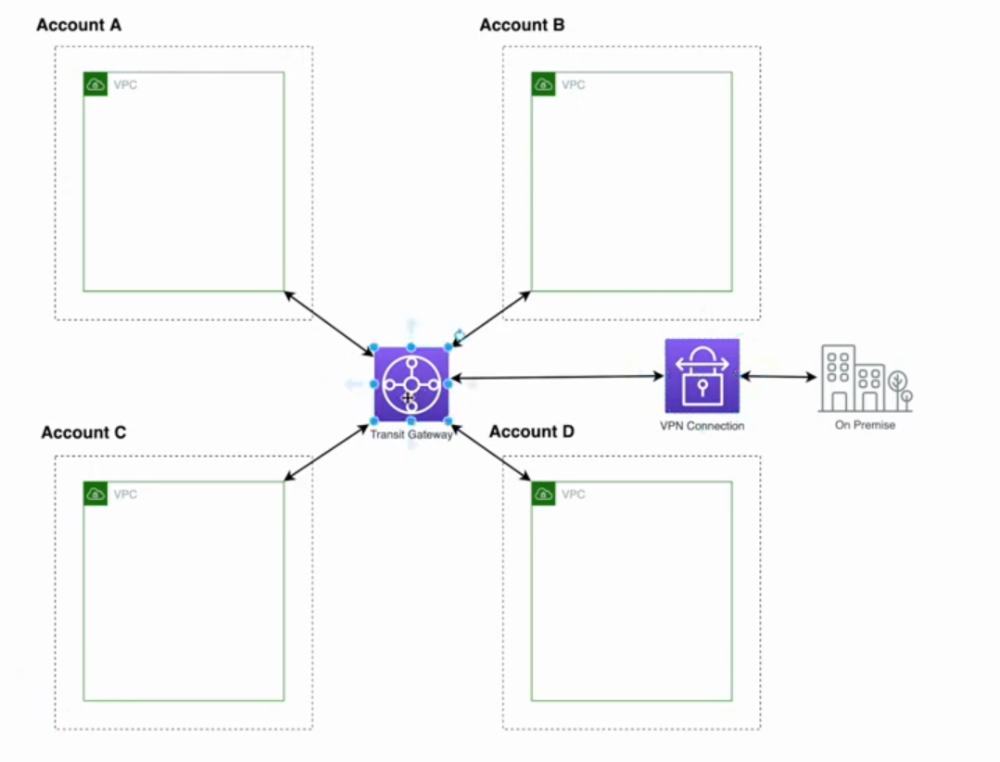

#AWS
This repo will be dedicated to AWS 

#AWS Services

1.Hosting a Static Website on AWS with S3, CloudFront and Route53 | Web | Hosting | AWS
  

- Below service will be used
    - S3: Upload website code
    - CloudFront: CDN to cache request
    - Route53: Act as a DNS to redirect request to Cloudfront
    - Certificate Manager: Apply the certificate to CloudFront so that it would support SSL
    
- Steps
    1. Get a domain. 
    2. Create a hosted zone in route53 and copy namespace values to domain nameservers.
    3. Create a S3 bucket with domain name and configure it as a static website hosting.
    4. Add a bucket policy so that it can be accessed.
        ~~~json
            {
              "Version":"2012-10-17",
              "Statement":[
                {
                  "Sid":"AddPerm",
                  "Effect":"Allow",
                  "Principal": "*",
                  "Action":["s3:GetObject"],
                  "Resource":["arn:aws:s3:::{bucket_name}/*"]
                  }
              ]
            }
        ~~~
    5. Now you should be able to access the site from S3, but we need to cache our site through cloudfront
    6. Create a cloudfront distribution and under the origin domain name paste S3 website url without http://
    7. Update domain name as Alternate domain name in cloudfront.
    8. Acquire a certificate and apply to cloudfront(ACM).
    9. You need to apply the CNAME given by certificate manager to route53
    10. You need to configure route53 to cloudfront using an A record with alias target to cloudfront domain name.

2.Deploying React, Angular, Vue.js apps on AWS

Check angular version
- ng version

Create new angular project
- ng new angularApp --style=scss --routing

- Steps
    1. Create a user that has permission to upload build files to S3.
        - Navigate to IAM
        - Create a new user with Programmatic access(AWS API,CLI,SDK access) and Management console access
        - Best practice to give only the access that the user needs rather than giving all the access(List access, GetObject and PutObject access)
        - You need to download Access key Id, Secret Access Key and Password for that user
    2. Configure AWS Cli in machine and Cli with created user
        - aws configure --profile {name}
    3. Write a simple script to deploy to S3
        ~~~json
           {
             "deploy-s3" : "aws s3 --profile {name} sync ./dist/ s3://{bucket-name} --region us-east-1"
           }   
        ~~~
    4. Invalidating CloudFront cache 
        ~~~json
           {
             "cache-bust" : "aws cloudfront --profile {name} create-invalidation --distribution-id {dist-id} --paths '/*'"
           }   
        ~~~
    5. Make sure to add permission for the above user to interact with cloudfront as well
 
3.Developing an API backend - AWS Lambda - API Gateway - DynamoDB

    
Serverless Framework
- npm install -g serverless
- serverless -v

Create a new service
- serverless create --template aws-nodejs --path my-service

~~~yml
service: my-service
provider:
    name: aws
    runtime: nodejs6.10
    profile: {username}
functions:
    hello:
        handler: handler.hello
        events:
            - http:
                path: users/hello
                method: get
~~~
   
Deploy a serverless app
- serverless deploy -v
    
Remove Serverless stack and everything provisioned
- serverless remove

- steps
    1. Need to create another path pattern that directs apis to API-Gateway
        - Navigate to cloudfront(copy api-gateway url)
        - Create another origin
            - domain as api-gateway url
        - Create another behaviour with path pattern as '/dev/*' 
 
 
4.Enabling gzip compression on S3 websites with Cloudfront

- steps
    1. If the website is being host through s3 bucket and cached through cloudfront we can inspect the site and check main.js bundle to see the 'Content-Type' of the served application which is 'application/javascript'
    2. We will enable compression that the website will load fast.
    3. Navigate to cloudfront
        - Click behaviour tab
        - Choose the default route that linked to s3 web application
        - Choose 'Compress Objects Automatically' and set it to 'Yes'
    4. Navigate to S3 and click the bucket
        - Select the Permission tab
        - Select CORS Configuration
        - Add below script, otherwise cloudfront will not know the size of the content 
        ~~~xml
       <AllowedHeader>Content-Length</AllowedHeader>
        ~~~
    5. We can enable compression inside S3 as well.
        - Navigate to properties of the object.
        - Click on Metadata
        - 'Content-Encoding' as 'gzip'
        - But if you are doing in this manner you need to upload files in gzip format
 
 
5.Building Web Apps with AWS Mobile Hub

- AWS Mobile hub supports iOS, Android, Web and React Native
- Create an app with preconfigured frontend and backend, set up your backend with AWS services configured(generates a cloud configuration file), connect your backend from our client.
- Features
    - Secure Authentication with AWS Cognito
    - Storage: S3
    - Serverless Functions: Lambda and API Gateway
    - Database: DynamoDB
    - Bots: Amazon Lex
    - Host web sites: CDN
    
- Steps
    1. Generate angular/react app
    2. Navigate to AWS Mobile Hub
    3. Setup AWS credentials
        - awsmobile configure
    4. Use below scripts
        - npm install -g awsmobile-cli
        - awsmobile --version
        - awsmobile init {token} - to link aws project with the generated app
    5. Push changes to aws mobile backend and run frontend locally
        - awsmobile run
    6. Any changes that are made from awsmobile hub side needs to be pulled back to client side using,
        - awsmobile pull
    7. Publish to s3 hosting bucket
        - awsmobile publish

6.User Authentication for Angular with AWS Cognito & Amplify

- Amazon Cognito Features
    - Secure and scalable user directory (Managed service)
    - Social and enterprise identity federation (Social: Google, Facebook, Amazon; Enterprise: Active Directory via SAML)
    - Supports Oauth2.0, SAML2.0, OpenID Connect
    - Fine grain access control
    
- Cognito Divides into
    - Cognito User Pools(for authentication: register users in user pool)
    - Cognito Federated Identities

- Steps
    1. Authentication
        1. User logs in with Username and Password
        2. Cognito verifies that and if credentials are correct it sends back response(id_token, access_token, refresh_token)
        3. These are temporary tokens and saved in the browser
    2. Authorization
        1. Sends tokens to Cognito and get temporary credentials from Cognito Federated Identities using STS(Security Token Service)
        2. STS sends(access_key_id, secret_key) back to the user
        3. User can use these temporary credentials to access AWS resources
        4. AWS resources grabs the role out of the credentials and checks the IAM policies attached to that role

- AWS Amplify
    - npm install --save aws-amplify
    - npm install --save aws-amplify-angular

7.Building a Secure Application on AWS - Cognito - API Gateway - Dynamodb

- Security

- Security Layer 1: Authentication Layer
- Security Layer 2: API Gateway Layer
    - For every API call jwt tokens that are stored in local storage will be sent as signed tokens
    - From signed tokens extract credentials and the IAM role.
    - Check against polices whether that IAM role is accessible to access APIs.
- Security Layer 3: DynamoDB Layer
    - Private : Users will not have any access to other users data
    - Protected: Users will read other users data and will not be allowed to update or delete each others items
    - Public: Users will read other users data and will be allowed to update or delete each others items
    - Partition key == users congnito id, so that the logged in user can only see his records from DynamoDB
    
Create API with Amazon API Gateway and Lambda
- awsmobile cloud-api enable --prompt

8.Building a S3 Directory for Your Company - S3 - IAM

- Steps
    1. Create a bucket for organization and create below directories
        - my-organization/Home/peter
        - my-organization/Home/ann
        - my-organization/Home/henry
    
        1. Any user can see all the other directories but cannot see the content
        2. Any user can only access his/her folder and can see the content
    2. Navigate to IAM 
        - Create a user 'Peter' with programmatic access and setup S3 browser with his credentials to S3 bucket
        - Attach below policy
            1. List all the buckets
            2. Get Bucket Locations
            3. Access to /Home
            4. Access to his/her bucket using IAM variables
            5. Allow all the actions
        ~~~json
        {
          "Version": "2012-10-17",
          "Statement": [
            {
              "Effect": "Allow",
              "Action": "s3:ListAllMyBuckets",
              "Resource": "arn:aws:s3:::*"
            },
            {
              "Effect": "Allow",
              "Action": "s3:GetBucketLocation",
              "Resource": "arn:aws:s3:::*"
            },
            {
              "Effect": "Allow",
              "Action": "s3:ListBucket",
              "Resource": "arn:aws:s3::my-organization",
              "Condition": {
                "StringEquals": {
                  "s3:prefix": [
                    "",
                    "Home/"
                  ],
                  "s3:delimeter": [
                    "/"
                  ]
                }
              }
            },
            {
              "Effect": "Allow",
              "Action": "s3:ListBucket",
              "Resource": "arn:aws:s3::my-organization",
              "Condition": {
                "StringLike": {
                  "s3:prefix": [
                    "Home/${aws:username}/*"
                  ]
                }
              }
            },
            {
              "Effect": "Allow",
              "Action": "s3:*",
              "Resource": [
                "arn:aws:s3::my-organization/Home/${aws:username}",
                "arn:aws:s3::my-organization/Home/${aws:username/*}"
              ]
            }
          ]
        }
        ~~~
    3. Add unique files to each of the users S3 directories

9. Building a chatbot with Amazon Lex - AWS

- Creating a conversational chatbot to retrieve weather information for users utterances using natural language.
- Steps
    1. Create an intent 'FindWeather'
        1. Add some sample utterances
            - "Tell me about the weather today?"
            - "How is the weather in {City}"
            - "What is the weather like in {City}"
        2. Create slots for variables
            - "Sure, Which city?" with {City} name
        3. Add Response message
            - "Temperature in {City} is 25C and Humidity level is 55%"
        4. Add AWS Lambda fulfillment
        5. Build the bot
    2. Create an intent 'GreetUser'
        1. Add some sample utterances
            - "Hi"
            - "Howdy"
            - "Hello"
        2. Create slots for variables
            - "Hi!! What is your {name}" with {Name} as name
        3. Add Response message
            - "Hello {Name}! How can I help you!"
            - "Hi {Name}! What do you want!"
        4. Build the bot
    3. Generate an angular application for weather app bot.
        - amplify init
        - amplify add auth
        - amplify push
        - Navigate to cognito and click 'Federated Identities' and find the role id
        - Navigate to IAM and attach 'AmazonLexFullAccess' policy
            
10. Containers on AWS
- Containers are an isolated resource section in our computer
- Will be talking about Docker with namespaces
- Volume mapping: It references original files rather than copying files to the container(e.g: Live reloading) 
- Steps
    1. Need to install Docker
        - docker --version
        - docker info
    2. Create Dockerfile
        ~~~.dockerfile
           FROM node:alpine
           WORKDIR '/app'
           COPY package.json .
           RUN npm install
           COPY . .
           EXPOSE 4200
           CMD npm run start
        ~~~
    3. Build the Dockerfile
        - docker build .
        - docker images
        - -p host_port: container_port
        - docker run -p 8080:4200
    4. Volume mapping with docker-compose.yml
        ~~~yml
            version: "3"
            services:
                myapp:
                    build: .
                    ports:
                        - "8080:4200"
                    volumes:
                        - "/app/node_modules"
                        - ".:/app"
        ~~~
    5. Run docker compose
        - docker-compose up

11. Deploying a containerized web application to Elastic Beanstalk

- Steps
    1. Navigate to Elastic Beanstalk(PAAS) - deploy, monitor and scale applications easily
    2. Create an Environment with docker
    3. Install EB Cli for relevant O/S
    4. Create multi step docker file
    ~~~.dockerfile
        FROM node:alpine as BUILD
        WORKDIR '/app'
        COPY package.json .
        RUN npm install
        COPY . .
        RUN npm run build
   
        FROM nginx
        EXPOSE 80
        COPY --from=BUILD /app/dist/myapp /usr/share/nginx/html
    ~~~
    5. Push to Elastic Beanstalk
        - docker run -p 80:80 {image_id}
        - eb --version
        - aws configure
        - eb init
        - Commit all the docker file changes before pushing to Elastic Beanstalk
        - eb create myapp
        - eb deploy
  
12 . Redirect URLs in AWS Using S3 and Cloud front
- eg: If we type any sub domains(www.mydomain.com or sub.mydomain.com) instead of Apex domain(mydomain.com) we need to redirect to apex domain
- Steps
    1. Needs to have an already created S3 bucket for apex domain
    2. Need to create a redirect bucket
    3. Select redirect bucket and navigate to properties and static website hosting
    4. Click 'Redirect requests'
        - Target bucket: mydomain.com
        - Protocol: https
    5. Navigate to CloudFront Distribution
        - Need to create another distribution for redirect bucket
        - Create SSL certificate to redirection bucket
        - For CNAME add 'www.mydomain.com'
    6. Navigate to route53
        - We need to create an A record for 'www.mydomain.com' DNS redirection with an ALIAS target for Cloudfront distribution created in step 5(domain name)
   
13 . How to Architect and Design Your Application on AWS Cloud    
- 5 Pillars of Well Architecture Application 
    1. Security
    2. Reliablilty: Ability for the system to recover from a certain disturbance, Horizontal scalability
    3. Performance Efficiency: High performance, hybrid architecture
    4. Cost Optimization
    5. Operational Excellence

- Steps
    1. Frontend
        - Angular Framework
        - AWS Amplify Library: Simple and Secure, make signed requests to backend resources
    2. Frontend Deployment
        - Host the website in S3 bucket: Reliability, 11 9s durability, cost effective, automatically scalable
        - Cloudfront in front of the S3 bucket: Performance efficiency, Caching, CDN
        - SSL certificate from ACM: Enable SSL, Connections will be encrypted
        - WAF on cloudfront: Security against common web attacks
        - Route53 as DNS
    3. Backend
        - Lambda to run business logic: Will scale automatically, serverless
        - API Gateway for API: Scales itself
        - DynamoDB as the database: NoSQL, Managed service, replicate data in different data center
    4. Search
        - Amazon ElasticSearch Service: Managed service, text based service, run in private network
        - AWS Lambda: Asynchronously index documents in ElasticSearch
    5. Authentication & Authorization
        - Amazon Cognito User Pool: Decouple users from application and they will serve in a highly scalable user pool
        - Amazon Cognito Identity Pool: IAM with Cognito users for more granular access
        
14 . Designing the AWS Project Architecture

- Frontend
    - WebApplication resides in a S3 bucket
    - Website is cached through Cloudfront and delivered through CDN
    - On Cloudfront applied a certificate to enable SSL and HTTPS from Amazon Certificate Manager, Web Application Firewall rules as well
    - Cognito as Authentication and Authorization provider
    - If the users are successfully signed in they are routed to Cloudfront via Route53 using DNS
    - In Cloudfront WAF checks whether they are legitimate requests if not requests are discarded
    - If legit request then checks whether the cache is available otherwise talk to S3 bucket and get the latest content and delivered
 
- Security considerations
    - Lambda must not be accessible over the internet
        - Need to put lambda functions within a VPC
        - It is our responsibility to handle all the network related task
            - Design IP ranges
            - Divide them to sub networks
            - Create different security groups
        - Create a different sub network without an internet access - private subnet(Lambdas cannot be accessed over internet)
        - "A Call Start" time will be longer after we put it inside a VPC
        
    - Database, ElasticSearch must not be accessible over the internet
        - Both these services are regional services and called through public endpoint
        - Lambdas need to connect with these 2 service over internet
        - DynamoDB and ElasticSearch services provide VPC endpoints
        - Through that VPC endpoints lambdas can communicate with these 2 services
        - We need to give access from dynamodb to lambda and vice-versa(for that we need to apply a security group in both places)
        
15 . Hosting a web application with AWS Amplify

- Steps
    1. Create an angular app
    2. Incorporate Amplify with the angular app
        - amplify configure and give programmatic access to AdministratorAccess policy
    3. Initialize Backend
        - amplify init
        - amplify will be using cloudformation stack to create the backend 
        - amplify hosting add
        - amplify publish
 
16 . Authentication & Authorization with AWS Amplify

- Steps
    1. amplify auth add
    2. Add amplify related changes in angular frontend side
   
    
17 . Single Sign On (SSO) with Facebook on AWS Cognito
- We'll be using Amazon Cognito Hosted UI for this
- Steps
    1. Navigate to Cognito
        - Navigate to the correct cognito user pool
        - Click 'Domain name' under 'App integration'
        - Check availability for a domain
        - Add social login with facebook as well
    2. SSO
        - When user logins through cognito authentication happens in Cognito user pool
        - Cognito checks whether the user is available in the pool and sends back access token, id token and refresh token
        - If the user wants to authenticate with facebook, cognito redirects it to facebook
        - After successful authentication facebook sends tokens/code to cognito user pool
        - Cognito checks tokens/code and create a record inside cognito pool and generates its own access, id and refresh token to the user
        - For any Identity provider we add, cognito will make sure for any authorized requests through these Identity providers it will create its own access, id, refresh tokens, so that the backend or frontend will rely on same set of tokens
 
18 . Authentication with Cognito Hosted UI
- Steps
    1. Will go through amazon cognito authentication documentation for configuring Hosted UI
        - Create an object with configuration
            - Domain, scope, redirectSignIn, redirectSingOut, responseType, AdvancedSecurityDataCollectionFlag
        
19 . DynamoDB, API Gateway and Amplify

- In this we'll be calling some API endpoints in API gateway which talks to a Dynamodb database using a lambda function
- VPC Endpoint will be added in upcoming session
- Steps
    1. Adding the API backend
        - amplify add api
    2. All the APIs will be generated for the given API endpoint with authentication and all the validation
    3. Check dynamodb for newly created table and API Gateway console for newly created API and endpoints
    4. Create home component
        - ng g c home
    5. Using Dynamodb streams to index records from dynamodb to ElasticSearch

20 . Connecting Azure Active Directory with Cognito
- How to setup Azure Active Directory as a 3rd party Identity provider for the application
- Steps
    1. Create a user pool and login with Cognito Hosted UI
        - Add an app client
        - Make a note of client ID
        - Check for a domain prefix
        - Copy the url format for 'Using the Hosted Domain'
        - Setup the redirect url
    2. Azure AD over SAML protocol
        - Need to provide metadata url and identifiers
        - Need to provide a user pool in AD
        - Need to provide configurations from cognito 
            1. Sign-On url
            2. Identifier uri
            3. Logout url
            4. Reply url
        - Update the manifest with above values
        - Need to get Azure metadata document and apply to cognito side
        - Add attribute mappings
    3. When user types corporate email they will be redirected to Azure AD
    4. Authenticate against AD
    5. If success redirect to application

21 . Working with DynamoDB and Elasticsearch

 - Steps
    1. When a product is added to dynamodb stream lambda function will trigger
        - Need to enable dynamoDB streams in dynamoDB
    2. It will index the record in ElasticSearch
    3. This is an asynchronous operation
    4. Dynamodb streams and lambdas are managed services
    5. Need to create an ElasticSearch service inside the private subnet of VPC
    6. Create a lambda function with an IAM role so that it can communicate with ElasticSearch service
        ~~~json
        {
          "Version": "2012-10-17",
          "Statement": [
                  {
                    "Effect":"Allow",
                    "Action":[
                      "es:ESHttpPost",
                      "es:ESHttpPut",
                      "dynamodb:DescribeStream",
                      "dynamodb:GetRecords",
                      "dynamodb:GetShardIterator",
                      "dynamodb:ListStreams",
                      "logs:CreateLogGroup",
                      "logs:CreateLogStream",
                      "logs:PutLogEvents"
                    ],
                    "Resource": "*"
                  }
          ]
        }
        ~~~
    7. Create a security group in ElasticSearch domain and apply the same in lambda so that communication can happen

22 . GraphQL in AWS with AppSync, Amplify and Angular 
- GraphQL
    - Fast and flexible compared to REST
    - GraphQL client decides what data to receive
    - Operate over HTTP
    - Fewer HTTP requests
    - Flexible data querying and less code to maintain    

- Operations
    - Query: Fetch the data from GraphQL - Get
    - Mutation: Change data - Create/Update/Delete
    - Subscription: Watch data for changes in Real time
        - Happens through web sockets

23 . Modeling Relationships in GraphQL
- Relationships
    - 1:1: Department has a Manager
    - 1:M: Department has many employees
    - M:N: Project has many Employees and Employees can be assigned to many projects

- Steps
    1. 'amplify api add' and choose graphql
        ~~~text
            type Department @model{
                id: ID!
                name: String 
                manager: Employee @connection
                employees: [Employee] @connection(name: "DeparmtentEmployees")
            }
            type Employee @model{
                id: ID!
                name: String 
                age: Int
                department: Department @connection(name: "DeparmtentEmployees")
                projects: [EmployeeProjects] @connection(name: "EmployeeProjects")
            }
            type EmployeeProjects @model (queries: null){
                id: ID!
                employee: Employee @connection(name: "EmployeeProjects")
                project: Project @connection(name: "ProjectEmployees")
            }
            type Project @model{
                id: ID!
                name: String 
                employees: [EmployeeProjects] @connection(name: "ProjectEmployees")
            }
        ~~~
    2. 'amplify api gql-compile' will recompile the graphql stack in appSync

24 . How to send realtime updates with GraphQL subscriptions
- AppSync is a managed graphQL server
- Subscription are watching over changes in graphQL
- Steps
    1. When have a subscription it will send all the changes to all the clients who are listening

25 . Let's Build an Offline Web App
- AWS AppSync SDK with Offline mode
- GraphQL uses Apollo Client which gives offline support
- Steps
    1. Install below dependencies
        ~~~text
           npm install -g @aws-amplify/cli
           npm install --save aws-amplify
           npm install --save aws-amplify-angular
           npm install --save aws-appsync graphql-tag
        ~~~      
       
26 . FullStack WebApp with AWS Amplify and Angular
- Navigate to https://enlear.academy/lets-build-a-profile-app-with-aws-amplify-part-01-bb596e682d3a
- Steps
    1. Using Angular with Amplify using App Sync for API layer
   
   
27 . Let's Build a Talking App! - (Amazon Polly, S3, Lambda, Angular)
- Steps
    1. Amazon Polly: Turn text into lifelike speech
        - Extract the text what the user has typing in and the selected voice id 
        - Call in SynthesizeSpeech API and store it, inside a S3 bucket
        - Get a signed url for that particular audio stream
        - Sends back to the application
    2. Create the backend using serverless framework
        ~~~text
        npm install serverless -g
        serverless create --template aws-nodejs --path backend
        npm i aws-sdk
        npm i uuid
        ~~~

28 . Sentiment Analysis with AWS Comprehend
- AWS Comprehend: Is a NLP(Natural Language Processing) service to discover insights and relationships in text.
- The sentiment can be either Positive, Negative or Neutral

29 . Secure Static Hosting with S3, CloudFront and OAI(Module 1)
- Using S3, CloudFront, Cloud 9 IDE
- S3
    - 
    - Types of Storage
        - Object Storage: Any static content eg: CSS, JS, Audio, Video, Images, HTML
        - Block Storage: Apache or Nginx which needs an Operating System eg: EBS attached to EC2
    - Access Control
        1. Resource Based Policies
            - Bucket Policy
            - ACL
        2. User Based Policies(Applied to IAM users)
    - Consistency Models
        1. Strong consistency/Immediate/Read-after-Write
        2. Eventual consistency
        
- Amazon CloudFront
    - AWS have edge locations around the world
    - When we configure a cloudfront we must block direct requests to the S3 bucket by bypassing CloudFront distribution
    - We can do this by using OAI(Origin Access Identity): Treat Cloudfront as a User
    - Only ALLOW that user to talk to the S3 bucket
    - S3 bucket is not publicly readable
    - Use Signed Url or Signed cookies together with OAI to the S3 bucket

30 . Cloud9 IDE Setup
- Steps
    1. Create an environment
    2. Clone specific branch
        - git clone -b {branch_name} {https_url}

31 . Secure Static Web Hosting with CloudFront and S3 with Origin Access Identity
- Steps
    1. Create S3 bucket
        - aws s3 mb s3://{bucket_name}
    2. Give access to cloudfront oai user to access S3 bucket
        ~~~text
        {
          "Id": "PolicyForCloudFrontPrivateContent",
          "Version": "2008-10-17",
          "Statement": [
            {
              "Sid": "1",
              "Effect": "Allow",
              "Principal": {
                   "AWS": arn:aws:iam::cloudfront:user/CloudFront Origin Access Identity {oai_id}
               },
              "Action": "s3:GetObject",
              "Resource": "arn:aws:s3:::{bucket_name}/*"
            }
          ]
        }
        ~~~
    3. Create OAI in cloudfront
        - aws cloudfront create-cloud-front-origin-access-identity --cloud-front-origin-access-identity-config CallerReference=Mysfits,Comment=Mysfits
    4. Adding bucket policy for the created S3 bucket
        - aws s3api put-bucket-policy --bucket {bucket_name} --policy {location_in_my_pc}
    5. Create a cloudFront distribution
        - Origin: S3 bucket
        - aws cloudfront create-distribution --distribution-config {path_to_distribution_config}
    6. Upload content to S3
        - aws s3 cp {path_to_index.html} s3://{bucket_name}/index.html

32 . Setting up a VPC & Networking to Run Fargate Containers(Module 2)
- Containerized Applications will,
    - Maximize the resource utilization
    - Run multiple containers inside the same server
    - Enable load balancing
    
- Steps
    1. Setting up a private network (VPC) on AWS
        - VPCs are logically isolated from other virtual networks in AWS
        - A subnet that has a route out to the internet is called a "Public Subnet" else it is called "Private Subnet"
        - VPC Endpoints allows VPC to connect to resources privately to other AWS services without using internet. Traffic never leaves the AWS network
        - 2 types of VPC endpoints
            1. Interface endpoints: Network interface(ENI) that points to the other AWS service
            2. Gateway endpoints: A gateway that can be set as a target in the route table
    
33 . Load balancing on ECS Cluster Powered by AWS Fargate
- Steps
    1. Deploying a service in ECS(Elastic Container Service)
        - AWS Fargate: Without having to manage the cluster or server
        - We will be using AWS Fargate launch type instead of EC2 launch type
        - Will deploy multiple containers of the backend for High Availability
        - Services are exposed via a Load Balancer
        - Load balancer directs traffic to tasks of the service
        
        - ECS Cluster
            - Cluster provides compute, memory and storage for tasks
            - If we use Fargate AWS will manage cluster resources
            - Task definition is like the blueprint of the application
            - Task/Container is an instantiation of a task definition
            - It is a json document which describes tasks
            - A service launches specified number of tasks/containers from a task definition
            - Service can run behind a Load Balancer to distribute traffic across its task
            
        - Task Networking
            - Tasks that uses Fargate launch type requires 'awsvpc' network mode
            - 'awsvpc' network mode provides an ENI for each task
            - You need to specify which subnets, the ENI should be attached
            - Need to specify the security group for the ENI
            - If the ENI is attached to a public subnet it will receive a public IP or else a private IP
            - Tasks in private subnet will use NAT gateway to access internet and pull docker images to run the containers
        
        - Load Balancing
            - To configure a load balancer you need to create target groups
            - Target groups can be either instances or ip addresses
            - Load balancer has listeners configured with a port and a protocol
            - Listeners have rules that will direct traffic to target groups if matched
            
34 . Microservice Implementation on AWS with ECS, Fargate, ECR and NLB
- Steps
    1. Create cloudformation stack(Refer 'core.yml')
        - aws cloudformation create-stack --stack-name {stack_name} --capabilities CAPABILITY_NAMED_IAM --template-body file://~/environment/aws-modern-application-workshop/module-2/cfn/core.yml
    2. Describe stack
        - aws cloudformation describe-stacks --stack-name {stack_name}
    3. Build docker image
        - docker build . -t {account_id}.dkr.ecr.{region}.amazonaws.com/{repo_name}:latest
    4. Create ECR(Elastic Container Registry: like docker hub)
        - aws ecr create-repository --repository-name {repo_name}
    5. Create ECS cluster
        - aws ecs create-cluster --cluster-name {cluster_name}
    6. Create log group
        - aws logs create-log-group --log-group-name {log_group_name}
    7. Create a task definition: Refer "task-definition.json"
        - aws ecs register-task-definition --cli-input-json file://~/environment/aws-modern-application-workshop/module-2/aws-cli/task-definition.json
    8. Create a network load balancer
        - aws elbv2 create-load-balancer --name {load_balancer_name} --scheme internet-facing --type network --subnets {public_subnet1_id} {public_subnet2_id} > ~/environment/nlb-output.json
    9. Create a target group
        - aws elbv2 create-target-group --name {target_group_name} --port 8080 --protocol TCP --target-type ip --vpc-id {vpc_id} --health-check-interval-seconds 10 --health-check-path / --health-check-protocol HTTP --healthy-threshold-count 3 --unhealthy-threshold-count 3 > ~/environment/target-group-output.json  
    10. Create Listener
        - aws elbv2 create-listener --default-actions TargetGroupArn={target_group_arn},Type=forward --load-balancer-arn {load_balancer_arn} --port 80 --protocol TCP         
    11. Create ECS iam role
        - aws iam create-service-linked-role --aws-service-name ecs.amazonaws.com
    12. Create ECS service(refer 'service-definition.json')
        - aws ecs create-service --cli-input-json file://~/environment/aws-modern-application-workshop/module-2/aws-cli/service-definition.json
   
35 . ECS Container Networking & Load Balancing Architecture
- Steps
    - Frontend is hosted inside a S3 bucket
    - Any request that generated from the frontend will first hit Load Balancer
    - Load Balancers have multiple rules defined for it and if any rule matches it will redirect requests to a Logical grouping called 'Target Groups'
    - These targets can be either EC2 instances or IP addresses
    - Since we are using AWS Fargate mode and using 'awsvpc' network mode each an every container will receive private IP address from the range of private subnet
    - In order to launch containers in our cluster we need to define 'services'(task definition and desired count)
    - We can associate target groups through services
    
36 . Docker CI_CD Pipeline on AWS
- Steps
    - What is CI/CD
        - Automating the release process
        - Four stages of release process
            1. Source Code: Use a centralized code repository, peer review the code before merging
            2. Build: Compile the code, run unit test, create container images eg: AWS Code build, Jenkins
            3. Test: Integration tests, UI tests, load, testing
            4. Deploy: Deploy to production environment, monitor code in production environment to detect errors
        
     
37 . Docker CI_CD pipeline on AWS - Part 2
- Steps
    1. Source Code resides in a centralized code repository: AWS CodeCommit
    2. Build process uses AWS CodeBuild
        - Will provision a small server and then pull the code from the given branch
        - Docker image(container image) created from the Dockerfile
        - Images will be pushed to ECR(Elastic Container Registry)
        - All these commands are stored in 'buildspec.yml'
            1. PreBuild: Logging in to ECR
            2. Build: Build the docker image and tag
            3. PostBuild: Push the image to ECR
    3. Create S3 bucket to store the artifacts
        - aws s3 mb s3://{artifact_s3_bucket_name}
    4. Push the bucket policy to S3(Refer artifacts-bucket-policy.json)
        - aws s3api put-bucket-policy --bucket {artifact_s3_bucket_name} --policy file://~/environment/aws-modern-application-workshop/module-2/aws-cli/artifacts-bucket-policy.json
    5. Create AWS CodeCommit Repository
        - aws codecommit create-repository --repository-name {code_commit_repo_name}
    6. Create a CodeBuild Project(Refer 'code-build-project.json')
        - aws codebuild create-project --cli-input-json file://~/environment/aws-modern-application-workshop/module-2/aws-cli/code-build-project.json
    7. Create a CodePipeline pipeline(Refer 'code-pipeline.json')
        - aws codepipeline create-pipeline --cli-input-json file://~/environment/aws-modern-application-workshop/module-2/aws-cli/code-pipeline.json
    8. Enable access to ECR(Refer 'ecr-policy.json')
        - aws ecr set-repository-policy --repository-name mythicalmysfits/service --policy-text file://~/environment/aws-modern-application-workshop/module-2/aws-cli/ecr-policy.json
    
38 . Introduction to Lambda Resolvers with AWS Amplify  
- Directives: @model, @key, @connection, @auth, @versioned, @searchable, @function
         
- @function: Creates Lambda resolvers
- amplify add function
    
39 . S3 web hosting with CloudFront and OAI

- Steps
    1. Create S3 bucket and give a unique name(Give public access to S3 bucket)
    2. Enable static web hosting
    3. Apply a bucket policy
    ~~~json
             {
          "Version":"2012-10-17",
          "Statement":[
            {
              "Sid":"AddPerm",
              "Effect":"Allow",
              "Principal": "*",
              "Action":["s3:GetObject"],
              "Resource":["arn:aws:s3:::{bucket_name}/*"]
              }
          ]
        }
    ~~~
    4. Create a Cloudfront distribution with Origin as the S3 bucket

40 . Learn AWS Amplify Console
- Steps
    1. React + Amplify implementation 
    2. Checkout to amplify dev branch
        - amplify env checkout dev

41 . Realtime and Offline API Design
- Steps
    1. amplify init
    2. amplify add api
    3. amplify add storage

42 . Serving Multiple Websites with AWS CloudFront & Lambda at Edge
- Steps
    1. Create 2 S3 buckets to hold new and old front end application code with public access
    2. Add static web hosting for both buckets
    3. Add a bucket policy for anonymous users
    4. Create a cloudfront distribution to support old code
    5. Create lambda@edge function to navigate to different domain based on the cookie value
    6. Whitelist cookie in cloudfront distribution cache for forward requests

43 . Building a CICD pipeline for Serverless Apps with UI Testing
- Steps
    1. Create CodeBuild pipeline
    2. Add Github to the Source stage
    3. Create new code build project for frontend
    4. Create new code build project for backend

44 . Continuous Delivery with AWS Fargate
- Steps
    1. Build Docker image\
        - docker build -t cicd-local:latest .
    2. Run container locally
        - docker run -it -p 80:3000 {container_id}
    3. Push to Remote repository
        - Login to AWS
        - Build the image
        - Push to repo
            - docker tag {image_name} {ecr_url}/{name}:latest
            - docker push {ecr_url}/{name}:latest
    4. Setup network
        - Create a VPC
        - Create public and private subnets
        - Create an internet gateway
        - Attach Internet Gateway to public subnet
    5. Create ECS cluster
        - Create Task Definition
        - Create Services
        - Create Application Load Balancer
        - Create Nat Gateway
      
  
- Steps
    - Automating the whole process
    1. Create CodePipeline pipeline and connect to github as the source and map the github repository
    2. Create CodeBuild project
 
45 . 5 Steps to Design Your DynamoDB Database
- Data modeling is how an application stores data in a given database related to the real world entities

- Relational Databases
    1. Optimized for storage with data normalization
    2. Each table has a strict schema
    3. Need more compute power to retrieve data from multiple tables
    4. Performance may degrade as the database scales
    
- NoSQL Databases
    1. Optimized for compute
    2. Flexible schema
    3. Designed for highly scalable application(Horizontal)
    
- For caching on DynamoDB use DAX(DynamoDB Accelerator)
- 5 Step Process
    1. Draw an entity diagram
          
    2. Identify the relationships between entities
    3. List down all the access patterns for each entity
        - Organization
            1. All CRUD operations
            2. Find all the projects of an organization
            3. Find all the employees of an organization
            4. Find all the projects and employees of an organization
            5. Find an organization by name
        - Project
            1. All CRUD operations
            2. Find a project by name
            3. Find the employees assigned to a project
            4. Find agile /fixed-bid projects
            5. Find on-hold projects
        - Employee
            1. All CRUD operations
            2. Find all the projects an employee is part of
            3. Find an employee by name
    4. Identify the primary key for each entity
          
    5. Identify secondary indexes for additional access patterns
     
46 . Additional Access Patterns
- Inverted Index
- GSI Overloading
- Sparse Index
     
47 . AWS Amplify DataStore          
- DataStore with Amplify is a powerful combination that provides a seamless way to handle data synchronization and offline functionality in your applications
- When testing locally all the data is saved in Indexed DB

48 . Encrypting Data with AWS KMS(Key Management Service)
- Implement encryption for both data-in-transit(SSL) and data-at-rest
- Steps
    - Client Side Encryption
        - You encrypt your data and manage your own keys
    - Server Side Encryption
        - AWS encrypts your data and manages the key for you

- How to encrypt_decrypt data with AWS KMS and OpenSSL

- AWS Encryption
    - DynamoDB Encryption Client
        - Only encrpyts payload
        - Key is not encrypted
    - S3 Encryption Client
    - AWS Encryption SDK
        - If we need to encrypt data in general in client side use AWS Encryption SDK

49 . AWS Lambda Layers - Sharing Code Between Lambda Functions
- Lambda layer is an archive that can contain additional code or other content. A layer can contain libraries, a custom runtime, data, or configuration files.
- Local development doesn't have access to lambda layers
- When lambda layer is updated we need to change the version number as well. Need a solution to overcome that as well

50 . Upload Large Payloads - AWS Lambda and S3

  
- API Gateway can only supports 10MB of payloads
- Lambda invocation maximum payload is 6MB

- According to the architecture S3 bucket will send an event to Lambda function
- We need to upload to S3 using a S3 presigned url and trigger a lambda asynchronously
- To get a presigned url there will be a method added to API gateway

51 . How to Alert Production Errors in Real-Time for Serverless Apps

  

52 . Kibana Dashboard with AWS ElasticSearch and Cloud Watch
- Steps
    1. Navigate to Cloud watch log group and select the log group
    2. Create an ElasticSearch subscription filter
    3. We need to have IAM role that index logged data to ES using a lambda function
    4. Configure a filter pattern so that it will limit the data that gets indexed to ES
    5. Create an index pattern in kibana

53 . Gatsby on AWS - Building A Complete Project
- Steps
    1. npm i -g gatsby-cli@2.12
    2. npm i -g @aws-amplify/cli@4.21
    3. Generate gatsby new project from template
    4. Add amplify as well

54 . How to Built an Online Store
- Steps
      
    1. Add amplify library 
        - npm i -g @aws-amplify/cli@4.24
    2. Config AWS
        - amplify configure(administrator access is default selected)
    3. amplify init: to generate an amplify project
    4. Add authentication
        - amplify add auth
    5. Add storage
        - amplify add storage
    6. Add 2 lambda function
        - amplify add function
    7. Add graphql api
        1 amplify add graphql
    8. Always estimate your cloud cost as well

55 . Amazon Honeycode
- Can build 3 Tier business applications without coding
- Runs on Web and mobile
- Share data in real time
- Send notifications 
- Manage business workflows

56 . How to add custom domains with HTTPS
- Attach SSL certificate
    1. Cloudfront distribution layer
    2. Application Load Balancer layer
    3. Elastic Beanstalk layer
    4. Using amplify console

57 . Continuous Deployment with AWS Amplify
- Creating multiple branches to point to different environments
    1. master -> prod
    2. develop -> dev
    3. test -> qa
- Steps
    1. Connect all the remaining branches
    2. Navigate to Domain Management and click manage subdomains
    3. Create dev-{naked-domain} -> dev repo and qa-{naked-domain} -> test

58 . AWS Amplify Console - Password Protect Websites
- If you want to send an unreleased version to a stakeholder you can use the password protection to an environment using amplify
- Navigate to Access control and select the branch and select "Password Required"

59 . AWS Amplify DevOps - Building Pull Requests
- PR reviews work only for private repositories
- Steps
    1. Navigate to aws amplify and click deploy
    2. Link a github project and select the branch and deploy
    3. Click on previews
    
60 . Web Content Compression with AWS CloudFront - Brotli vs GZip
- Steps
    1. Create a serverless app
        - serverless create --template aws-nodejs
    2. Deploy api
        - sls deploy --stage dev
    3. Create cloudfront 
    4. Compression applying at cloudfront level(Create behaviours for all the endpoints separately)
        1. Not applying compression
            - set cache policies
            - uncheck cache gzip and cache brotli objects
            - select no as compression
        2. Applying GZip compression
            - set cache policies
            - check only gzip
            - select yes as compression
        3. Applying Brotli compression
            - set cache policies
            - check only brotli
            - select yes as compression

61 . How to Create a Highly Secure MongoDB and Lambda Connection
- Steps
      
    - When a VPC peering is enabled all the traffic are traversed through AWS backbone network, so it is not vulnerable to internet attacks

62 . Stop Lambda Cold Starts in your Serverless Apps
- What is cold start?

- Lambda Ping(CloudWatch event that pings the lambda)

- Steps
    1. CloudWatch will issue a schedule event and it will ping the lambda so that it will keep the execution environment active
    2. Lambda will try to remove this execution environment probably after 1 hour
    3. Add npm i serverless-plugin-warmup dependency
    4. Add customer warmup block in serverless.yml
    
- Lambda Provision concurrency

- Steps
    1. For an AWS account you get 1000 provision concurrencies
    2. It will generate x number of pre warmed environments
    3. Add provisionedConcurrency variable in serverless.yml    

63 . How did we reduce costs by 30% using AWS Shared VPC
- Steps
      
    1. AWS Transit Gateway
        - AWS Transit Gateway connects your Amazon Virtual Private Clouds (VPCs) and on-premises networks through a central hub
        - We can manage routing logics, VPC to VPC, VPC to VPN
      
    2. However, if we have 1 VPC that spans across all the AWS accounts then all the network will be managed by 1 VPC
      

64 . AWS Shared VPC
- Steps
      
    1. We have 2 AWS account(Using AWS Organization)
        a. Account A - Production
        b. Account B - Dev
    2. Add separate Roles and tags for both accounts         
    3. Create a VPC with CIDR block 10.0.0.0/16 and enable DNS resolution for the VPC
    4. Create a private subnet with CIDR block 10.0.1.0/24 
    5. Create a public subnet with CIDR block 10.0.2.0/24
    6. Create an Internet Gateway and attach to the VPC
    7. Create a NAT Gateway and assign it to the public subnet and allocate an Elastic IP as well
    8. Create private Route table
        - 0.0.0.0/0 directed to NAT Gateway
    9. Create public Route table
        - 0.0.0.0/0 directed to internet Gateway
    10. Navigate to public subnet and navigate to route table and associate to the public route table
    11. Navigate to private subnet and navigate to route table and associate to the private route table
    12. Create an ElasticSearch cluster from production account and select Allow open access to the domain
    13. Navigate to Resource Access Manager(RAM) and select private and public subnet
    14. Make sure to add Dev account id as Principal and add some tags as well
    15. Go to AWS Organizations from master account and enable resource sharing
    16. Create a lambda function and make sure to add elasticsearch inside the VPC private subnet
    17. Create a production user for production and deploy the lambda to stage prod
    18. Create a separate SG for dev account that associated with the lambda
    19. Navigate to production account and find the SG that allows access for ES and add a new inbound path for all the traffic from dev SG as well
    20. Create a dev user for development account

#AWS Theories

1 . What is Cloud Computing
- Cloud computing is the on demand delivery of compute power, database storage, applications and other IT resources through a cloud services platform via the internet with pay as you go model.

- Vertical Scalability(Scaling UP)
~~~txt
1GB RAM                     Increase of traffic  16GB RAM 
             --------------------------------->
500GB HDD   <---------------------------------   1TB HDD
                            Decrease of traffic                                
~~~
- Horizontal Scalability(Scaling OUT)
~~~txt
1GB RAM                     Increase of traffic  1GB RAM    1GB RAM    1GB RAM
             --------------------------------->
500GB HDD    <---------------------------------  500GB HDD  500GB HDD  500GB HDD
                            Decrease of traffic                
~~~
- Auto Scaling
~~~txt
If CPU > 70% -------------------------> Spin 3 more servers
If CPU < 50% -------------------------> Decrease to 1 server  
~~~

- Cloud Computing
    - Converts Capex to Opex(Capital Expenditures to Operational Expenditures)
    - On demand
    - Pay as you go
    - Elastic services
    - Managed via internet
    - Fast deployment
    
2 . Types of Cloud Computing

- Virtualization
    - Ability to host multiple clients on the same infrastructure while maintaining isolation among each other
    
- Types of Cloud
    - IAAS: Infrastructure As A Service
        - All the Infrastructure related changes will be managed by the user(Installation and patches)
    - PAAS: Platform As A Service
        - Infrastructure managed by AWS, we only need to focus on code and other stuff
        - eg: Elastic Beanstalk
    - SAAS: Software As A Service
        - Zero administration
    
3 . AWS VPC - Networking on AWS
- On Prem Architecture
    
    - Explanation
        - IP Range is divided to 2 sub-networks
        - Web servers are in 1 sub-network and it is protected by a firewall and users can directly talk to the web server
        - Application server and database server can only be accessed through web servers only
        
- AWS Architecture
    
    - Explanation
        - When we spin up an EC2 server if we don't specify a network or a VPC it will be assigned to the default VPC
        - Virtual Private Cloud(VPC) we have full control over network, security, resources and it is isolated from other AWS customers
        - VPC is only associated with 1 region in AWS(Cannot have a VPC spanning over different regions) and we need to define an IP range for VPC
        - IRC 1918 standard
            1. 10.0.0.0/16
            2. 172.16.0.0/16
            3. 192.168.0.0/16
            
        - CIDR Notation
            1. eg: 10.0.0.0/16 
                - Total IP Count: 2^(32-16)=65536
            2. eg: 192.168.0.0/24 
                - Total IP Count: 2^(32-24)=256
            - AWS will reserve 5 addresses from these(first 4 and last address)
            - Maximum cider that AWS supports is /16 and minimum is /28
        - Can create multiple sub-networks inside a VPC and it corresponds to an Availability Zone
        - Subnetwork IP ranges cannot overlap
        - VPC Router allows communication between sub-networks
            - eg: Destination: 10.0.0.0/16 Target: local
            - Web server can communicate to Backend server and vise versa if the ip range falls into the Destination
        - We need internet access for web server(Need to setup an internet gateway for subnet1)
        - Internet gateway is a managed service and you dont find any single point of failure
        - Create another route entry in the route table associated for subnet1 that points out to internet gateway
            - eg: 0.0.0.0/0 internet-gatewat-id
        - If any subnetwork doesn't have an internet gateway associated with or any routing rule for internet gateway that subnetwork is a Private subnetwork
        - Application server and the database server needs to run updates for that we can setup a NAT Gateway in public subnet
        - We can add a route to the NAT gateway which points to 0.0.0.0/0
        
4 . Security Groups and NACL in VPC
- Steps
    1. We need to define firewall rules so that who can access which resources on which ports
    
        - Security Groups(Firewall)
            1. EC2 server communicates with the subnet via ENI(Elastic Network Interface) - virtual network interface card attached to a virtual server
            2. Security Groups works at ENI level(Instance level)
            3. Allow or block traffic in and out of EC2 instance
            4. EC2 instance can have upto 5 security groups
            5. Stateful
            6. Can have only 'Allow' rules
            7. If no rule is defined, traffic is blocked to the instance
        - NACLs(Network Access Control List)
            1. NACL works at subnet level
            2. Stateless
            3. Both 'Allow' and 'Deny' rules are possible
            4. Rules are evaluated from Lowest to Highest
            5. Lower the rule number, higher the priority
            6. Rules are applied to all the instances within the subnet
            7. Default NACL -> traffic is allowed for both inbound and outbound
        
     
     
5 . Amazon Virtual Private Cloud (VPC)   
    

- Steps
    1. Spin up a VPC in a selected region
        - For every region there is a default VPC
        - Give a cider block for VPC eg: 10.0.0.0/16
        - You will get a Main Route table, Main Network ACL and DHCP options set
    2. Allocate subnetworks
        - Private subnet with cider block of 10.0.0.0/24
        - 1 subnet should have an availability zone
        - Public subnet with cider block of 10.0.1.0/24
    3. Check default NACL created with the VPC
        - It is associated with 2 subnetworks
        - Inbound rule and Outbound rule
            1. ALL Traffic ALLOW for any source(0.0.0.0/0) for all the port ranges and for all the protocols
    4. Check default Route table associated with the VPC
        - Click Subnet Associations and edit and add public subnet
    5. Create an Internet Gateway
        - Attach the Internet Gateway to the VPC
        - For public route table add the internet gateway for all 0.0.0.0/0 destination
        - Create a private route table but dont attach the internet gateway because private subnet should not be directly accessed through internet
    
6 . Security Groups and Launching EC2 Instances
- Steps
    1. Launch EC2 instances in both private and public subnet
        - WebServer
            - Enable http, https and ssh(only my ip) for the 'webserver' instance that resides in public subnet
            - Add public ip while configuring so that the instance can be accessed via internet
            - When you restart the instance public ip address will be changed to a different address from aws ipv4 pool
            - If we want to mitigate earlier issue we need an elastic IP
            - Permission Levels
                - chmod 777(owner, group, public)
                    - 1: execute
                    - 2: write
                    - 4: read
        - Backend
            - Do not add public ip while configuring
            - To talk from web-server to backend allow access for 'web-server-security-group' as the source
            - Still we cannot ssh into backend server from web-server bacause we do not have the pem file there
            - Its not a security best practice to copy private .pem file to webserver
            - Best practice is to use SSH agent forwarding

7 . SSH Agent Forwarding - Connecting to EC2 Instances
- To connect to an instance that resides in a private subnet through an instance in public subnetwork
- Steps
    1. Navigate to local machine
        - For windows use 'putty' and for MAC use terminal
        - Mac
            - Add .pem file to ssh agent
                - eg: ssh-add -K my-private-key.pem
            - Connect to web server
                - eg: ssh -A ec2-user@35.123.48.34
            - After you connect to webserver ssh to database server using the forwarded ssh agent 
    - Even though we connected to database server we cannot communicate with the internet to download updates(for that we need NAT gateway or Instance)
    
8 . Nat Gateway vs NAT Instance
- Steps
    1. We need to place a NAT gateway or an instance in public subnetwork(NAT will have internet connectivity)
    2. Add a new route to private subnet
    3. Comparison
        
        
    
        - NAT Gateway
            
            1. Need to setup NAT gateway in public subnet
            2. Need to assign an Elastic IP for NAT gateway.(public IP that use to connect to internet)
            3. Update route table of private subnet to allow for Destination -> 0.0.0.0/0 and Target -> nat-gateway-id 
        - NAT Instance
            1. Can have an Elastic IP or the Public IP to communicate
            
            2. We need to disable source/destination check for the NAT instance
       
9 . AWS IAM
- AWS IAM provide access to,
    1. Users
    2. Groups
    3. Roles

- AWS Polices
    1. Managed polices: Managed by AWS
    2. Custom policies: Managed by customer
 
- Access Key ID and Secret Access Key is used when using AWS cli api
- Password is needed to access AWS Console

- IAM Roles
    - Roles have 2 parts. Permission policy and Trust policy
    - Permission policy describes the permission of the role
    - Trust policy describes who can assume that role(who can do what on which resource)
    - Once the role is assumed by an allowed entity, AWS STS(Security Token Service) provides temporary security credentials to the entity
    - It contains
        1. Session Tokens
        2. Access Key Id
        3. Secret Access Key
        4. Expiration
- Main Policy types
    1. SCPs(Service Control Policies)
        - In AWS Organization there can be multiple Organizational units under root or there can be multiple accounts inside an Organizational unit
        - We can attach SCPs directly to Organizational Unit or account
    2. Identity Based Policies
        - In Identity Based Policies we dont need to define a Principal
    3. Resource Based Policies   
        - We need to define a Principal(IAM user or role)
   
- Identity Federation
    1. SAML Based Identity Federation
        - IAM allows 5000 users per account(hard limit)
        - Identity Federation is based on trust
        - Manage Identites or users externally to the AWS for SAML it is Active Directory of on premises organization
        - Setup trust between on premises Active Directory and AWS
        - Two types of SAML Based Identity Federation
            1. AWS Console Access
                
            2. AWS API Access 
                
        
    2. Web Identity Federation
        - Identities are maintained in external identity providers like Facebook, Google, Twitter
            
            
# Exam Guides
- Define solutions using architectural design principals based on customer requirements
- Provide implementations based on best practices to the organization throughout the lifecycle of the project

# Cloud Practitioner

1 . Which AWS services should be used for read/write of constantly changing data?
- Amazon Glacier is used for archiving and infrequently accessing
- Amazon Redshift is an OLAP transaction and for analytical purposes only
- Snowball is a petabyte scale data transport solution that used to transfer large amounts of data into and out of cloud
- Amazon RDS is an OLTP transactions and can achieve this scenario
- Amazon EFS is a file system and can be used for the scenario

2 . What is the advantage of RDS?
- 99.99999999999% reliability and durability is an S3 feature
- Amazon Aurora scales databases for load
- You cannot dynamically adjust CPU and RAM
- It simplifies relational administrative overhead
    
3 . How to run MySQL database that scales easily
- Redshift is used for data warehousing
- DynamoDB is a NoSQL database
- ElastiCache is a caching service
- Aurora can be a good fit for MySQL and PostgreSQL
    
4 . Which of the following components of the AWS Global infrastructure consists of the one or more discrete data centers interconnected through low latency links?
- Edge Locations are closer to users than Regions or Availability Zones
- Region consists of multiple AZ and AZ consists of multiple data centers
- Availability Zone consists of one or more discrete data centers interconnected through low latency links
    
5 . Which is shared control between the customer and AWS
- Providing a key for S3 client side encryption - customer only
- Configuring EC2 instance - customer only
- Environmental controls of physical AWS data centers - AWS 
- Awareness for customers and training provide by AWS
    
6 . Minimum of 2 AZ is needed to achieve High Availability and there are 99 AZ in total as of now

7 . Advantage of moving infrastructure from an on premises to AWS cloud is?
- IT bills are not eliminated, but reduced, Pay as you go model. Capital expenditures are major purchases that a company makes, which are used over the long term. Operating expenses, on the other hand, are the day-to-day expenses that a company incurs to keep its business running.
- Business needs to apply patches when ever an update is necessary
- It allows the business to focus on business activities

8 . What is the lowest cost, durable storage option for retaining backups for immediate retrieval?
- Glacier is not used for immediate retrieval
- EBS is an elastic Block Store for EC2, but it is costly
- EC2 instance store is identical to a RAM or memory and it is temporary and only upto 1TB of data can be accommodate
- S3 is an option for scenario
    
9 . Which is a fast and reliable NoSQL database service?
- Redshift is SQL based
- RDS is SQL based
- S3 is Object storage based
- DynamoDB matches
    
10 . Which service should a customer use to consolidate and centrally manage multiple AWS accounts?
- AWS IAM is for Identity and Access Management of users, groups and roles
- AWS Config monitor the config changes that happen to aws resources over the time and logs it
- AWS Organizations
    
11 . What approach is used to transcoding many individual video files adheres to AWS architecture principles?
- Using a single large instance during off-peak hours is not an appropriate way
- Dedicated hardware will not complete the job, need degree of parallelism
- Using a large GPU instance type is good but many instances running parallel is much better
- Using many instances in parallel is the solution
    
12 . Which auditing process does AWS have sole responsibility?
- IAM policies - customer
- S3 bucket policies - customer
- CloudTrail Logs - customer
- Physical security - AWS

13 . Which feature of the AWS cloud will support an international company's requirement for low latency to all of its customers?
- Fault tolerance is the ability of a workload to remain operational with zero downtime or data loss in the event of a disruption
- Highly availability protect against data center, availability zone, server, network and storage subsystem failures to keep your business running without downtime
- Global reach is the solution

14 . What is customers responsibility?
- Patching underline hardware - AWS
- Patching network infrastructure - AWS
- Physical security - AWS
- Patching AWS EC2 instances - customer only

15 . A customer is using multiple AWS accounts with seperate billing. How can the customer take advantage of volume discounts with minimal impact to the AWS resources?
- Signing up for three years of RI pricing will help to reduce cost but will not help for this scenario
- If you purchase Enterprise version support plan comes with it
- Consolidate billing feature from AWS Organizations is the solution

16 . Features of CloudWatch Logs?
- Summaries of SNS, Amazon ElasticSearch service analytic are not features of CloudWatch logs
- Custom matrices charges and this is not a feature
- Real time monitoring, adjustable retention is a feature

17 . AWS Managed DNS web service?
- Amazon Neptune: graph database
- Amazon SageMaker: Machine Learning tool
- Amazon Route 53 is the solution

18 . A customer is deploying a new application and needs to choose an AWS Region. Which of the following factor could influence the customer's decision?
- Proximity to the customers office for on site visit, cooling costs in hotter climates are not solutions
- Reduced latency to users, data sovereignty compliance are solutions

19 . Low cost option for hosting static websites?
- Glacier, DynamoDB, EFS are not solutions
- S3 is a solution

20 . Which EC2 instance pricing model can provide discounts up to 90%?
- Dedicated hosts - entire hardware will be allocated for you and this is the most expensive and this is not a solution
- On demand - Less expensive than dedicated hosts and this is not a solution
- Reserved Instances - Less expensive than on demand and need to pay upfront for 1-3 years and this is not a solution 
- Spot instances is the solution but this not good for hosting critical application

21 . Web servers running on EC2 access a legacy application running in a corporate data center. What term describe this model?
- Cloud native - Everything is on AWS, not a solution
- Partner network - not a solution
- Hybrid Architecture - Cloud and on premise mix - solution

22 . Benefits of using AWS managed services, Amazon ElastiCache and Amazon RDS?
- SQL server on EC2 - Needs to monitor and replace failing instances, since it is RDS you dont need to do patching and updating 
- They have better performance than customer managed services is the solution

23 . Which service provides unlimited amount of online highly durable object storage?
- Redshift is a data warehouse, OLAP for analytical
- EFS is a file store
- ECS is a container service for microservices
- S3 is the solution

24 . Which of the following IAM entities are associated with an access key id and secret access key when using AWS CLI?
- IAM group - list of users added to a group, not a solution
- IAM role - tells what are the things that the user with role can do and cant do, not a solution
- IAM user is the solution

25 . Which of the following security related services does AWS offer?
- Data encryption and AWS trusted advisor security checks are solutions

26 . Which AWS managed service is used to host databases?
- AWS Data pipeline - For migration
- AWS batch - Create batch and schedule tasks
- Amazon RDS is the solution

27 . Which service provides a simple and scalable shared file storage solution for use with linux based AWS and on premises servers?
- S3 - Object store, not a solution
- Glacier - Part of S3, not a solution
- Amazon EBS - Block storage and part of EC2
- Amazon EFS - is a file based service(does not work with microsoft, works with linux) and the solution

28 . When architecting cloud applications, which of the following are a key design principle?
- Using the largest instance, provision capacity for peak load, use scrum development process are not the solutions
- Implement elasticity is the solution

29 . Which AWS service should be used for long term, low cost storage of data backups?
- AWS Snowball - Way of migrating data from on premises to cloud
- AWS EBS - Storage for EC2 instances, costlier than S3 and glacier
- Amazon Glacier is the solution

30 . What is shared responsibility between AWS and the customer?
- Patch management is the solution

31 . Which AWS service allows companies to connect an AWS VPC to an on-premise data center?
- AWS VPN - Can use to securely access resources within both AWS and on-premise business networks
- API Gateway - acts as a gateway for routing API and not the solution
- Direct Connect is the solution and supports encryption to the connection between on premises and VPC

32 . Which service reduce the physical compute footprint by enabling serverless architectures?
- AWS CodeCommit - Repository to storing code
- AWS Lambda is the solution

33 . Which task is AWS responsible for in the shared responsibility model for security and compliance?
- Grating access to individuals and services using IAM - customer
- Encrypting data in transit - customer
- Updating operating system - shared
- Updating EC2 host firmware - AWS

34 . Where should a company go to search software listings from independent software vendors to find, test and deploy software that runs in AWS?
- AWS artifact is for compliance reports and stuff eg: HIPAA
- Amazon Cloudsearch - Simple and cost-effective to set up, manage, and scale a search solution for your website or application
- AWS Marketplace when creating EC2 instances is the solution

35 . Which of the following is a benefit of using AWS cloud?
- Control over cloud network, choice of specific cloud hardware vendors, permissive security removes the administrative burden are not the solutions
- Ability to focus on revenue generating activities is the solution

36 . Which model supports physical isolation of a customer workload?
- Dedicated Host is the answer

37 . Which AWS service provides the ability to manage infrastructure as a code?
- AWS Codepipeline - Create a pipeline for CICD purpose
- AWS CodeDeploy - Auto Deployment once you commit to CodeCommit or similar github repo
- AWS Cloudformation is the solution, terraform is also possible

38 . If a customer needs to audit the change management of AWS resources which of the following AWS services should the customer use?
- AWS Cloudwatch monitor metrices and logs
- AWS Trusted Advisor provides recommendations that help you follow AWS best practices
- AWS Inspector - Automated vulnerability management service that continually scans AWS workloads for software vulnerabilities
- AWS Config is the solution

39 . Which service allows a company with multiple AWS accounts to combine its usage to obtain volume discounts?
- AWS Server Migration Service is used to migrate servers
- AWS Budgets is the simplest way to monitor your AWS spend and be alerted when you exceed or are forecasted to exceed your desired spending limit
- AWS Organizations is the solution

40 . Which of the following services could be used to deploy application server to servers running on-premise?
- Elastic BeanStalk only within AWS only, not a solution
- AWS batch only for AWS Compute only, not a solution
- AWS X-Ray is used to analyze and debug application, not a solution
- AWS CodeDeploy will deploy to on-premise severs and is a solution
- AWS Opswork use Chef and Puppet and can deploy to on-premise servers and is a solution

41 . Which amazon EC2 pricing model adjust based on supply and demand of EC2 instances?
- Spot instances is the solution and always use non critical workloads along, can get upto 90% discounts with compared to on demand instances

42 . What principles to check when re-architecting a large monolithic application?
- Using fixed servers, rely on individual components, use manual monitoring are not solutions
- Design for scalability, implement loose coupling are the solutions

43 . Which is the minimum AWS support plan that allows for one hour target response time for support cases?
- For Business and Enterprise level you get support within 1 hour. Since the question asked minimum Business is the solution

44 . What is AWS Certificate Manager?
- ACM is used to provision, manage, and deploy public and private SSL(Secure Socket Layer)/TLS(Transport Layer Security) certificates for use with AWS services and your internal connected resources

45 . Advantage of using consolidated billing on AWS?
- Volume pricing qualification is the solution yet you need to tag the resources

46 . Which of the following AWS feature enables the user to launch a pre configured Amazon EC2 instance?
- Amazon Appstream is a fully managed non persistent application and desktop streaming service, not a solution
- AMI is the solution

47 . How would an AWS customer easily apply common access controls to a large set of users?
- Apply an IAM policy to an IAM group is the solution

48 . What technology enables compute capacity to adjust as load changes?
- Auto scaling

49 . What services are global?
- AWS IAM, Organization, CloudFront, Route53, Global Accelerator, Direct Connect, WAF, Firewall Manager are global resources

50 . Which of the following are customers responsibility?
- Ensuring that application data is encrypted at rest, ensures that users have received training in the use of AWS services are the solutions

51 . Which AWS service can be used to manually launch instance based on resource requirement?
- AWS EBS is a storage EC2 uses
- AWS EC2 is the solution
 
52 . Financial benefit of using AWS?
- Reduced Total Cost of Ownership(TCO)
- Decrease capital expenditures
- Decrease operational expenditures

53 . Which AWS Cost management tool allows you to view the most granular data about your AWS bill?
- AWS Budgets give you forecasted value of the cost, alerts when the cost exceeds the expected cost value and not a solution
- AWS Billing dashboard is also correct but here we need the most granular data, so this is also not a solution
- AWS Cost and Usage report is the solution

54 . Which of the following can a customer use to launch new RDS cluster?
- AWS Concierge is a senior support consultant
- CloudFormation, AWS Management console are the solution

55 . Which of the following is a design principle of AWS?
- Implement loose coupling is the solution

56 . Which of the following security measures protect access to AWS account?
- Enabling cloudTrail,create one IAM user and share it with many users, enabling cloudfront are not solutions
- Grant least privilege to IAM user, enabling multi factor authentication for privilege users are solutions

57 . Which service provides a hybrid storage service that enables on-premise applications to seamlessly use cloud storage?
- Glacier is not a hybrid option hence not a solution
- Snowball is a hybrid option but it cannot seamlessly use cloud storage hence not a solution
- AWS EBS is only for EC2 storage and only works in AWS hence not a solution
- AWS Storage gateway is the solution

58 . Which of the following services falls under the responsibility of the customer to maintain operating system configuration, security patching and network?
- AWS Fargate, RDS, ElastiCache are managed services and hence not the solution
- AWS EC2 is the solution

59 . Which of the following is an important architectural design principal when designing cloud application?
- Use multiple AZ is the solution

60 . Which plan includes a Dedicated Technical Account Manager?
- Enterprise is the solution

61 . RDS offers which of the following benefits over traditional database management?
- AWS manages data stored in RDS tables, AWS automatically scales up instance types on demand, AWS manages the database types are not solutions
- AWS Manages the maintenance of the Operating System is the solution

62 . Which service is best for storing common database query results?
- Amazon ElastiCache is the solution

63 . Which of the following is a component of the shared responsibility model managed entirely by AWS?
- Patching OS software - customer
- Encrypting data - customer
- Enforcing multi factor authentication - customer
- Auditing physical data center assets - AWS - solution

64 . If each department within the company has its own AWS account, what is one way to consolidate billing?
- Using AWS budgets on each account to pay only the budget, contacting AWS support for a monthly bill are not solutions
- Create an AWS Organization from the payer account and invite the other accounts to join is the solution 

65 . Which AWS services can be used to gather information about AWS account activity?
- AWS Cloud9 is a cloud-based integrated development environment and not a solution
- AWS CloudHSM is a cryptographic service for creating and maintaining hardware security modules and not a solution
- AWS CloudTrail(Mostly used for auditing purposes) and CloudWatch are the solutions

66 . In which scenario should AWS EC2 spot instances be used?
- Any critical job should not be used as spot instances
- A company has a number of infrequent, interruptible jobs that are currently using on demand instances is the solution

67 . Which AWS feature should a customer leverage to achieve HA of an application?
- Direct connect is to establish a secure connection from on-premise to AWS and not a solution 
- Availability Zones is a solution

68 . Which is the minimum AWS support plan that includes infrastructure Event Management without additional costs?
- Business and Enterprise plans support it since it is asking for the minimum Business is the solution

69 . Which AWS service can serve a static website?
- AWS QuickSight - ML powered business intelligence (BI) tool build for cloud and not a solution
- AWS X-Ray - Analyze and debug production and distributed applications and not a solution
- S3 is the solution

70 . How does AWS shorten the time to provision IT resources?
- AWS Proton automates management for container and serverless deployments
- It provides the ability to programmatically provision existing resources is the solution

71 . What can AWS edge locations be used for?
- Not used for hosting applications, running NOSQL database caching(DAX - DynamoDB Accelerator) services, sending notification messages to end users
- Delivering content closer to users, reducing traffic on the server by caching responses are the solutions

72 . Which of the following can limit S3 bucket access to specific users?
- Bucket policy, AWS IAM policies are the solutions

73 . A solution that is able to support growth in users, traffic or data size with no drop in performance aligns with which cloud principle?
- Implement Elasticity is the solution

74 . A company will be moving from on premises data center to the AWS Cloud. What will be one financial difference after the move?
- Moving from upfront capital expense to variable operational expense

75 . How should a customer forecast the future costs for running a new web application?
- Amazon Aurora Backtrack is to restore to a point in time hence not a solution
- CloudWatch Billing Alarms are to setup alarms hence not a solution
- AWS Cost and usage report contains most comprehensive set of data available including additional metadata hence not a solution
- AWS Simple Monthly calculator is the solution

76 . Which is the minimum AWS plan that provides technical support through phone calls?
- Business and enterprise and hence asking for minimum Business is the solution

77 . Which of the following tasks is the responsibility of AWS?
- Encrypting client side data - customer, not a solution
- Configuring IAM roles - customer, not a solution
- Setting user password policies - customer, not a solution
- Securing the EC2 hypervisor - AWS and the solution

78 . One benefit of on demand EC2 pricing is?
- Paying only for the time used ins the solution

79 . An administrator needs to rapidly deploy a popular IT solution and start using it immediately. Where can the administrator find assistance?
- AWS well-Architected framework documentation(How best practices can be leveraged) is not the solution
- AWS Quick start reference deployments is the solution

80 . Which of the following services is in the category of AWS serverless platform?
- AWS EMR - Elastic MapReduce(Easily run and scale Apache Spark, Hive, Hadoop and other big data workloads)
- AWS Lambda is the solution

81 . Which services are parts of the AWS serverless platform?
- AWS Step functions, Amazon DynamoDB, Amazon SNS, AWS Lambda, Fargate, AWS EventBridge,AWS SQS, 
Api Gateway, AppSync, S3, EFS, Aurora Serverless, Redshift Serverless, OpenSearch Serverless are all serverless services provided by AWS

82 . According to the AWS shared responsibility model, what is the sole responsibility of AWS?
- Application security - customer, not the solution
- Patch Management - customer, not the solution
- Client side data - customer, not the solution
- Edge Location management - AWS, the solution

83 . Which AWS IAM feature is used to associate a set of permission with multiple users?
- Groups is the solution

84 . Which of the following are benefits of the AWS cloud?
- Elasticity, Agility are the solution

85 . Which of the following can a customer use to enable single sign on to the AWS cloud?
- Amazon Pinpoint to send push notifications, in-app notifications, emails, text messages, voice messages, and messages over custom channels
- Amazon Rekognition is an image recognition service that detects objects, scenes, activities, landmarks, faces, dominant colors, and image quality
- Amazon Directory Service - For active directory purposes and the solution

86 . What are the multiple isolated locations within an AWS Region that are connected by low latency networks called?
- AWS VPC is a logically isolated virtual network in the cloud and not a solution
- Availability Zones is the solution

87 . Which of the following benefits does the AWS Compliance program provide to AWS customers?
- It verifies that hosted workloads are automatically compliant with the controls of supported compliance frameworks
- AWS is responsible for the maintenance of common framework documentation

88 . Which of the following services provides on demand access to AWS compliance reports?
- AWS KMS create and control the keys used to encrypt or digitally sign your data
- AWS GuardDuty protects your AWS accounts, workloads and data with intelligent threat detection and continuous monitoring
- AWS Artifact is the solution

89 . When comparing AWS Cloud with on-premises Total Cost of Ownership, which expenses must be considered?
- Storage hardware and Physical servers are the solution

90 . Which of the following tasks are the responsibility of the customer?
- Maintaining the underlying EC2 hardware - AWS
- Replacing failed hard disk drives - AWS
- Deploying hardware in different AZ - AWS
- Encrypting data in transit and at rest - customer
- Managing the VPC network access control list - customer

91 . Which scenarios represent the concept of elasticity on AWS?
- Scaling the number of EC2 instances based on traffic
- Resizing RDS instances as business needs change are the solutions

92 . When is it beneficial for a company to use a spot instance?
- When there is flexibility in when an application needs to run is the solution

93 . How does AWS charge for AWS Lambda?
- Users pay based on the number of requests and consumed compute resources is the solution

94 . What function do security groups serve related to EC2 instance security?
- AWS Shield provide protection against DDOS and not a solution
- Act as a virtual firewall for the EC2 instance is the solution

95 . Which disaster recovery scenario offers the lowest probability of down time?
- Multi site active-active which is very cost expensive but lowest probability of down time is the solution

96 . What will help a company perform a cost benefit analysis of migrating to AWS cloud?
- AWS Cost Explorer - Easy to use interface that lets you visualize and manage AWS costs and usage over time and not a solution
- AWS Trusted advisor is an online tool that provides you real time guidance and recommendation to provision your AWS resources and not a solution
- AWS Simple Monthly Calculator - Enables you to estimate the monthly cost of AWS services for your use case based on your expected usage and not a solution
- AWS Total Cost Ownership(TCO) of running workloads in the cloud as it compares to running them on-premises is the solution

97 . Which of the following provides the ability to share the cost benefits of RI across AWS account?
- Linked accounts and consolidated billing is the solution

98 . A company has multiple AWS accounts and want sto simplify and consolidate its billing process. Which AWS service will achieve this?
- AWS Organizations is the solution

99 . A company is designing an application hosted in a single AWS region serving end users spread across the world. The company wants to provide the end users low latency access to the application data. Which of the following services will help fulfill this requirement?
- S3 Transfer Acceleration enables fast easy and secure transfers of files over long distances between your client and S3 bucket
- AWS CloudFront is the solution

100 . Which of the following deployment models enables customers to fully trade their capital IT expenses for operational expenses?
- PAAS is not the solution we need to make sure the PAAS is in cloud environment 
- Cloud is the solution

101 . How is asset management on AWS easier than asset management in a physical data center?
- AWS Config assess, audit and evaluate your AWS resources and not the solution and this doesn't work for on-premises
- AWS performs infrastructure discovery scans on the customers behalf is the solution

102 . What feature of RDS helps to create globally redundant(duplicate) databases?
- Snapshots are used for DR and not a solution
- Cross Region read replicas is the solution

103 . Using AWS IAM to grant access only to the resources needed to perform a task is a concept known as?
- Least privilege access is the solution

104 . Which methods can be used to identify AWS costs by departments?
- Use tags to associate each instance with a particular department is a solution
- Create separate accounts for each department is a solution

105 . Which of the following is a customer responsibility?
- Securing the hardware, software, facilities and networks that run all products and services - AWS
- Providing certificates, reports and other documentation directly to AWS customers under NDA - AWS
- Obtaining industry certifications and independent third party attestations - AWS
- Configuring the OS/network and firewall - customer and the solution

106 . Which managed AWS service provides real time guidance on AWS security best practices?
- AWS Systems manager provides a unified interface so you can view operational data from multiple AWS services and allow you to automate operational tasks across AWS resources and not the solution
- AWS Trusted Advisor is the solution

107 . Which feature adds elasticity to EC2 instances to handle the changing demand for workloads?
- EC2 Auto scaling is the solution

108 . Customers are responsible for which of the following in aspect of security?
- Firewall - customer is a solution
- Encryption - customer is a solution

109 . Which AWS hybrid storage service enables on premises applications to seamlessly use AWS Cloud storage through standard file storage protocols?
- AWS Storage Gateway is the solution

110 . What is the responsibility of AWS in the shared responsibility model?
- Updating the network ACLs to block traffic to vulnerable ports - customer
- Patching OS running on EC2 instances - customer
- Updating the security groups rules to block traffic to the vulnerable ports - customer
- Updating the firmware on the underlying EC2 hosts - AWS is the solution

111 . Which architectural principle is used when deploying an RDS instance in Multiple AZ mode?
- Design for failure is the solution

112 . What is a benefit of loose coupling as a principle of cloud architecture design?
- It prevents cascading failures between different components is the solution

113 . Which service will facilitate private hybrid connectivity?
- Direct connect is the solution when it is private and hybrid

114 . Which mechanism allows developers to access AWS services from application code?
- AWS SDK is the solution

115 . Which EC2 pricing model is the most cost efficient for an uninterruptible workload that runs once a year for 24 hours?
- Spot instance is not suitable since it needs to be uninterruptible and not a solution
- Reserved instance is not suitable since it needs to run once a year for 24 hours and not a solution
- On demand instances is the solution

116 . Which of the following services is a MYSQL compatible database that automatically grows storage as needed?
- RDS also MySQL compatible but it doesn't grow storage automatically
- Amazon Aurora is the solution

117 . Which AWS VPC feature enables users to connect two VPCs together?
- VPC Peering is the solution

118 . Which services primary purpose is software version control?
- AWS CodeStar quickly develop, build and deploy applications on AWS
- AWS CodeCommit is the solution

119 . Which AWS service provides a secure, fast and cost effective way to migrate or transport exabyte-scale datasets into AWS?
- AWS Migration Hub simplify and accelerate migrations to AWS and not the solution
- AWS Snowmobile is the solution

120 . Which of the following best describe the AWS pricing model?
- Pay as you go, variable cost are the solutions

121 . Why should a company choose AWS instead of a traditional data center?
- AWS does not require long term contracts and provides a pay as you go model is the solution

122 . What solution provides the fastest application response times to frequent accessed data to users in multiple AWS regions?
- Amazon CloudTrail enable operational and risk auditing, governance, and compliance of your AWS account
- Amazon CloudFront to edge locations is the solution

123 . What exclusive benefit is provided to users with Enterprise Support?
- Access to a Technical Account Manager is the solution

124 . How can a user protect against AWS service disruptions if a natural disaster affects an entire geographic area?
- Deploy applications across multiple AWS Regions is the solution

125 . How does AWS most effectively reduce computing costs for a growing start up company?
- It provides on demand resources for peak usage is the solution

126 . A startup is working on a new application that needs to go to market quickly. The application requirements may need to be adjusted in the near future. Which of the characteristic of the AWS cloud would meet this specific need?
- Elasticity, Performance, Reliability are not the solutions
- Agility is the solution

127 . Which AWS Support plan provides a full set of AWS Trusted Advisor checks?
- Business and Enterprise is the solution

128 . Which of the following services have DDoS mitigation features?
- AWS WAF and AWS CloudFront are the solution

129 . When building a cloud TCO model which cost elements should be considered for workloads running on AWS?
- Compute cost, Storage cost and Network Infrastructure costs are the solutions

130 . What time savings advantage is offered with the use of Amazon Rekognition?
- Provides automatic detection of objects appearing in pictures is the solution

131 . When comparing AWS with on premises TCO what costs are included?
- Data center security is the solution

132 . What is AWS responsible for?
- Configuring VPC - customer
- Managing application code - customer
- Maintaining application traffic - customer
- Managing network infrastructure - AWS is the solution

133 . Which AWS tool will identify SG that grant unrestricted internet access to a limited list of ports?
- AWS Trusted Advisor provides real time guidance and best practices hence the solution

134 . Which AWS service can be used to generate alerts based on an estimated monthly bill?
- AWS Config log the configuration changes over the span of time
- AWS CloudTrail enable operational and risk auditing, governance, and compliance of your AWS account
- Amazon CloudWatch is the solution

135 . Which pricing model gives the most significant discount when compared to on demand instances?
- All upfront Reserved instances for a 3 year term is the solution

136 . Which of the following is the responsibility of AWS?
- Setting up AWS IAM users and groups - customer
- Patching guest OS - customer
- Configuring security settings on EC2 - customer
- Physically destroying storage media at end of life - AWS is the solution

137 . Which of the following is an advantage of using AWS?
- AWS manages compliance needs is the solution

138 . Which AWS service would a customer use with a static website and lower latency and high transfer speeds?
- AWS cloudfront is the solution

139 . Which services manage and automate application deployments on AWS?
- AWS CodeCommit manages code repositories
- AWS Elastic BeanStalk is used to deploy and scale web application
- AWS CloudFormation and AWS Elastic BeanStalk are the solution

140 . A user wants guidance On possible savings when migrating from on premises to AWS. Which tool is suitable for this scenario?
- AWS Well architected toll helps you to review the state of your workloads and compares them to the latest AWS architectural best practices
- AWS Total Cost of Ownership Calculator is the solution

141 . Which principles are used to architect applications for reliability on the AWS cloud?
- Design for automated failure recovery and use multiple Availability Zones are the solutions

142 . What tasks should a customer perform when that customer suspects an AWS account has been compromised?
- Rotate passwords and access keys and contact AWS support are the solutions

143 . Which AWS security service protects application from distributed denial of service attacks with always on detection and automatic incline mitigations?
- AWS Shield is a managed DDoS protection service that safeguards applications running on AWS and it is the solution

144 . A company wants to monitor the CPU usage of its AWS EC2 resources.Which AWS service should the company use?
- AWS CloudWatch is the solution

145 . What is and AWS IAM role?
- An entity that defines a set of permissions for use with an AWS resources is the solution

146 . What are the advantage of Reserved Instances?
- They provide a discount over on demand pricing, customers can reserve capacity in an AZ are the solutions

147 . How do EC2 auto scaling groups help achieve high availability for a web application?
- They automatically add or remove instances across multiple AZ when the application needs it is the solution

148 . How can one AWS account use RI from another AWS account?
- By using AWS Organizations consolidated billing

149 . A customer runs an on demand EC2 instance for 3 hours, 5 minutes and 6 seconds. For how much time will the customer be billed?
- Per second billing 3 hours 5 minutes and 6 seconds is the solution

150 . Which of the following AWS services provide compute resources?
- AWS Lambda and ECS are solutions

151 . Under the shared responsibility model which of the following areas are the customers responsibility?
- Firmware upgrades - AWS
- Patching underlying hypervisor - AWS
- Physical security of data centers - AWS
- Patching of OS - customer
- Configuring the security group - customer

152 . Which service enables customers to audit and monitor changes in AWS resources?
- AWS Config is the solution

153 . According to the AWS shared responsibility model who is responsible for configuration management?
- AWS Opswork is a configuration management service that provides managed instances of Chef and Puppet
- It is shared responsibility of customer and AWS is the solution

154 . Which benefit of the AWS Cloud supports matching the supply of resources with changing workload demands?
- Elasticity is the solution

155 . Whom should you contact first if there is a DDOS attack?
- AWS Abuse team is the solution

156 . Which of the following are benefits of hosting infrastructure in the AWS cloud?
- There are no upfront commitments and users have the ability to provision resources on demand are the solutions

157 . What AWS service would be used to centrally manage AWS access policies across multiple accounts?
- AWS Organizations is the solution

158 . Which AWS service or feature allows a company to visualize understand and manage AWS costs and usage over time?
- AWS Cost Explorer is the solution

159 . Which AWS services can host a Microsoft SQL Server database?
- AWS EC2 and AWS RDS are the solutions

160 . Which AWS characteristics make AWS cost effective for a workload with dynamic user demand?
- Elasticity and Pay as you go pricing are the solutions

161 . Which of the following are characteristics of S3?
- An Object storage and a global file system are the solutions

162 . Which services can be used across hybrid AWS Cloud architectures?
- Amazon Route53 and Virtual Private Gateway are the solutions

163 . AWS supports which of the following methods to add security to IAM users?
- Using MFA and Enforcing password strength and expiration

164 . Which AWS services should be used for read/write of constantly changing data?
- AWS RDS and EFS are the solutions

165 . Which of the following are features of CloudWatch Logs?
- Real time monitoring and Adjustable retention are the solutions

166 . Which of the following AWS services can be used to serve large amounts of online video content with the lowest possible latency?
- Amazon Cloudfront and S3 are the solutions

167 . Which of the following security related services does AWS offer?
- AWS Trusted Advisor security checks and Data encryptions are the solutions

168 . Which of the following are categories of AWS Trusted Advisor?
- Fault tolerance, Cost optimization, security, service limits and Performance are the solutions

169 . Which of the following services could be used to deploy and application to servers running on premise?
- AWS OpsWork and AWS CodeDeploy are the solutions

170 . Which of the following AWS services should a client utilize to audit the change management of AWS resources?
- Amazon Inspector is for vulnerability management at scale and not a solution
- Amazon Config is the solution

171 . What is raised when a business deploys web servers across serveral AWS Regions?
- Availability is the solution

172 . Which of the following is a shared responsibility of AWS and customer?
- Patch management is the solution

173 . According to the AWS Shared responsibility model, which job is shared between AWS and the customer?
- Patch Management and configuration management is the solution

174 . Which of the following is not a duty of the client under the AWS shared responsibility model?
- Decommissioning of physical storage devices and controlling physical access to data centers are the solution

175 . What attributes of an AWS account can AWS Trusted Advisor monitor and advise on?
- Performance with services, compliance with security best practices and cost optimization are the solutions

176 . Which feature enables EC2 instances to be more elastic in response to changing workload demand?
- Virtualization Management is the solution

177 . What is the unique advantage that Enterprise Support customers receive?
- Access to a Technical Account Manager is the solution

178 . What are the advantages of AWS cloud elasticity?
- Automatically adjust the required compute capacity to maintain consistent performance is the solution

179 . Which of the following are capabilities of the AWS Cost Management tools?
- Break down AWS cost by day, service and linked AWS account and create budgets and receive notifications if current of forecasted usage exceeds the budgets are the solutions

180 . Which cost components should be addressed when developping a cloud TCO model for AWS workloads?
- Compute costs, storage costs, Data transfer costs are the solutions

181 . How should an EC2 instance be granted access to an S3 bucket in accordance with best practices?
- Have the EC2 instance assume a role to obtain the priviledges to upload the files is the solution

182 . Which of the following price options would result in the highest reduction after making an EC2 dedicated host reservation?
- All upfront payment is the solution

183 . Which AWS services and/or features increase availability and mitigate the effect of failures while constructing a typical 3 tier web application?
- AWS Auto scaling for EC2 instances and distributed resources across multiple AZ are the solutions

184 . Which of the following IT responsibilities AWS relieve a company's IT team of?
- Patching database software and storage capacity planning are the solution

185 . Which of the following describes the root user of an AWS account?
- The root user is the first sign in identity that is available when an AWS account is created is the solution
 
186 . A business wishes to be alerted when its AWS cloud expenses or usage surpass certain limits. Which AWS offering will meet these requirements?
- AWS Macie discovers a variety of sensitive data types, evaluate and monitor data for security and access control and not a solution
- AWS Budgets is the solution

187 . Which AWS services enables customers to establish a network connection between two VPCs?
- VPC Peering and AWS Transit Gateway is the solution
